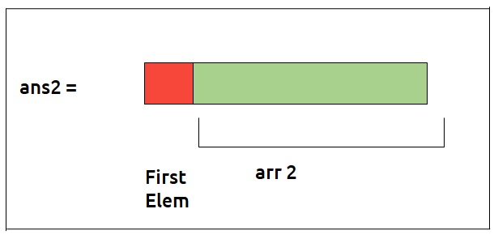
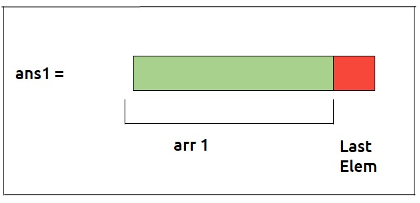

# 1-D Dynamic Programming


We defined sub-problems and their dependency, other important entities in **dp** are the **dependent elements or variables**. The **count** of these variables defines the **dimension** of the problem. If a problem is dependent on **1** variable, its a **1D dp** problem.

**Approach to solving 1-D DP problems :-**

* Using memoization
* Using tabulation method


---


## Questions

💡 In the below **questions** try to draw the **recursion's diagram** of each problem on the 📝 paper.

??? tip "Climbing Stairs"

    * <a href="https://leetcode.com/problems/climbing-stairs/description/" target="_blank">Climbing Stairs (leetcode)</a>

    ---

    **memoization**

    ```cpp

    int solver(int n , vector<int> &dp){

        if(n == 0){
            return 1;
        }
        if(n < 0){
            return 0;
        }

        if(dp[n] != -1){
            return dp[n];
        }

        int l = solver(n-1 , dp);
        int r = solver(n-2 , dp);

        return dp[n] = l+r;
    }

    ```

    **tabulation**

    ```cpp

    int tabulation(int n){

        vector<int> dp(n+1 , -1);
        dp[0] = 1;
        for(int i = 1 ; i <= n ; i++){
            if(i == 1){
                dp[i] = dp[i-1];
            }
            else{
                dp[i] = dp[i-1]+dp[i-2];
            }
        }

        return dp[n];
    }

    ```


??? tip "Frog Jump"

    * <a href="https://www.geeksforgeeks.org/problems/geek-jump/1?utm_source=youtube&utm_medium=collab_striver_ytdescription&utm_campaign=geek-jump" target="_blank">Frog Jump (gfg)</a>


    ---

    **memoization**

    ```cpp

    int solver(vector<int> &height , int n , vector<int> &dp){
        
        if(n == 0){
            return 0;
        }
        
        if(dp[n] != -1){
            return dp[n];
        }
        
        int l = solver(height , n-1 , dp) + abs(height[n]-height[n-1]);
        int r = INT_MAX;
        if(n > 1)
            r = solver(height , n-2 , dp) + abs(height[n]-height[n-2]);
        
        
        return dp[n] = min(l,r);
        
    }

    ```

    **tabulation**

    ```cpp

    int tabulation(vector<int> &height , int n){
        
        vector<int> dp(n+1 , -1);
        dp[0] = 0;
        dp[1] = abs(height[1]-height[0]);
        
        for(int i = 2 ; i < n ; i++){
            int jump1 = dp[i-1] + abs(height[i]-height[i-1]);
            int jump2 = dp[i-2] + abs(height[i]-height[i-2]);
            dp[i] = min(jump1,jump2);
        }
        
        return dp[n-1];
    }

    ```

??? tip "Frog Jump with k distances"

    * <a href="https://www.geeksforgeeks.org/problems/minimal-cost/1?utm_source=youtube&utm_medium=collab_striver_ytdescription&utm_campaign=minimal-cost" target="_blank">Frog Jump with k distances (gfg)</a>


    ---

    **memoization**

    ```cpp

    int solver(vector<int> &height , int n , int k , vector<int> &dp){
      
      if(n == 0){
          return 0;
      }
      
      if(dp[n] != -1){
          return dp[n];
      }
      
      int ans = INT_MAX;
      for(int i = 1 ; i <= k ; i++){
          if(n-i >= 0){
              int cost = solver(height , n-i , k , dp) + abs(height[n]-height[n-i]);
              ans = min(ans , cost);
          }
            
          
      }
      
      return dp[n] = ans;
    }

    ```

    **tabulation**

    ```cpp

    int tabulation(vector<int> &height , int n , int k){
      
      vector<int> dp(n+1,-1);
      dp[0] = 0;
      
      for(int i = 1 ; i<n ; i++){
          
          int ans = INT_MAX;
          for(int j = 1 ; j <= k ; j++){
              if(i-j >= 0){
                 int cost = dp[i-j] + abs(height[i]-height[i-j]);
                ans = min(ans , cost);
              }
          }
          dp[i] = ans;
      }
      
      return dp[n-1];
    }

    ```


??? tip "Maximum sum of non-adjacent elements"

    * <a href="https://leetcode.com/problems/house-robber/" target="_blank">Maximum sum of non-adjacent elements (leetcode)</a>

    ---

    **memoization**

    ```cpp

    int solver(vector<int> &nums , int n , vector<int> &dp){

        if(n == 0){
            return nums[n];
        }
        if(n < 0){
            return 0;
        }

        if(dp[n] != -1){
            return dp[n];
        }

        int picked = nums[n] + solver(nums , n-2 , dp);
        int not_picked = 0 + solver(nums , n-1 , dp);

        return dp[n] = max(picked , not_picked);
    }

    ```

    **tabulation**

    ```cpp

    int tabulation(vector<int> &nums , int n){

        vector<int> dp(n+1 , -1);
        dp[0] = nums[0];

        for(int i = 1 ; i < n ; i++){
            int picked = nums[i];
            if(i > 1) picked += dp[i-2];
            int not_picked = 0 + dp[i-1];

            dp[i] = max(picked , not_picked);
        }

        return dp[n-1];
    }

    ```


??? tip "House Robber II"

    * <a href="https://leetcode.com/problems/house-robber-ii/description/" target="_blank">House Robber II (leetcode)</a>

    ---

    :banana: After reading the question see the **below image,** you will get the idea to **solve**

    

    

    **memoization**

    ```cpp

    class Solution {
    public:

        int solver(int n , vector<int> &nums , vector<int> &dp){

            if(n == 0){
                return nums[n];
            }
            if(n < 0){
                return 0;
            }

            if(dp[n] != -1){
                return dp[n];
            }

            int picked = nums[n] + solver(n-2 , nums , dp);
            int not_picked = 0 + solver(n-1 , nums , dp);

            return dp[n] = max(picked , not_picked);
        }

        int rob(vector<int>& nums) {
            
            int n = nums.size();
            if(n == 1){
                return nums[0];
            }
            vector<int> v1 , v2;
            for(int i = 1 ; i < n ; i++){
                v1.push_back(nums[i]);
            }
            for(int i = 0 ; i < n-1 ; i++){
                v2.push_back(nums[i]);
            }
            vector<int> dp1(v1.size()+1 , -1);
            vector<int> dp2(v2.size()+1 , -1);
            int ans1 = solver(v1.size()-1 , v1 , dp1);
            int ans2 = solver(v2.size()-1 , v2 , dp2);

            return max(ans1 , ans2);
        }
    };

    ```


💯 🔥 🚀
