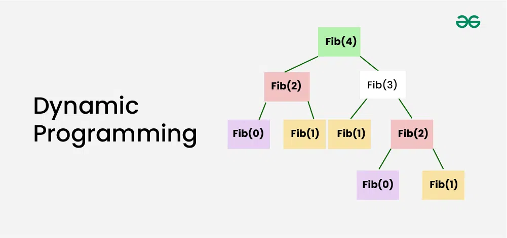
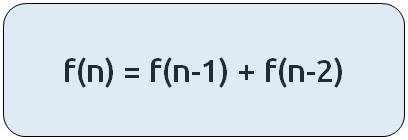
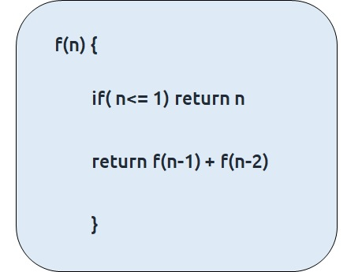
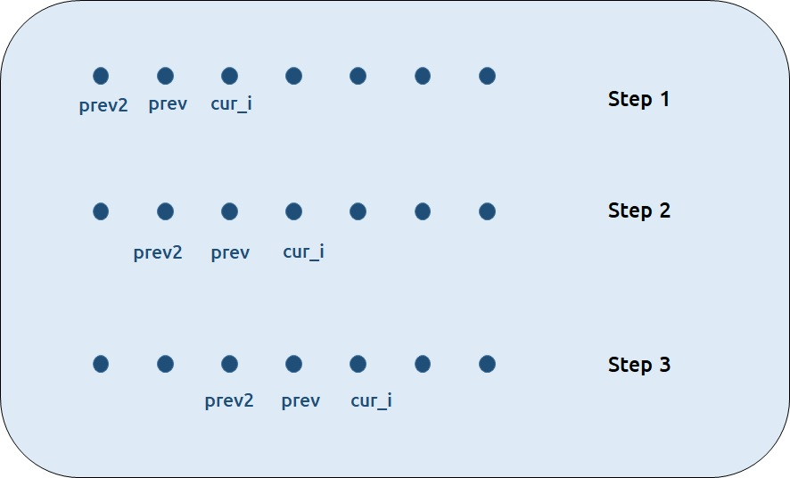

## Dynamic Programming or DP

**Dynamic Programming** is a method used in mathematics and computer science to solve complex problems by breaking them down into simpler subproblems.

Dynamic Programming can be described as storing answers to various **sub-problems** to be used later whenever required to solve the main problem.





???+ tip "How Does Dynamic Programming (DP) Work?"

    * **Identify Subproblems** :- Divide the main problem into smaller, independent subproblems.
    * **Store Solutions** :- Solve each subproblem and store the solution in a table or array.
    * **Build Up Solutions** :- Use the stored solutions to build up the solution to the main problem.
    * **Avoid Redundancy** :- By storing solutions, DP ensures that each subproblem is solved only once, reducing computation time.


## Approaches of Dynamic Programming (DP)

The two common dynamic programming approaches are :-

* **Memoization**: Known as the “top-down” dynamic programming, usually the problem is solved in the direction of the main problem to the base cases.
* **Tabulation**: Known as the “bottom-up '' dynamic programming, usually the problem is solved in the direction of solving the base cases to the main problem


---

## We will be using the example of Fibonacci numbers.


The following series is called the Fibonacci series :- **0,1,1,2,3,5,8,13,21,...**

We need to find the nth Fibonacci number, where n is based on a 0-based index.

Every ith number of the series is equal to the sum of (i-1)th and (i-2)th number where the first and second number is given as 0 and 1 respectively.


#### Part - 1: Memoizaton :bar_chart:

As every number is equal to the sum of the previous two terms, the recurrence relation can be written as :-



The basic pseudo-code for the problem will be given as :-




**Steps to memoize a recursive solution :-**


- 💯👍 Any recursive solution to a problem can be memoized using these three steps :-

    * [x] Create a dp[n+1] array initialized to -1.
    * [x] Whenever we want to find the answer of a particular value (say n), we first check whether the answer is already calculated using the dp array(i.e dp[n]!= -1 ). If yes, simply return the value from the dp array.
    * [x] If not, then we are finding the answer for the given value for the first time, we will use the recursive relation as usual but before returning from the function, we will set dp[n] to the solution we get.


#### Code

```cpp

#include <bits/stdc++.h>
using namespace std;

int fibonacci(int n, vector<int>& dp){
    if(n<=1) return n;
    
    if(dp[n]!= -1) return dp[n];
    return dp[n]= fibonacci(n-1,dp) + fibonacci(n-2,dp);
}

int main() {

  int n=5;
  vector<int> dp(n+1,-1);
  cout<<fibonacci(n,dp);
  
  return 0;
}


```
#### Time Complexity: O(N)

Reason: The overlapping subproblems will return the answer in constant time O(1). Therefore the total number of new subproblems we solve is ‘n’. Hence total time complexity is O(N).

#### Space Complexity: O(N)

Reason: We are using a recursion stack space(O(N)) and an array (again O(N)). Therefore total space complexity will be O(N) + O(N) ≈ O(N)


---

#### Part -2: Tabulation :bar_chart:

Tabulation is a ‘bottom-up’ approach where we start from the base case and reach the final answer that we want.

- 💯👍 Steps to convert Recursive Solution to Tabulation one.

    * [x] Declare a dp[] array of size n+1.
    * [x] First initialize the base condition values, i.e i=0 and i=1 of the dp array as 0 and 1 respectively.
    * [x] Set an iterative loop that traverses the array( from index 2 to n) and for every index set its value as dp[i-1] + dp[i-2]. 


#### Code

```cpp

#include <bits/stdc++.h>
using namespace std;

int fibonacci(int n){
    vector<int> dp(n+1,-1);
    
    dp[0]= 0;
    dp[1]= 1;
    
    for(int i=2; i<=n; i++){
        dp[i] = dp[i-1]+ dp[i-2];
    }

    return dp[n];
}

int main() {

  int n=5;
  cout<<fibonacci(n);

  return 0;
}


```

#### Time Complexity: O(N)

Reason: We are running a simple iterative loop

#### Space Complexity: O(N)

Reason: We are using an external array of size ‘n+1’.


---

#### Part 3: Space Optimization :bar_chart:

🤔 If we closely look at the below relation

**dp[i] =  dp[i-1] + dp[i-2]**

we see that for any i, we do need only the last two values in the array. So is there a need to maintain a whole array for it? 
<br>
The answer is ‘No’. Let us call dp[i-1] as prev and dp[i-2] as prev2.

**Now understand the following illustration.**




* Each iteration’s cur_i and prev becomes the next iteration’s prev and prev2 respectively.
* Therefore after calculating cur_i, if we update prev and prev2 according to the next step, we will always get the answer. 
* After the iterative loop has ended we can simply return prev as our answer.

#### Code

```cpp

#include <bits/stdc++.h>
using namespace std;

int main() {

  int n=5;
  int prev2 = 0;
  int prev = 1;
  
  for(int i=2; i<=n; i++){
      int cur_i = prev2+ prev;
      prev2 = prev;
      prev= cur_i;
  }

  cout<<prev;

  return 0;
}


```

#### Time Complexity: O(N)

Reason: We are running a simple iterative loop

#### Space Complexity: O(1)

Reason: We are not using any extra space

