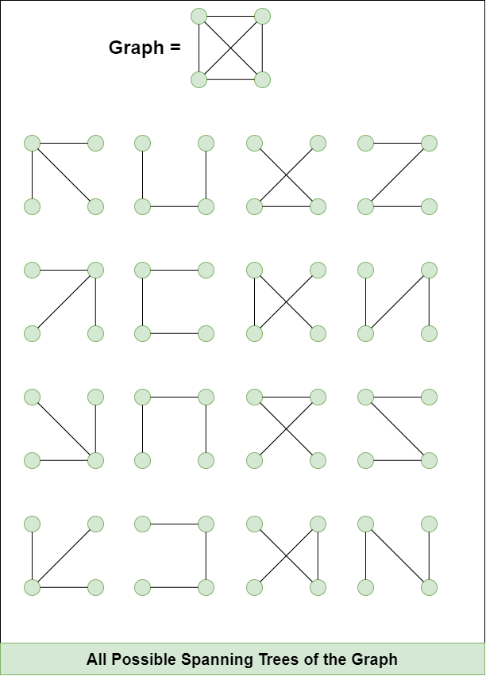
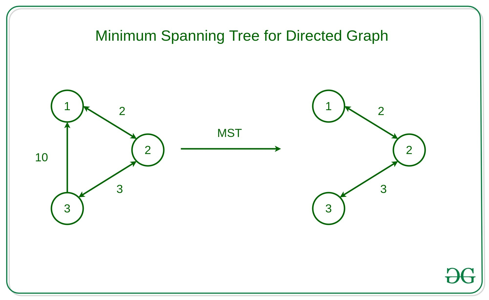

# Minimum spanning trees

## What are spanning trees?

A spanning tree is a subset of Graph G, such that all the vertices are connected using minimum possible number of edges.

- Hence, a spanning tree does not have cycles
- a graph may have more than one spanning tree
- Every node is reachable by another node.

!!! info
    Spanning tree

    - n nodes (vertices)
    - (n-1) edges
    
    

---

## Properties of Spanning tree

- A Spanning tree does not exist for a disconnected graph.
- For a connected graph having N vertices then the number of edges in the spanning tree for that graph will be N-1.
- A Spanning tree does not have any cycle.
- We can construct a spanning tree for a complete graph by removing E-N+1 edges, where E is the number of Edges and N is the number of vertices.
- Algorithms like `Dijkstra` & `A* search` algorithm internally build a spanning tree as an intermediate step.

---

## Minimum Spanning tree

- A spanning tree with **minimum sum of weights**.

