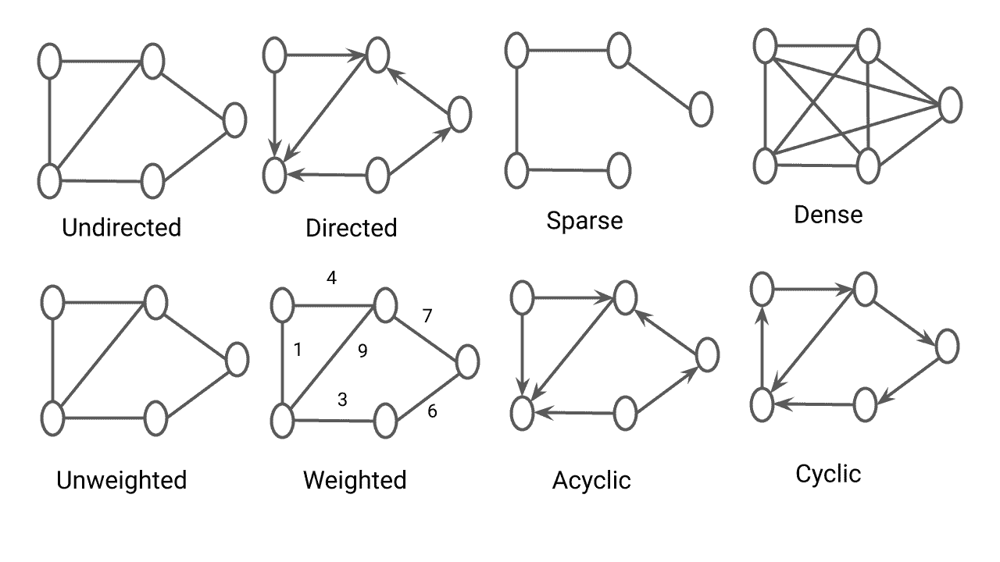
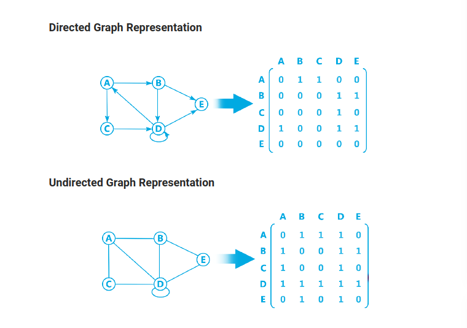
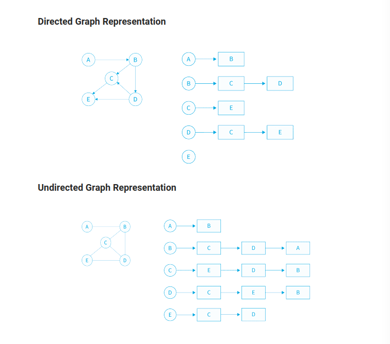

## What is Graph Data Structure?

Graph is a non-linear data structure consisting of vertices and edges. The vertices are sometimes also referred to as nodes and the edges are lines that connect any two nodes in the graph. More formally a Graph is composed of a set of vertices( V ) and a set of edges( E ). The graph is denoted by G(V, E).


---

## Types of Graph



---

## Implementation of Graph

??? abstract "See the code"

    ```cpp
    
        #include<bits/stdc++.h>
        using namespace std;

        class graph
        {
            public: 
                unordered_map<int, list<int>> adj;

            void addEdge(int u, int v, bool direction)
            {
                adj[u].push_back(v);
                if(direction == 0)
                {
                    adj[v].push_back(u);
                }
            } 

            void printAdjList()
            {
                for(auto i : adj)
                {
                    cout<<"Printing adjacent list : ";
                    cout<<i.first<<"->";
                    for(auto j : i.second)
                    {
                        cout<<j<<", ";
                    }
                    cout<<endl;
                }
            } 
        };

        int main()
        {
            int n, m;
            cout<<"Enter the number of nodes : "<<endl;
            cin>>n;

            cout<<"Enter the number of edges : "<<endl;
            cin>>m;

            graph g;

            cout<<"Enter the edges : "<<endl;
            for(int i = 0; i<m; i++)
            {
                int u, v;
                cin>> u >> v;

                g.addEdge(u, v, 0);
            }

            g.printAdjList();
        }


    ```

---

## Representations of Graph

There are two most common ways to represent a graph :

1. Adjacency Matrix
2. Adjacency List

### Adjacency Matrix Representation



??? abstract "See the code"

    ```cpp

    #include <iostream>
    using namespace std;

    int main()
    {
        int n, m;
        cin >> n >> m;
        // adjacency matrix for undirected graph
        // time complexity: O(n)
        int adj[n+1][n+1];
        for(int i = 0; i < m; i++)
        {
            int u, v;
            cin >> u >> v;
            adj[u][v] = 1;
            adj[v][u] = 1; // this statement will be removed in case of directed graph
        }
        return 0;
    }


    ```

    

---

### Adjacency List Representation



??? abstract "See the code"

    ```cpp

    #include <iostream>
    using namespace std;

    int main()
    {
        int n, m;
        cin >> n >> m;
        // adjacency list for undirected graph
        // time complexity: O(2E)
        vector<int> adj[n+1];
        for(int i = 0; i < m; i++)
        {
            int u, v;
            cin >> u >> v;
            adj[u].push_back(v);
            adj[v].push_back(u); // this statement will be removed in case of directed graph
        }
        return 0;
    }

    ```

---
