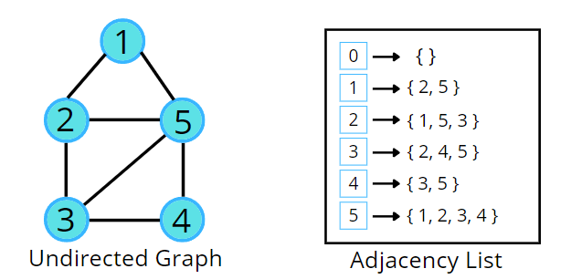

## Breadth First Search or BFS

Breadth First Search (BFS) is a fundamental graph traversal algorithm. It involves visiting all the connected nodes of a graph in a level-by-level manner.




---


```cpp

    #include <bits/stdc++.h>
    using namespace std;

    vector<int> bfs(vector<int> adj[] , int size){

        vector<int> visited(size , 0);
        vector<int> ans;
        queue<int> q;
        q.push(1);
        visited[1] = 1;

        while(!q.empty()){

            int temp = q.front();
            q.pop();
            ans.push_back(temp);

            for(auto val : adj[temp]){

                if(visited[val] == 0){
                    visited[val] = 1;
                    q.push(val);
                }

            }
        }

        return ans;
    }

    int main(){

        int V = 6;
        vector<int> adj[V];

        adj[1] = {2, 5};
        adj[2] = {1, 5, 3};
        adj[3] = {2, 4, 5};
        adj[4] = {3, 5};
        adj[5] = {1, 2, 3, 4};

        vector<int> ans = bfs(adj , V);

        for(auto val : ans){
            cout<<val<<" ";
        }

        return 0;
    }

```

#### Time Complexity 

O(N) + O(2E), Where N = Nodes, 2E is for total degrees as we traverse all adjacent nodes.

#### Space Complexity

O(3N) ~ O(N), Space for queue data structure visited array and an adjacency list
