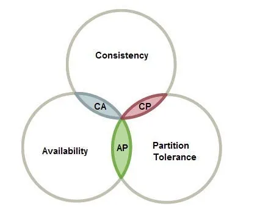

# CAP Theorem in DBMS

In the world of distributed systems, where data needs to be stored and accessed across multiple servers or nodes, ensuring the system’s reliability, performance, and consistency can be quite challenging. To address these challenges, computer scientist **Eric Brewer introduced the CAP theorem**, which has become a fundamental concept in the design and operation of distributed systems.

The CAP theorem, also known as Brewer’s theorem, was introduced by Eric Brewer in 2000 . The three letters in CAP theorem stands for :-

* **C :-** Consistency

* **A :-** Availability

* **P :-** Partition Tolerance

The theorem articulates the inherent trade-offs that exist when designing distributed systems.

