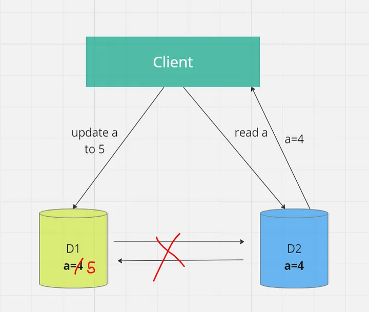
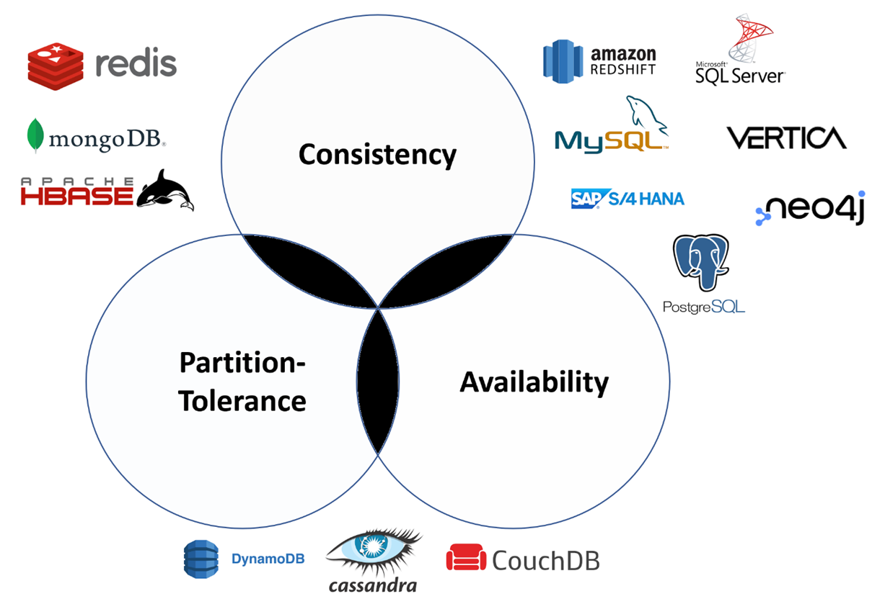

# CAP Theorem

## Statement of CAP theorem

**The CAP theorem** states that it is not possible to guarantee all three of the desirable properties — `consistency`, `availability`, and `partition tolerance` at the same time in a distributed system with data replication.

**To understand it better let’s understand these three letters (C A P) first.**

### 1. C :- Consistency

In a distributed system, **consistency means that all nodes or replicas in the system have the same data at the same time**. When a client reads data, it receives the most recent write or an error. In other words, there is no divergence in the data observed by different nodes.

Suppose we are working on a distributed system having client node and two database nodes say d1 and d2 . Now let’s say we have generated an update request to d1 and at the same time we have generated a read request at d2 . So here due to replication of data between d1 and d2 we are able to access latest data . This is called consistency.

### 2. A :- Availability

**Availability** refers to the system’s ability to respond to client requests, even in the presence of node failures or network partitions. An available system ensures that every request eventually receives a response, though it doesn’t guarantee that the response contains the most recent data.

In short availability ensures that the system is always available.

### 3. P :- Partition Tolerance

**Partition tolerance** deals with the system’s ability to continue functioning even when network partitions occur. Network partitions can cause nodes to lose contact with one another, making communication and synchronization difficult.

Let’s consider above example to understand it better.

Suppose somehow the connection between d1 and d2 breaks down now the replication of data will not occur hence consistency is not maintained but still both systems are generating output. This is partition tolerance. So even after connection breakdown the output is being generated by systems is partition tolerance.

---

CAP theorem says that we cannot have all three properties i.e. **C A P** at same time we can have at most two at once. So let’s understand this.

All possible combinations of **consistency** , **availability** and **partition tolerance** are :-

1. **CA (consistency + availability)** 
2. **AP (availability + partition tolerance)** 
3. **CP (consistency + partition tolerance)** 

Now,

### 1. CA (consistency + availability)

Here complete system is **consistent** and is **always available**. If we break the connection between systems in order to make it **partition tolerant** we will lose **consistency** of system.

### 2. AP (availability + partition tolerance)

After breaking the connection between **d1** and **d2** our system becomes **partition tolerant** and is **always available** but **consistency** is not maintained.

### 3. CP (consistency + partition tolerance)

To make above system consistent and partition tolerant we have to down the system in order to establish the connection between d1 and d2 again this will make our system unavailable for a while and after the connection has been established the system will not be partition tolerant.

---

## Why is the CAP theorem important?

**The CAP theorem** is important because it forces developers to think carefully about the trade-offs they’re making when building a distributed system. When designing a distributed system, you have to decide which two properties are most important for your use case.

**For example,** if you’re building a banking application, consistency is likely to be the most important property because you can’t afford to have different account balances for different users. On the other hand, if you’re building a social media application, availability is likely to be the most important property because users will expect the application to be up and running all the time.

### Real-World Examples

Let’s look at a couple of real-world examples to illustrate the CAP theorem in action :-

* **Amazon DynamoDB :-** DynamoDB is designed to provide high availability and partition tolerance. It replicates data across multiple Availability Zones (AZs) to ensure data durability and availability. However, during network partitions, it might not provide strong consistency by default.

* **Google Spanner :-** Google’s Spanner database is an example of a CP system. It achieves strong consistency by using synchronized clocks and a globally distributed architecture. However, this comes at the cost of potential unavailability in the event of network partitions.

---

## Different databases bcoz of CAP theorem

- NoSQL databases are great for distributed networks. They allow for horizontal scaling, and they can quickly scale
across multiple nodes. When deciding which NoSQL database to use, it’s important to keep the CAP theorem in mind.

## So, RDBMS is not used at all in large-scale systems?

- Obviously, this is false statement. They are very old and mature DBs and been in the industry for years.

- Despite the CAP theorem's constraints, MySQL and PostgreSQL are indeed used at a very large scale in the real world. Here are some strategies employed.

!!! quote "Hybrid Approaches"
    Read replicas: Using read replicas to handle high read traffic, while the primary node handles writes. This can improve availability and distribute the load but might introduce eventual consistency for reads.
    Multi-master replication: Allows writes on multiple nodes but comes with complex conflict resolution mechanisms to maintain consistency.

!!! quote "Use Cases"
    - Financial Systems: Often use CP configurations with strong consistency guarantees, such as synchronous replication. For example, a payment processing system might use PostgreSQL with synchronous replication to ensure that all transactions are consistent.

    - Web Applications: Often use AP configurations with asynchronous replication to ensure high availability. For example, a social media platform might use MySQL with asynchronous replication and read replicas to handle high traffic volumes.

