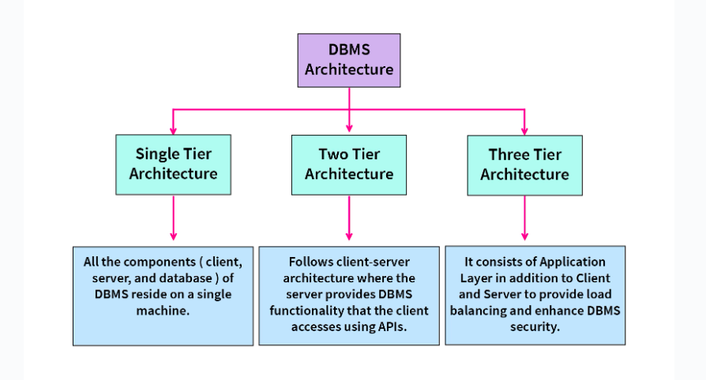

# Introduction to DBMS Architecture

**Database management systems** are divided into multiple levels of **abstraction** for proper functioning. These modules/layers describe the functioning and the design of the DBMS.

Since a database management system is not always directly accessible by the user or an application, we can maintain it with the help of various architectures based on how the user is connected to the database. These architectures follow a tier-based classification, i.e., the DBMS architecture is classified depending upon how many layers are present in the **structure of the DBMS.**

Hence, an **n-tier DBMS Architecture** divides the whole DBMS into related but n independent layers or levels, i.e., a **one-tier** architecture divides the DBMS into a **single layer**, a **two-tier** DBMS architecture divides the DBMS into two layers, a three-tier in three layers, and **so on.**

**Now, let’s look at the most common DBMS architectures:**

* Single Tier Architecture (One-Tier Architecture)

* Two-Tier Architecture

* Three-Tier Architecture

