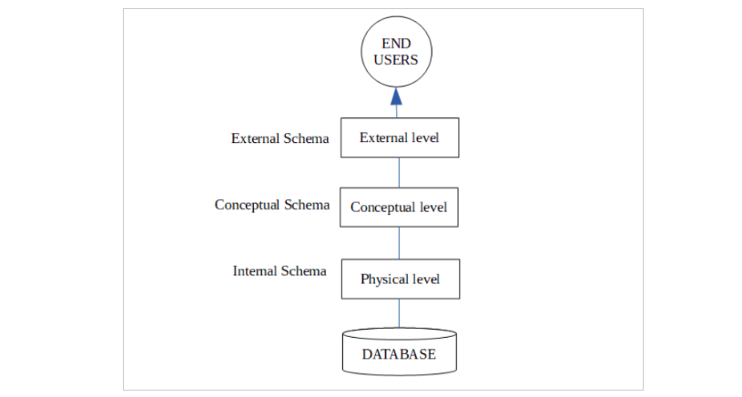

# Three Level Architecture

## Three Level Architecture

**Three Level Architecture** is a commonly used architectural approach in Database Management Systems (DBMS) for the design and development of applications that work with databases. The 3-level architecture divides an application’s components into three layers. Each layer has its own set of responsibilities.

DBMS 3-Level architecture divides the complete system into three inter-related but independent modules as shown below:

### Physical Level

This is the lowest level in the three level architecture.It is also known as the internal level. The physical level describes how data is actually stored in the database. In the lowest level, this data is stored in the external hard drives in the form of bits and at a little high level, it can be said that the data is stored in files and folders. The physical level also discusses compression and encryption techniques.

### Conceptual Level

The conceptual level is also known as the logical level. It describes how the database appears to the users conceptually and the relationships between various data tables. The whole design of the database such as relationship among data, schema of data etc. are described in this level. Database constraints and security are also implemented in this level of architecture. This level is
maintained by DBA (database administrator).

### External Level

This is the highest level in the three level architecture and closest to the user. It is also known as the view level. The external level only shows the relevant database content to the users in the form of views and hides the rest of the data. So different users can see the database as a different view as per their individual requirements.

