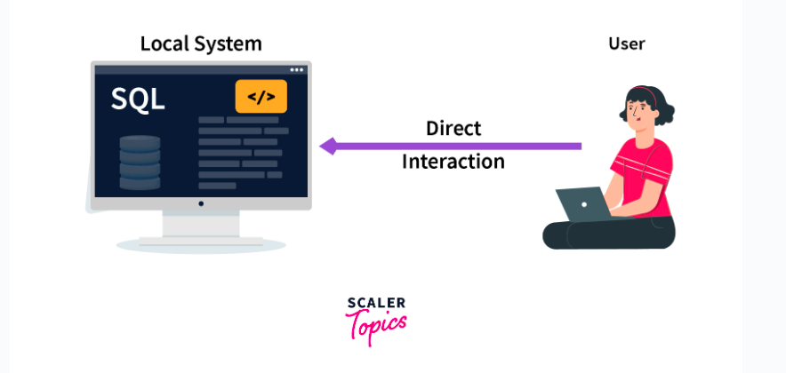

# One_Tier_Architecture

## Single Tier Architecture

* In this architecture, the database is directly available to the user. It means the user can directly sit on the DBMS and uses it.

* Any changes done here will directly be done on the database itself. It doesn't provide a handy tool for end users.

* The 1-Tier architecture is used for development of the local application, where programmers can directly communicate with the database for the quick response.

## When Single Tier Architecture Used?

* The data isn't changed frequently.

* No multiple users are accessing the database system.

* We need a direct and simple way to modify or access the database for application development.

### Example

In order to learn the Structure Query Language **(SQL),** we set up our SQL server and the database on our local system. This SQL server enables us to directly interact with the relational database and execute certain operations without requiring any network connection. This whole setup to learn SQL queries is an example of **Single-Tier DBMS architecture.**

### Highlights

1. Simplest DBMS architecture.

2. All the components of DBMS, i.e., the server, database, and client, reside on a single system.

3. The user can directly access the database.

4. Used when data isn't changing frequently.

5. Suitable for programmers, database designers, and single-user access.

