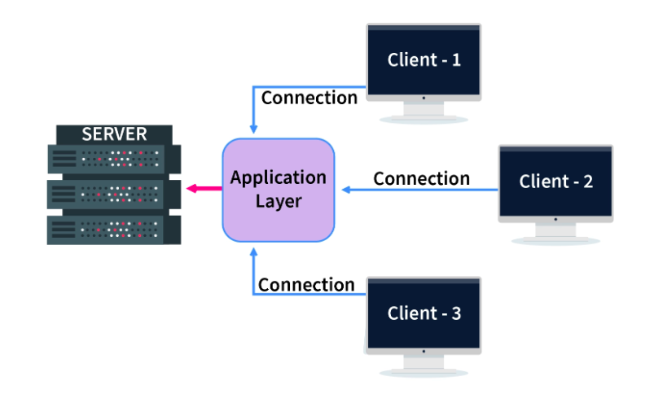

# Three_Tier_Architecture

## Three Tier Architecture

* The 3-Tier architecture contains another layer between the client and server. In this architecture, the client can't directly communicate with the server.

* The application on the client end interacts with an application server which further communicates with the database system.

* The end-user has no idea about the existence of the database beyond the application server. The database also has no idea about any other user beyond the application. The 3-Tier architecture is used in the case of the large web application.

## Advantages of Three Tier Architecture

* **Scalability -** Since the database server isn't aware of any users beyond the application layer and the application layer implements load balancing, there can be as many clients as you want.

* **Data Integrity -** Data corruption and bad requests can be avoided because of the checks performed in the application layer on each client reques.

* **Security -** The removal of the direct connection between the client and server systems via abstraction reduces unauthorized access to the database.

**Note -** In Three Tier DBMS Architecture, an additional layer (Application Layer) is added between the Client and the Server. This increases the number of layers present between the DBMS and the end-users, making the implementation of the DBMS structure complex and difficult to maintain.

### Highlights

1. Most widely used DBMS architecture.

2. Follows Client-Application-Server architecture.

3. Enhanced security, data integrity, and scalability.

4. Has complexity and maintenance issues because of the extra layer.

