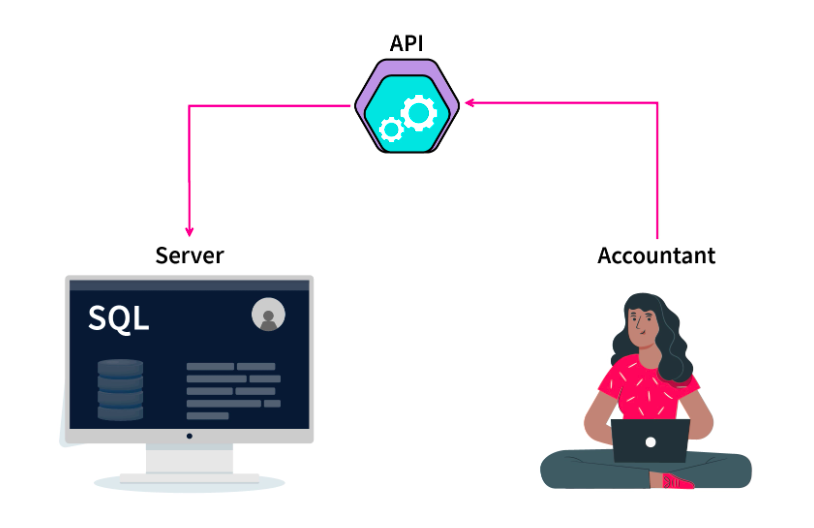

# Two_Tier_Architecture

## Two Tier Architecture

* The 2-Tier architecture is the same as the basic client-server. In the two-tier architecture, applications on the client end can directly communicate with the database on the server side. For this interaction, APIs like ODBC, and JDBC are used.

* The user interfaces and application programs are run on the client side.

* The server side is responsible to provide the functionalities like query processing and transaction management. To communicate with the DBMS, the client-side application establishes a connection with the server side.

## Advantages of Two Tier Architecture

* Multiple users can use it at the same time. Hence, it can be used in an organization.

* It has high processing ability as the database functionality is handled by the server alone.

* Faster access to the database due to the direct connection and improved performance.

* Because of the two independent layers, it's easier to maintain.

## Disadvantages of Two-Tier DBMS Architecture

1. **Scalability -** As the number of clients increases, the load on the server increases. Thereby declining the performance of the DBMS and, in turn, the client-side application.

2. **Security -** The Direct connection between the client and server systems makes this architecture vulnerable to attacks.

### Example

Consider a situation where you went to a bank to withdraw some cash. After entering the withdrawal amount and the account details on the withdrawal slip, the banker will go through the server-side database via his credential (API call) and will check whether there is enough balance present or not. This client-server model is an example of Two-Tier DBMS architecture.

### Highlights

1. Similar to a client-server architecture.

2. Faster access, Easier to maintain, and can handle multiple users simultaneously.

3. Used when we wish to access DBMS via applications and APIs.

4. Has scalability and security issues because of direct client-server connection.

