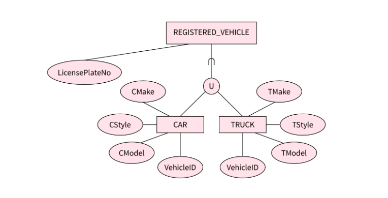
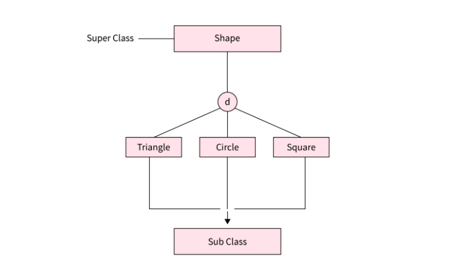
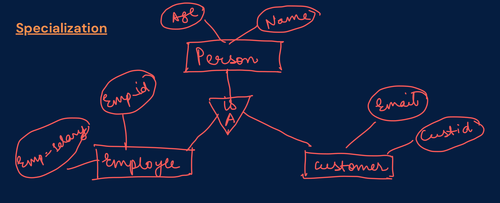
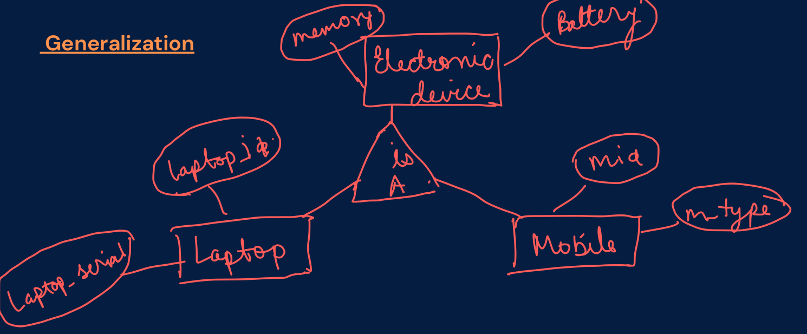
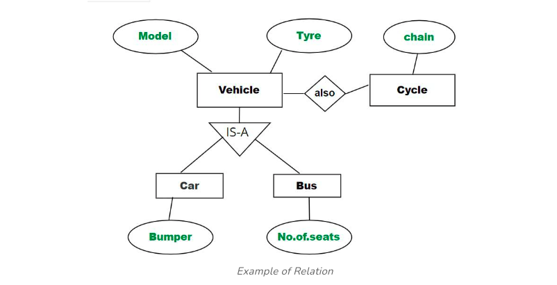
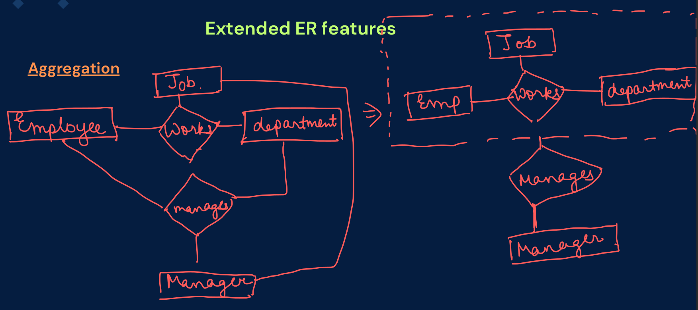

# Extended ER Model (OR EER model)

## Why EER model?

Using the **ER model** for bigger data creates a lot of complexity while designing a database model, So in order to minimize the complexity, we have to enhanced entity-relationship model.

All the components of an ER diagram are included in an EER diagram, with the following additions that help us create and maintain detailed databases through high-level models and tools.

* Specialization
* Generalization
* Aggregation

The below diagram is a representation of an Enhanced Entity-relationship model. As you can see, the below EER model is expanded upon ER models.

---

### Sub Class and Super Class

The link between subclasses and superclasses introduces the idea of inheritance. The 'd' symbol is used to indicate the relationship between subclasses and superclasses.

**Super Class**

A superclass is a type of entity that is connected to one or more subtypes. And, also note that a database entity cannot be created just by belonging to a superclass.

For example: The superclass of shapes includes subgroups like Triangle, Circles, and Squares.

**Sub Class**

A subclass is a collection of objects with special characteristics. The traits and properties of a subclass are inherited from its superclass.

For example: Triangles, Circles, and squares are the subclass of the Shape superclass.

---

## Specialization

**Specialization** in the ER model is like categorizing entities based on common features.

* A "Supertype" groups entities with shared attributes and relationships, while
"Subtypes" have their own unique attributes and relationships. It's a way to organize
data efficiently. It is a **Top-Down** approach.

* We have **is-a** relationship between superclass and subclass. 

## Generalization

**Generalization** is like finding things that are alike and putting them into a big group to represent what they have in common. It helps make things simpler and organized. It is a **Bottom-Up** approach.

* We have **is-a** relationship between subclass and superclass. 

**Inheritance** :- It is an important feature of generalization and specialization.

* **Attribute inheritance:** allows lower level entities to inherit the attributes of higher level entities and vice versa.

* in diagram: Car entity is an inheritance of Vehicle entity ,So Car can acquire attributes of Vehicle example:car can acquire Model attribute of Vehicle.

* **Participation inheritance:** In participation inheritance, relationships involving higher level entity set also inherited by lower level entity and vice versa.

* in diagram: Vehicle entity has an relationship with Cycle entity ,So Cycle entity can acquire attributes of lower level entities i.e Car and Bus since it is inheritance of Vehicle.

## Aggregation

**Aggregation** is like stacking things on top of each other to create a structure. It is used to create a hierarchical structure in data modeling, showing how a higher-level entity is composed of lower-level entities.

* **Abstraction** is employed to view relationships from a more general perspective, focusing on a higher-level entity.

