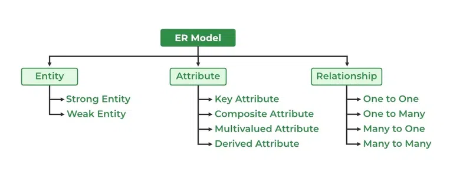
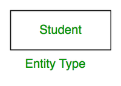
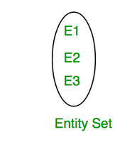

# Introduction to ER Model

## What is ER Model?

**The Entity Relationship Diagram** explains the relationship among the entities present in the database. ER models are used to model real-world objects like a person, a car, or a company and the relation between these real-world objects. In short, the ER Diagram is the structural format of the database.

## Why Use ER Diagrams In DBMS?

* ER diagrams are used to represent the E-R model in a database, which makes them easy to convert into relations (tables).

* These diagrams are very easy to understand and easy to create even for a naive user.

* It gives a standard solution for visualizing the data logically.

## Symbols Used in ER Model

## Components of ER Diagram

ER Model consists of Entities, Attributes, and Relationships among Entities in a Database System.

## Entity

**An Entity** may be an object with a physical existence – a particular person, car, house, or employee – or it may be an object with a conceptual existence – a company, a job, or a university course.

### Entity Type

It refers to the category that a particular entity belongs to.

**Example**

* A table named student in a university database.
* A table named employee in a company database.

### Entity Set

An entity set is a collection or set of all entities of a particular entity type at any point in time. The type of all the entities should be the same.

**Example**

* The collection of all the students from the student table at a particular instant of time is an example of an entity set.

---

1. **Strong Entity**

A Strong Entity is a type of entity that has a key Attribute. Strong Entity does not depend on other Entity in the Schema. It has a primary key, that helps in identifying it uniquely, and it is represented by a rectangle. These are called Strong Entity Types.

2. **Weak Entity**

An entity that cannot be uniquely identified by its own attributes and relies on the relationship with other entity is called weak entity. it is represented by a double rectangle.

---

## Attributes

**An entity** is represented by a set of attributes, each entity has a value for each of its attributes.

**Example** 
Student Entity has following attributes --> `Student_ID, Name, Course, Batch, Contact number`

### Types of Attributes

1. **Simple Attribute**

Attributes which can’t be divided further.

E.g.--> `Customer’s account number in a bank, Student’s Roll number etc.`

2. **Composite Attribute**

An attribute composed of many other attributes is called a composite attribute.

E.g. --> `Name of a person, can be divided into first-name, middle-name, last-name.`

3. **Single-valued Attribute**

Only one value attribute.

E.g. --> `Student ID, loan-number for a loan.`

4. **Multi-valued Attribute**

An attribute consisting of more than one value for a given entity.

E.g. --> `Phone_No (can be more than one for a given student).`

5. **Derived Attribute**

An attribute that can be derived from other attributes is known as a derived attribute.

E.g. --> `Age (can be derived from DOB).`

6. **NULL Value Attribute**

An attribute takes a null value when an entity does not have a value for it.

E.g. --> `person having no middle-name`

