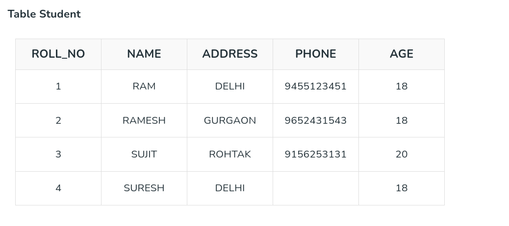
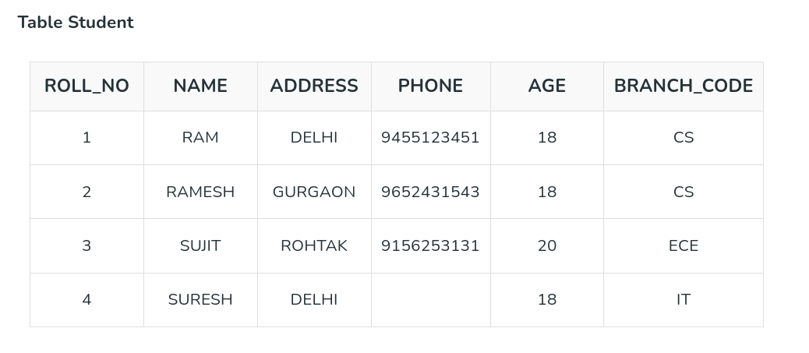
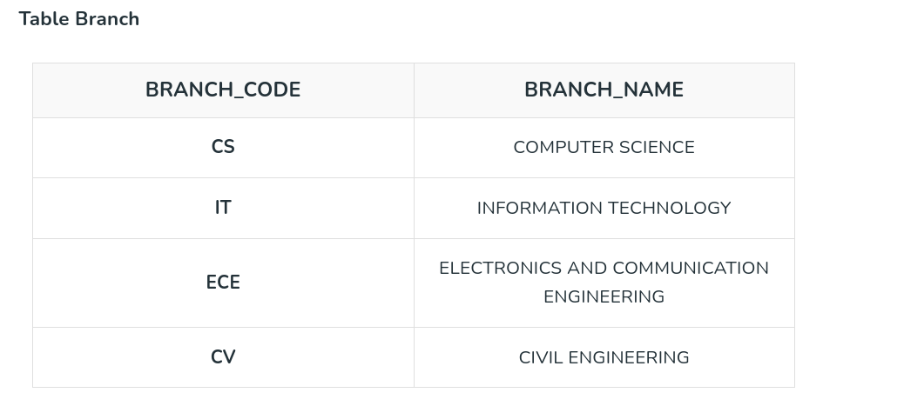

# Relational Model

## What is Relational Model?

**The relational model** represents how data is stored in **Relational Databases.**  
**A relational database** consists of a collection of tables, each of which is assigned a unique name. Consider a relation STUDENT with attributes ROLL_NO, NAME, ADDRESS, PHONE, and AGE shown in the table.

* **Relational Model** based DBMS systems, also known as RDBMS :- Oracle, IBM, MySQL.

## Important Terminologies

* **Attribute:** Each column in the relation is known as a attribute. Attributes are the properties that define an entity. e.g.; ROLL_NO, NAME, ADDRESS

* **Tuple:** Each row in the relation/table is known as a tuple.

* **Degree:** The number of attributes in the relation is known as the degree of the relation.The STUDENT relation defined above has degree 5.

* **Cardinality:** The number of tuples in a relation is known as cardinality. The STUDENT relation defined above has cardinality 4.

* **Relation Schema:** A relation schema defines the structure of the relation and represents the name of the relation with its attributes. e.g.; STUDENT (ROLL_NO, NAME, ADDRESS, PHONE, and AGE) is the relation schema for STUDENT.

* **NULL Values:** The value which is not known or unavailable is called a NULL value. It is represented by blank space. e.g.; PHONE of STUDENT having ROLL_NO 4 is NULL.

* **Relation Key:** These are basically the keys that are used to identify the rows uniquely or also help in identifying tables. e.g.; Primary Key, Candidate Key, Super Key, Foreign Key

## Constraints in Relational Model

While designing the Relational Model, we define some conditions which must hold for data present in the database are called Constraints. These constraints are checked before performing any operation (insertion, deletion, and updation ) in the database. If there is a violation of any of the constraints, the operation will fail.

### Domain Constraints

These are attribute-level constraints. An attribute can only take values that lie inside the domain range. e.g.; If a constraint AGE>0 is applied to STUDENT relation, inserting a negative value of AGE will result in failure.

### Key Integrity

Every relation in the database should have at least one set of attributes that defines a tuple uniquely. Those set of attributes is called keys. e.g.; ROLL_NO in STUDENT is key. No two students can have the same roll number. So a key has two properties: 

* It should be unique for all tuples.
* It can’t have NULL values.

### Referential Integrity

When one attribute of a relation can only take values from another attribute of the same relation or any other relation, it is called referential integrity. Let us suppose we have 2 relations 

BRANCH_CODE of STUDENT can only take the values which are present in BRANCH_CODE of BRANCH which is called referential integrity constraint. The relation which is referencing another relation is called REFERENCING RELATION (STUDENT in this case) and the relation to which other relations refer is called REFERENCED RELATION (BRANCH in this case).

## Anomalies in the Relational Model

An anomaly is an irregularity or something which deviates from the expected or normal state. When designing databases, we identify three types of anomalies: Insert, Update, and Delete.

### Insertion Anomaly in Referencing Relation

We can’t insert a row in REFERENCING RELATION if referencing attribute’s value is not present in the referenced attribute value. e.g.; Insertion of a student with BRANCH_CODE ‘ME’ in STUDENT relation will result in an error because ‘ME’ is not present in BRANCH_CODE of BRANCH. 

### Deletion/ Updation Anomaly in Referenced Relation

We can’t delete or update a row from REFERENCED RELATION if the value of REFERENCED ATTRIBUTE is used in the value of REFERENCING ATTRIBUTE. e.g; if we try to delete a tuple from BRANCH having BRANCH_CODE ‘CS’, it will result in an error because ‘CS’ is referenced by BRANCH_CODE of STUDENT, but if we try to delete the row from BRANCH with BRANCH_CODE CV, it will be deleted as the value is not been used by referencing relation.

