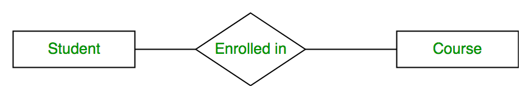
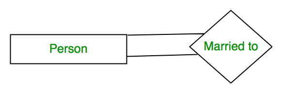
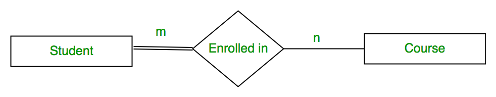
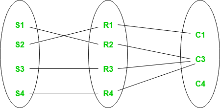

# Relationships

## Relationship Type and Relationship Set

**A Relationship Type** represents the association between entity types. For example, ‘Enrolled in’ is a relationship type that exists between entity type Student and Course. In ER diagram, the relationship type is represented by a diamond and connecting the entities with lines.

A set of relationships of the same type is known as a relationship set. The following relationship set depicts S1 as enrolled in C2, S2 as enrolled in C1, and S3 as registered in C3.

## Degree of a Relationship

The number of different entity sets participating in a relationship set is called the degree of a relationship.

### 1. Unary Relationship

When there is only ONE entity set participating in a relation, the relationship is called a unary relationship. For example, one person is married to only one person.

### 2. Binary Relationship

When there are TWO entities set participating in a relationship, the relationship is called a binary relationship. For example, a Student is enrolled in a Course.

### 3. Ternary Relationship

When there are n entities set participating in a relation, the relationship is called an n-ary relationship.

## Cardinality

The number of times an entity of an entity set participates in a relationship set is known as cardinality.

### 1. One-to-One

When each entity in each entity set can take part only once in the relationship, the cardinality is one-to-one.

E.g. --> `Citizen has Aadhar Card`

### 2. One-to-Many

In one-to-many mapping as well where each entity can be related to more than one entity.

E.g. --> `Citizen has Vehicle`

### 3. Many-to-One

When entities in one entity set can take part only once in the relationship set and entities in other entity sets can take part more than once in the relationship set, cardinality is many to one.

E.g. --> `Course taken by Professor`

### 4. Many-to-Many

When entities in all entity sets can take part more than once in the relationship cardinality is many to many.

E.g. --> `A student can take more than one course and one course can be taken by many students`

## Participation Constraint

Participation Constraint is applied to the entity participating in the relationship set.  

### 1. Total Participation

Each entity in the entity set must participate in the relationship. If each student must enroll in a course, the participation of students will be total. Total participation is shown by a double line in the ER diagram.

### 2. Partial Participation

The entity in the entity set may or may NOT participate in the relationship. If some courses are not enrolled by any of the students, the participation in the course will be partial.

The diagram depicts the ‘Enrolled in’ relationship set with Student Entity set having total participation and Course Entity set having partial participation. 

Using Set, it can be represented as, 

