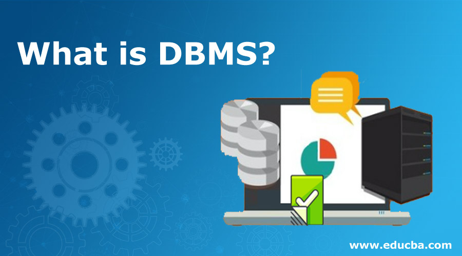

Database Management System is a software or technology used to manage data from a database. Some popular databases are MySQL, Oracle, MongoDB, etc. DBMS provides many operations e.g. creating a database, Storing in the database, updating an existing database, delete from the database.

