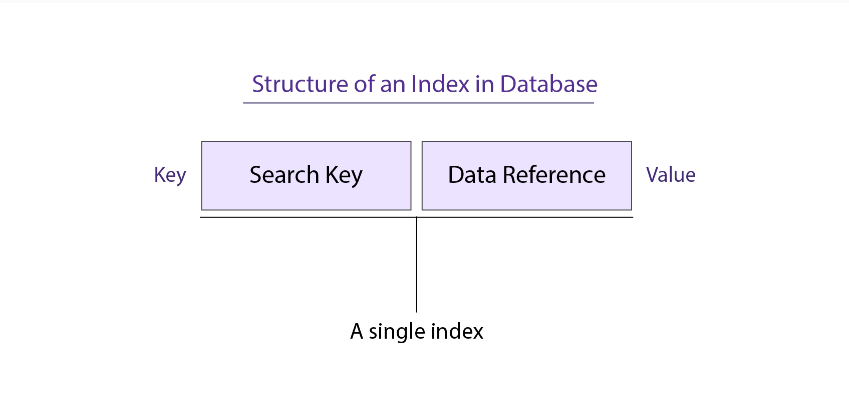
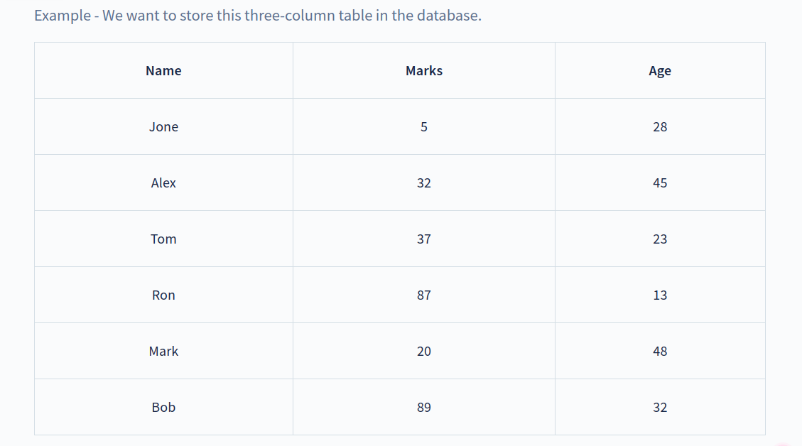
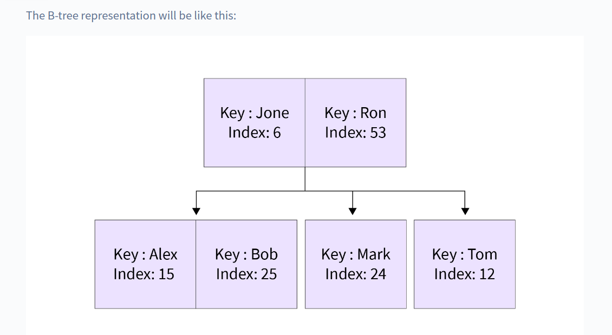

# Introduction to Indexing

## What is Indexing in DBMS?

**Indexing** is used to quickly retrieve particular data from the database. Formally we can define Indexing as a technique that uses data structures to optimize the searching time of a **database query in DBMS**. Indexing reduces the number of disks required to access a particular data by internally creating an index table.

**Indexing** is achieved by creating **Index-table** or **Index**.

**Index** usually consists of two columns which are a key-value pair. The two columns of the index table(i.e., the key-value pair) contain copies of selected columns of the tabular data of the database.

Here, **Search Key** contains the copy of the **Primary Key** or the **Candidate Key** of the database table. Generally, we store the selected Primary or Candidate keys in a sorted manner so that we can reduce the overall query time or search time(from linear to binary).

**Data Reference** contains a set of pointers that holds the address of the disk block. The pointed disk block contains the actual data referred to by the Search Key. Data Reference is also called **Block Pointer** because it uses block-based addressing.

## Indexing Attributes

Let's discuss the various indexing attributes:

### Standard (B-tree) and Bitmap

**B-tree-indexing** is one of the most popular and commonly used indexing techniques. **B-tree in DBMS** is a type of tree data structure that contains 2 things namely: Index Key and its corresponding disk address. Index Key refers to a certain disk address and that disk further contains rows or tuples of data.

On the other hand, **Bitmap** indexing uses strings to store the address of the **tuples** or rows. A bitmap is a mapping from one system to the other such as integers to bits.

Bitmap has an advantage over B-tress as bitmap performs faster retrieval of certain data (Bitmap is made according to a certain data, hence retrieves faster). Bitmaps are also more compact than B-trees.

There is a drawback with bit mapping, bit mapping requires more overhead during tuple operations on the table. Hence, bit maps are mainly used in data warehouse environments.

