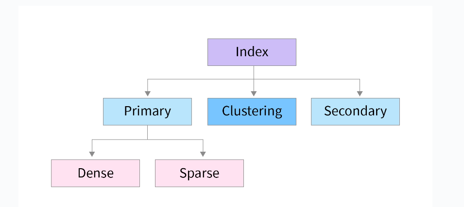
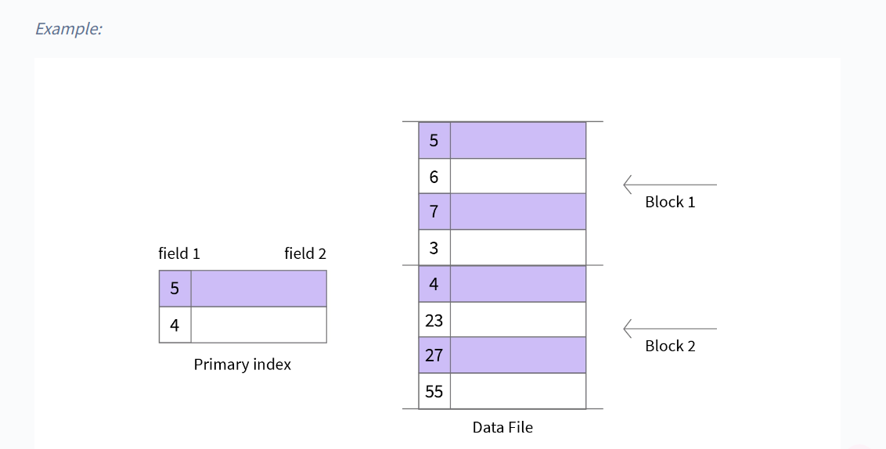
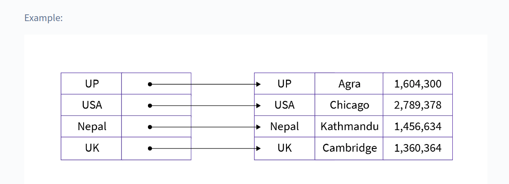
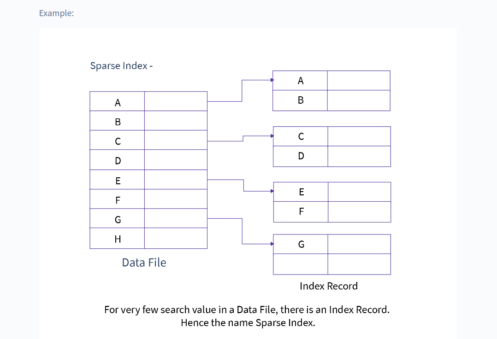
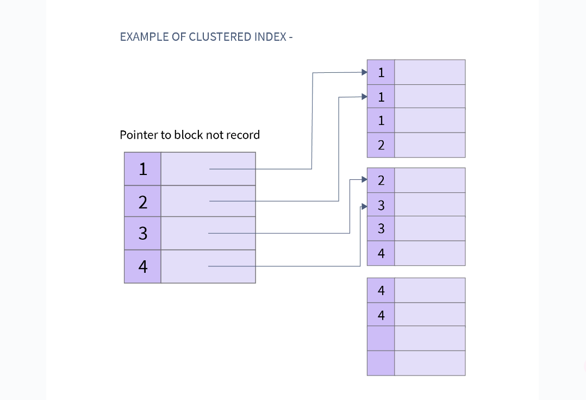
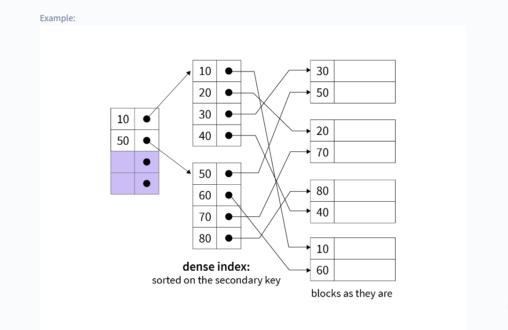

# Types of Indexes

## Types of Indexes

we divide indexing mainly into three types

### Single Level Indexing

It is somewhat like the index (or the table of contents) found in a book. Index of a book contains topic names along with the page number similarly the index table of the database contains keys and their corresponding block address.

**Single Level Indexing is further divided into three categories:**

1. #### Primary Indexing

The indexing or the index table created using Primary keys is known as Primary Indexing. It is defined on ordered data. As the index is comprised of primary keys, they are unique, not null, and possess one to one relationship with the data blocks.

??? tip "Characteristics of Primary Indexing"

    * Search Keys are unique.
    * Search Keys are in sorted order.
    * Search Keys cannot be null as it points to a block of data.
    * Fast and Efficient Searching.

* #### Dense Indexing

In dense indexing, the index table contains records for every search key value of the database. This makes searching faster but requires a lot more space. It is like primary indexing but contains a record for every search key.

* #### Sparse Indexing

Sparse indexing consumes lesser space than dense indexing, but it is a bit slower as well. We do not include a search key for every record despite that we store a Search key that points to a block. The pointed block further contains a group of data. Sometimes we have to perform double searching this makes sparse indexing a bit slower.

---

#### Cluster Indexing

Clustered Indexing is used when there are multiple related records found at one place. It is defined on ordered data. The important thing to note here is that the index table of clustered indexing is created using non-key values which may or may not be unique. To achieve faster retrieval, we group columns having similar characteristics. The indexes are created using these groups and this process is known as Clustering Index.

??? tip "Characteristics of Clustered Indexing"

    * Search Keys are non-key values.
    * Search Keys are sorted.
    * Search Keys cannot be null.
    * Search Keys may or may not be unique.
    * Requires extra work to create indexing.

---

#### Secondary Indexing

It is a two-level indexing technique used to reduce the mapping size of the primary index. The secondary index points to a certain location where the data is to be found but the actual data is not sorted like in the primary indexing. Secondary Indexing is also known as non-clustered Indexing.

??? tip "Characteristics of Secondary Indexing"

    * Search Keys are Candidate Keys.
    * Search Keys are sorted but actual data may or may not be sorted.
    * Requires more time than primary indexing.
    * Search Keys cannot be null.
    * Faster than clustered indexing but slower than primary indexing.

---

## Advantages of Indexing

!!! success ""
    - Faster access and retrieval of data.
    - IO is less.

## Limitations of Indexing

!!! danger ""
    - Additional space to store index table
    - Indexing Decrease performance in INSERT, DELETE, and UPDATE query.

---

## FAQs on Indexing in DBMS

??? warning "Q1. What is Indexing in DBMS?"
    Indexing in DBMS is a technique that uses data structures to optimize the searching time of a database query. It helps in faster query results and quick data retrieval from the database. Indexing makes database performance better. It also consumes lesser space in the main memory.

??? warning "Q2. Is indexing similar to hashing?"
    
    **Indexing:**

    * **Purpose:** Indexing is used to speed up the retrieval of data from a database or data structure, typically by creating a smaller, more efficient reference system to access the data.

    * **Method:** An index is usually a sorted list of keys (or other identifiers) that allows for faster searching using algorithms like binary search. For example, database indexes use B-trees or other structures to optimize search operations.

    * **Search Time:** Typically reduces search time from 𝑂(𝑛) to 𝑂(log 𝑛) when using binary search or similar methods.

    * **Use Case:** Indexing is commonly used in databases, text searching (like for keywords), and large datasets where quick lookup is necessary.

    ---

    **Hashing:**

    * **Purpose:** Hashing is used to quickly map data (keys) to a location (bucket) where values are stored. It’s a way to uniquely identify data for fast access.

    * **Method:** Hashing uses a hash function to convert a key (e.g., a string, number) into a fixed-size integer (hash code), which is then used to locate the data in a hash table.

    * **Search Time:** Ideally, hashing provides constant-time search, i.e., 𝑂(1) assuming no hash collisions (where multiple keys hash to the same location).

    * **Use Case:** Commonly used in hash maps, dictionaries, or hash tables where fast insertions, deletions, and lookups are necessary.

??? warning "Q3. What are the types of Indexing in DBMS?"
    Indexing in DBMS is of the following types:

    - Primary Index
    - Clustering Index
    - Sparsing Index
