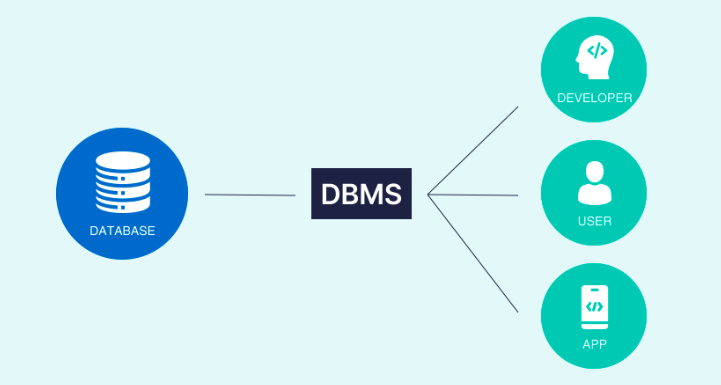
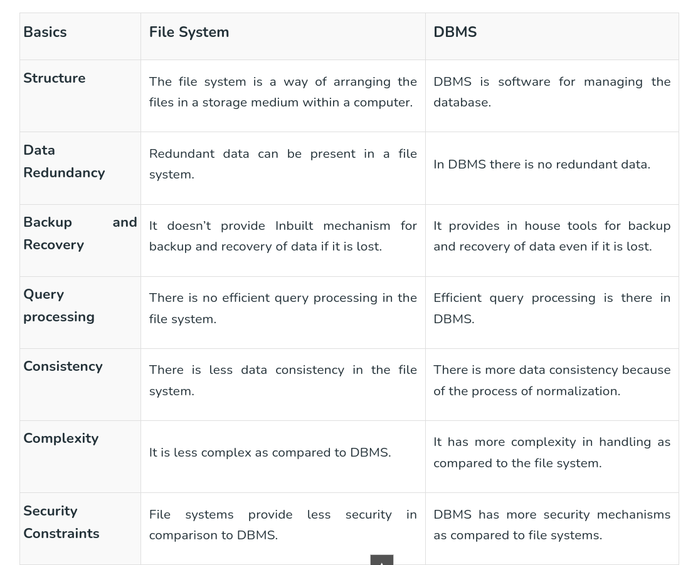
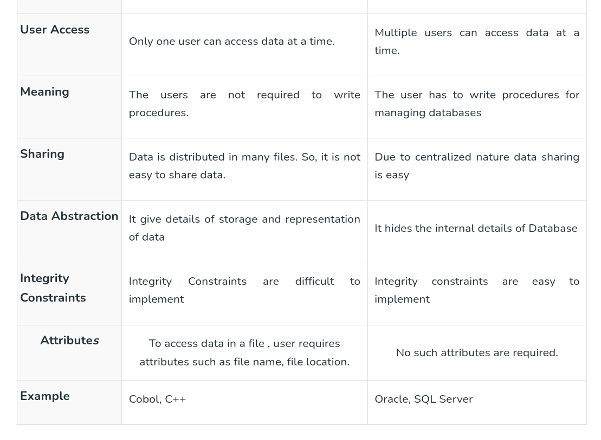

# Introduction to DBMS

## What is Data?

**Data** is a collection of raw, unorganized facts and details like text, observations, figures, symbols,
and descriptions of things etc.

Data can be recorded and doesn’t have any meaning unless processed.

## Types of Data

There are two types of Data:-

1. **Quantitative:** Quantitative data refers to numerical information like weight, height, etc.
2. **Qualitative:** Qualitative data refers to non-numeric information like opinions, perceptions, etc.

## What is Information?

**Information** is defined as structured, organized, and processed data, presented within a context that makes it relevant and useful to the person who needs it.

## Data vs Information

* Data is a collection of facts, while information puts those facts into context.

* While data is raw and unorganized, information is organized.

* Data points are individual and sometimes unrelated. Information maps out that data to provide a big-picture view of how it all fits together.

* Data, on its own, is meaningless. When it’s analyzed and interpreted, it becomes meaningful information.

* Data does not depend on information; however, information depends on data.

* Data isn’t sufficient for decision-making, but you can make decisions based on information.

## What is a Database?

**Database** is an electronic place/system where data is stored in a way that it can be **easily accessed, managed, and updated.**

## What is DBMS?

A database management system **(DBMS)** is a software system for creating and managing databases. A DBMS enables end users to create, protect, read, update and delete data in a database.

## DBMS vs File Systems

