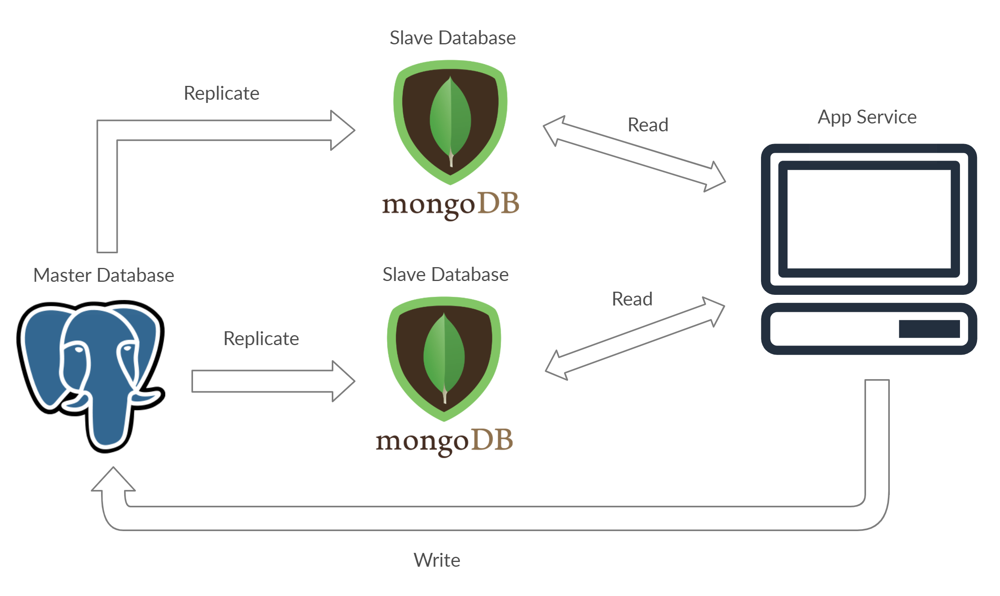

# Master-Slave Database Architecture

"`Data is the new Oil`", with rising Data - The accessibility, readability, and backup of the data are major concerns.

## What is Master-Slave Database Configuration?

**Master-Slave Database Configuration** in simple words is dividing our master databases into multiple slave databases. The Slave database serves as a backup for the master database.

The **master** database is the primary storage of the data, where all the writing operations of the data request are performed whereas the reading operation is spread across multiple **slave** databases relative to the master database. This enhances the reliability of the databases to a great extent. 

- We have one master node, to which we perform write operation.
- Master node is connected with multiple slave nodes.
- If the system prefers consistency, then it will first update the master node, then perform update on slave nodes, and then mark the transaction as successful.
- Else, if the availability matters more, then it will defer the updation for some time.
- DB **replication** will take care of distributing data from Master machine to Slaves machines. This can be **synchronous or asynchronous** depending upon the system's need.

!!! info ""
    - Its a Pattern 3 in [Database Scaling Pattern](../07-scaling-database/03-db-scaling-pattern.md/#pattern-3). (**Command Query Responsibility Segregation**)

---

## What if a update request comes at a slave node?

!!! success ""
    - Simply ignore the request.
    - If we are updating the db, then we need some way to propagate the updation to master node.
    - But, this architecture won't be called **Master-slave architecture**.

---

## Tip in Master-Slave Architecture

!!! tip "`Write->Master`, `Read=>Slave`"
    - Perform **write** operation to **Master node**.
    - Perform **read** operation on **Slave node**.

---

## Advantages

!!! tip ""
    - BackUP (even if master node goes down, we can still read data)
    - Scale out read operations, reduces latency
    - availability
    - reliable
    - parallelly execute multiple incoming requests (since, multiple read nodes)

