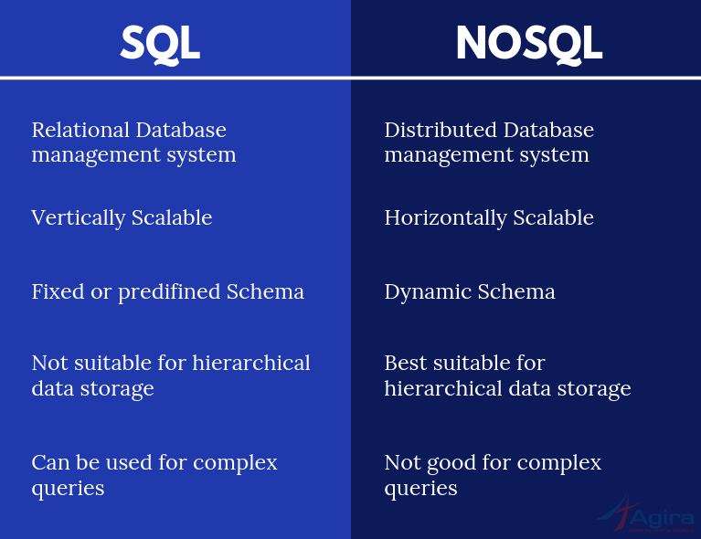

# SQL Vs NoSQL


## SQL (Structured Query Language) Databases


* **Structured Data:** SQL databases store data in tables (like a spreadsheet) with rows and columns. Each row represents a record, and each column represents a field (e.g., name, age, address).

* **Schema-based:** They follow a predefined schema, meaning the structure of the data (like what fields exist and their types) must be defined upfront. All data must fit into this structure.

* **Relational:** They are also called relational databases because data can be linked between different tables through relationships (using foreign keys).

* **Examples:** MySQL, PostgreSQL, Oracle, SQL Server.

* **Use Case:** Ideal for applications that require complex queries, structured data, and strong consistency, like financial systems, inventory management, and enterprise applications.


## NoSQL (Not Only SQL) Databases


* **Unstructured or Semi-structured Data:** NoSQL databases store data in a more flexible way, often using documents, key-value pairs, graphs, or wide-column stores.

    * **Document-based:** Data is stored as documents (usually in JSON or BSON format) that can have varying structures (e.g., some documents might have different fields).

    * **Key-value:** Data is stored as key-value pairs, like a dictionary.

* **Schema-less:** No predefined schema is required. Data can be added without needing to define a strict structure, allowing for greater flexibility in handling different types of data.

* **Non-relational:** Relationships between data are less strict, or sometimes nonexistent, compared to SQL.

* **Examples:** MongoDB, Cassandra, Redis, CouchDB.

* **Use Case:** Ideal for applications that handle large volumes of unstructured or semi-structured data, need high scalability, or deal with frequently changing data, like social media, real-time analytics, or IoT data.


## SQL Vs NoSQL





!!! example "ACID compliant in MongoDB"
	- Most NoSQL aren't ACID compliant, but **MongoDB** is acid compliant.

	```mongodb
	s.start_transaction()
		orders.insert_one(order, session=s)
		stock.update_one(item, stockUpdate, session=s)
	s.commit_transaction()
	```


