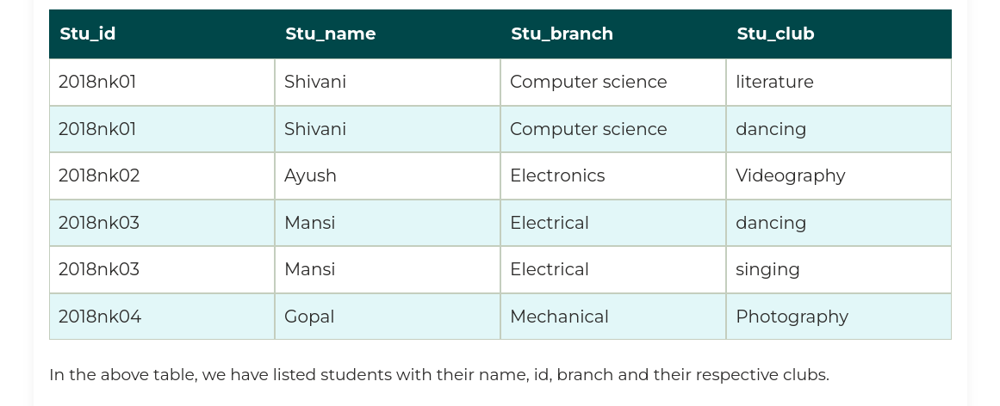
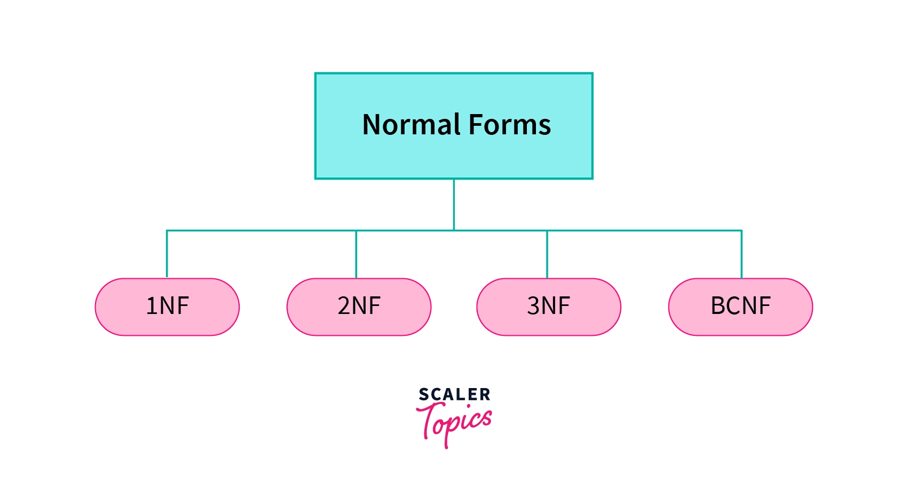

# Introduction to Normalization

## What is a Normalization?

**Normalization** is the process of organizing the data and the attributes of a database. It is performed to reduce the data redundancy in a database and to ensure that data is stored logically.

**Data redundancy in DBMS** means having the same data but at multiple places. It is necessary to remove data redundancy because it causes anomalies in a database which makes it very hard for a database administrator to maintain it.

## Why Do We Need Normalization?

Normalization is used to reduce data redundancy. It provides a method to remove the following anomalies from the database and bring it to a more consistent state:

**Updation / Update Anomaly**

In the above table, if Shivani changes her branch from Computer Science to Electronics, then we will have to update all the rows. If we miss any row, then Shivani will have more than one branch, which will create the update anomaly in the table.

**Insertion Anomaly**

If we add a new row for student Ankit who is not a part of any club, we cannot insert the row into the table as we cannot insert null in the column of stu_club. This is called insertion anomaly.

**Deletion Anomaly**

If we remove the photography club from the college, then we will have to delete its row from the table. But it will also delete the table of Gopal and his details. So, this is called deletion anomaly and it will make the database inconsistent.

!!! quote ""
    - Due to these anomalies, **DB size increases, and DB performance slows down.**
    - To rectify these anomalies, we use **`Normalization`**.

## Normal Forms

There are four types of normal forms that are usually used in relational databases.

