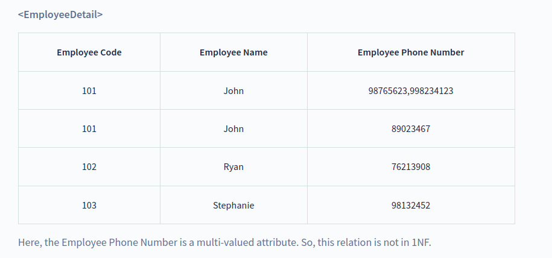
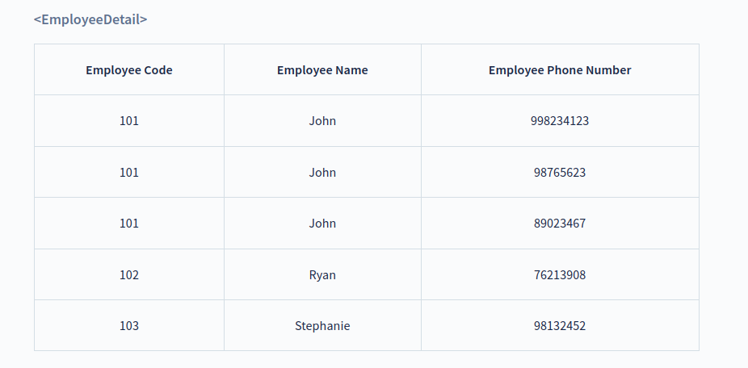

# Normal Forms

## First Normal Form (1NF)

A **relation** is in **1NF** if every attribute is a **single-valued attribute** or it does not contain any multi-valued or composite attribute, i.e., every attribute is an atomic attribute. If there is a composite or multi-valued attribute, it violates the 1NF. To solve this, we can create a new row for each of the values of the multi-valued attribute to convert the table into the 1NF.

Let’s take an example of a relational table `EmployeeDetail` that contains the details of the employees of the company.

To convert this table into 1NF, we make new rows with each Employee Phone Number as a new row as shown below:

