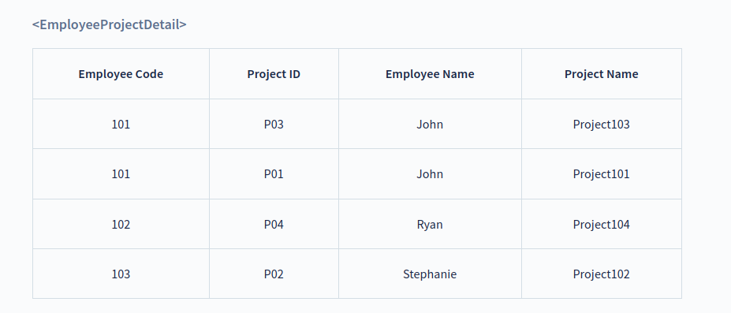
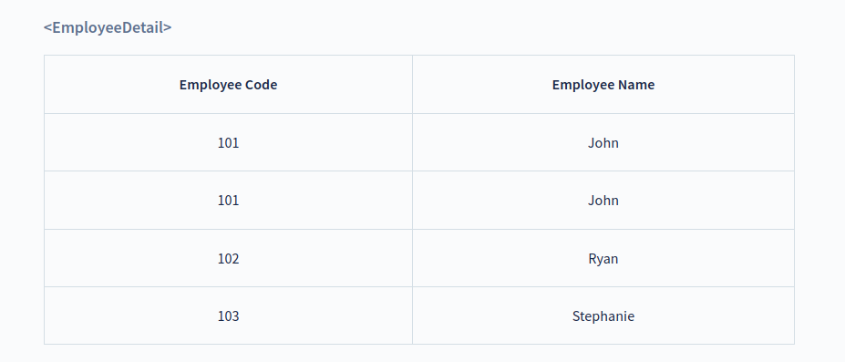
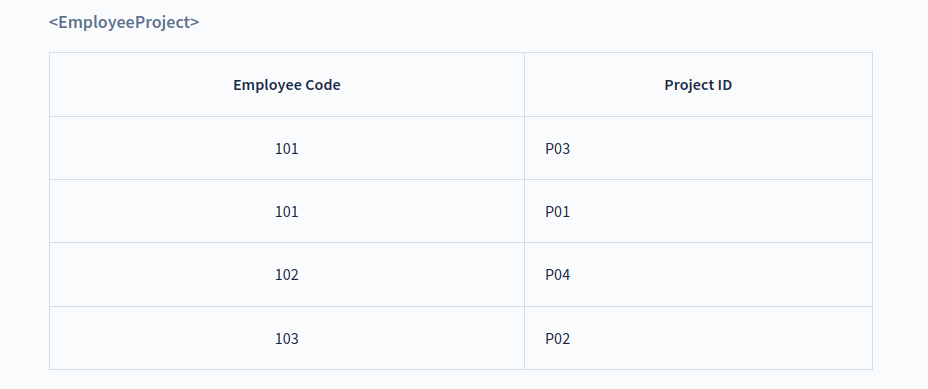
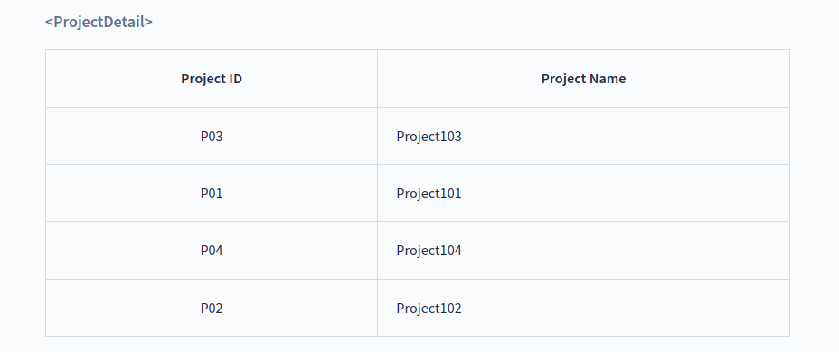

# Normal Forms

## Second Normal Form (2NF)

**The normalization** of 1NF relations to **2NF** involves the elimination of partial dependencies. A **partial dependency in DBMS** exists when any non-prime attributes, i.e., an attribute not a part of the primary key, is not fully functionally dependent on one of the primary keys.

* For a relational table to be in second normal form, it must satisfy the following rules:

    1. The table must be in first normal form.
    2. It must not contain any partial dependency, i.e., all non-prime attributes are fully functionally dependent on the primary key.

* If a partial dependency exists, we can divide the table to remove the partially dependent attributes and move them to some other table where they fit in well.

Let us take an example of the following `EmployeeProjectDetail` table to understand what is partial dependency and how to normalize the table to the second normal form:

??? tip "Explanation"
    In the above table, the **prime attributes** of the table are `Employee Code` and `Project ID`. We have partial dependencies in this table because `Employee Name` can be determined by `Employee Code` and `Project Name` can be determined by `Project ID`. Thus, the above relational table violates the rule of 2NF.

To remove partial dependencies from this table and normalize it into second normal form, we can decompose the `EmployeeProjectDetail` table into the following three tables:

Thus, we’ve converted the `EmployeeProjectDetail` table into 2NF by decomposing it into `EmployeeDetail`, `ProjectDetail` and `EmployeeProject` tables. The above tables satisfy the following two rules of 2NF as they are in 1NF and every non-prime attribute is fully dependent on the primary key.