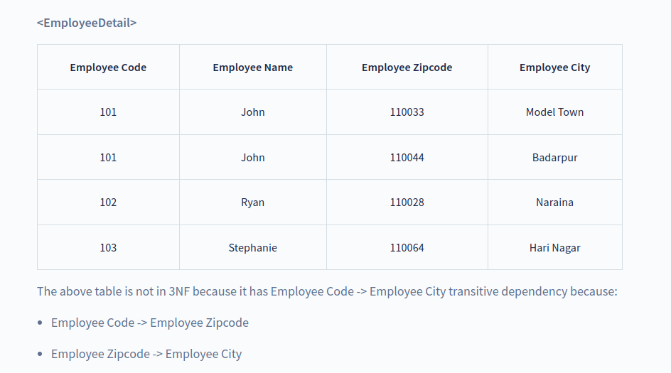
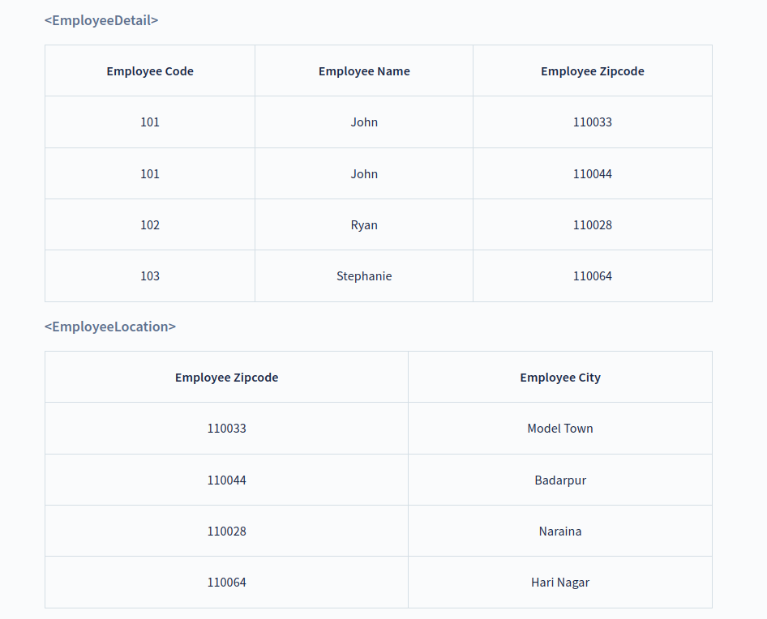

# Normal Forms

## Third Normal Form (3NF)

The normalization of 2NF relations to 3NF involves the elimination of **transitive dependencies in DBMS**.

* For a relational table to be in third normal form, it must satisfy the following rules:

    1. The table must be in the second normal form.
    2. No transitivity dependency exists.
        * If a non-primary attribute can be defined using another non-primary attribute then it is called a transitive dependency.

Let us take an example of the following `EmployeeDetail` table to understand what is transitive dependency and how to normalize the table to the third normal form:

??? tip "Explanation"
    In the above table, the **prime attribute** of the table is `Employee Code` and **non-prime attributes** are `Employee Name` , `Employee Zipcode` and `Employee City`. We have transitive dependencies in this table because `Employee City` can be determined by `Employee Zipcode` and both `Employee City` and `Employee Zipcode` are **non-prime attribute**. Thus, the above relational table violates the rule of 3NF.

To remove transitive dependency from this table and normalize it into the third normal form, we can decompose the `EmployeeDetail` table into the following two tables:

Thus, we’ve converted the `EmployeeDetail` table into 3NF by decomposing it into `EmployeeDetail` and `EmployeeLocation` tables as they are in 2NF and they don’t have any transitive dependency.

