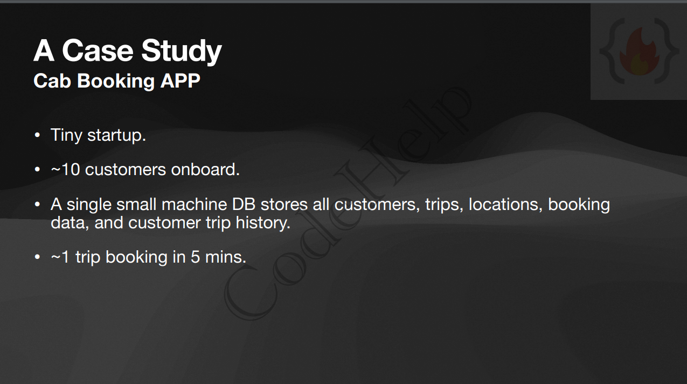
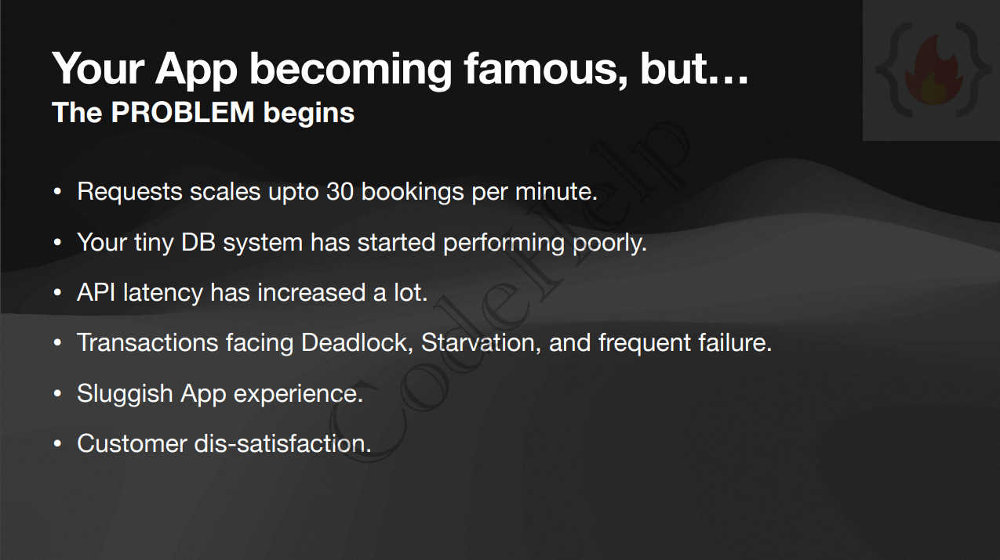
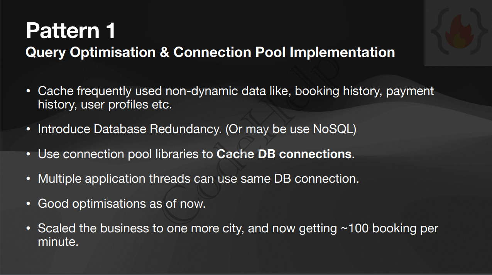
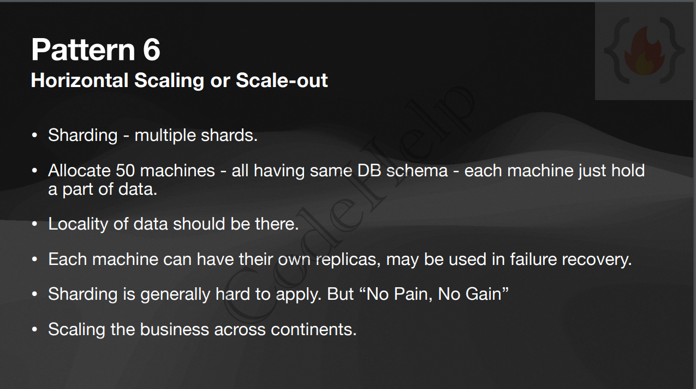
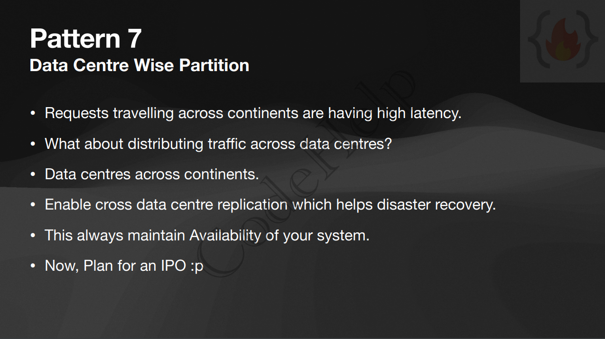

# Database Scaling Patterns

- step by step manner, when to choose which scaling option

---

## Case Study

---

## Pattern 1

---

## Pattern 2

---

## Pattern 3

---

## Pattern 4

---

## Pattern 5

---

## Pattern 6

---

## Pattern 7

