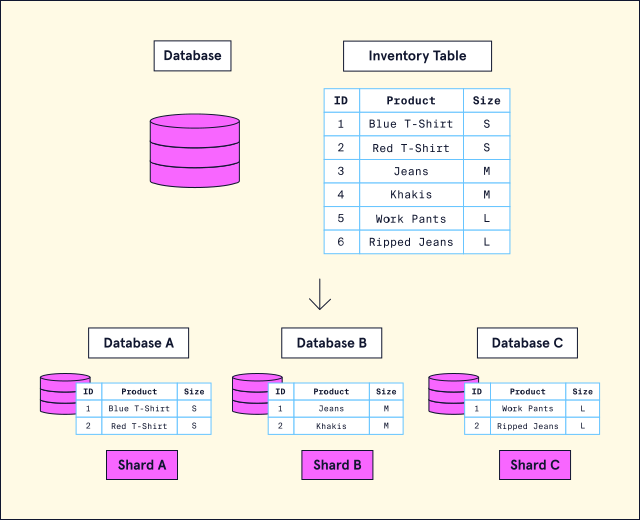
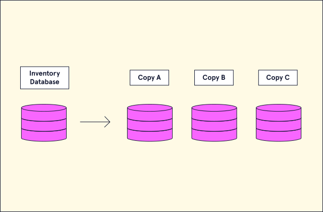

# Sharding & Replication

## Sharding

let’s explore **database sharding**. It is the process of splitting a single (usually large) dataset into various smaller chunks (known as shards) that are stored across multiple databases. Sharding is considered to be a horizontal scaling solution since it increases the number of database instances in a system.

For example, we wanted to shard a large dataset of clothing inventory for an e-commerce application, it might look like this :-

Note how the **inventory table** was broken up and spread across multiple machines hosting a database. In this case, the table was broken up by the size value, with all items of a particular size in its own database instance (aka a shard).

Now, we have a general overview of the concept of sharding, let’s explore the distinct advantages and disadvantages:

!!! success "Advantages"

    * **Increase in storage capacity:** By increasing the number of shards, the overall total storage capacity of a system is increased.

    * **Increased Availability:** Even if one shard goes offline, the majority of shards will still be available to retrieve and store data. This means only a portion of the overall dataset will be unavailable.

!!! bug "Disadvantages"

    * **Query overhead:** A database that has been sharded must have an independent machine or service that can properly route database queries to the appropriate shard. This increases latency and expense on every operation because if the query requires data from multiple shards, the router must query each shard and then merge the data.

    * **Administration complexity:** A database that has been sharded requires more upkeep and maintenance since there are now multiple machines with their own databases.

    * **Increased cost:** There is an inherent increase in cost because sharding requires more machines as well as computing power.

---

## Replication

**A replica set** is a group of database servers (nodes) that store copies of the same data. The purpose of a replica set is to provide `redundancy` and `high availability`.

**How It Works:**

* In a replica set, there is typically one primary node and one or more secondary nodes.

* `Primary Node` Handles all write operations. The changes are replicated to the secondary nodes.

* `Secondary Nodes` Act as backups, and if the primary node fails, one of the secondary nodes automatically becomes the new primary (called `failover`).

**Replication** is a scaling strategy where identical copies of a database are created on additional machines. If we return to our clothing inventory database, here is what the database architecture would look like using the replication strategy:

Now, we have a general overview of the concept of replication, let’s explore the distinct advantages and disadvantages:

!!! success "Advantages"

    * **Decreased load:** Due to data being replicated, queries can be spread across multiple databases. This reduces the likelihood that any single database will be overwhelmed with queries.

    * **Increased Availability:** With the same data being replicated on multiple servers; replication ensures that if one database goes down, the entire system can still be fully functional.

!!! bug "Disadvantages"

    * **Increased write complexity:** Write-focused queries (i.e., saving data to the database) increase complexity because the data must be copied to every replicated database instance to make sure each database stays in sync.

    * **Potential Data inconsistency:** Data that has been replicated that is either incorrect or out of date can lead to other machines part of the system being out of sync.

