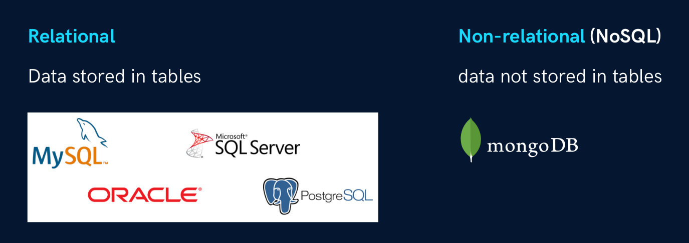

# Introduction to SQL

## What is a Database?

**Database** is an electronic place/system where data is stored in a way that it can be **easily accessed, managed, and updated.**

## What is DBMS?

A database management system **(DBMS)** is a software system for creating and managing databases. A DBMS enables end users to create, protect, read, update and delete data in a database.

## What is RDBMS?

* **RDBMS** (Relational Database Management System) is a DBMS based on the concept of tables (also called relations).
* Data is organized into tables (also known as relations) with rows (records) and columns (attributes).
* Eg - MySQL, PostgreSQL, Oracle etc.

## Types of Databases

### Relational Database

**A relational database** stores data in a table composed of rows and columns. The **table** represents an object or entity, such as users, customers, orders, etc.

### Non-Relational database

**Non-relational databases** different from relational databases because they do not store data in tabular form.

## What is SQL?

**SQL** is Structured Query Language used to store, manipulate and retrieve data from RDBMS.

**Note** 
1. It is not a database, it is a language used to interact with database. 
2. SQL keywords are **NOT** case sensitive. Eg:- **select** is the same as **SELECT** in SQL.

**We use SQL for CRUD Operations :-** 
1. **CREATE -** To create databases, tables etc... 
2. **READ -** To read data present in the database. 
3. **UPDATE -** Modify already inserted data. 
4. **DELETE -** Delete database, table or specific data point/tuple/row or multiple rows.

## SQL v/s MySQL
SQL is a language used to perform CRUD operations in Relational DB, while MySQL is a
RDBMS that uses SQL.

