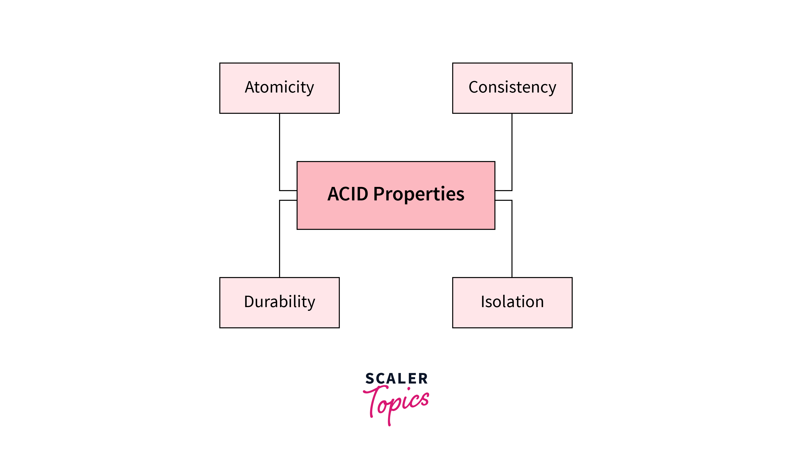

# ACID properties in DBMS

## What are ACID Properties?

**ACID properties** are a set of properties that guarantee reliable processing of transactions in a database management system (DBMS). Transactions are a sequence of database operations that are executed as a single unit of work, and the ACID properties ensure that transactions are processed reliably and consistently in a DBMS.

* The **Atomicity** property ensures that a transaction is either executed completely or not at all.
* The **Consistency** property ensures that the database remains in a consistent state before and after a transaction.
* The **Isolation** property ensures that multiple transactions can run concurrently without interfering with each other.
* The **Durability** property ensures that the results of a committed transaction are permanent and cannot be lost due to system failure.

Together, these properties ensure that transactions are processed reliably and consistently in a DBMS, which is essential for the integrity and accuracy of data in a database.

### 1. Atomicity

The term **atomicity** means if any operation on the data is conducted, it should either be executed completely or not at all. It also implies that the operation should not be interrupted or just half completed. When performing operations on a transaction, the operation should be completed totally rather than partially. If any of the operations aren’t completed fully, the transaction gets aborted.

### 2. Consistency

This ACID Property will verify the total sum of seats left in the train + sum of seats booked by users = total the number of seats present in the train. After each transaction, consistency is checked to ensure nothing has gone wrong.

### 3. Isolation

This property ensures that multiple transactions can occur concurrently without leading to the inconsistency of the database state. Transactions occur independently without interference. Changes occurring in a particular transaction will not be visible to any other transaction until that particular change in that transaction is written to memory or has been committed.

### 4. Durability

The **durability** property states that once the execution of a transaction is completed, the modifications and updates on the database gets written on and stored in the disk. These persist even after the occurrence of a system failure. Such updates become permanent and get stored in non-volatile memory. Thus, the effects of this transaction are never lost.
