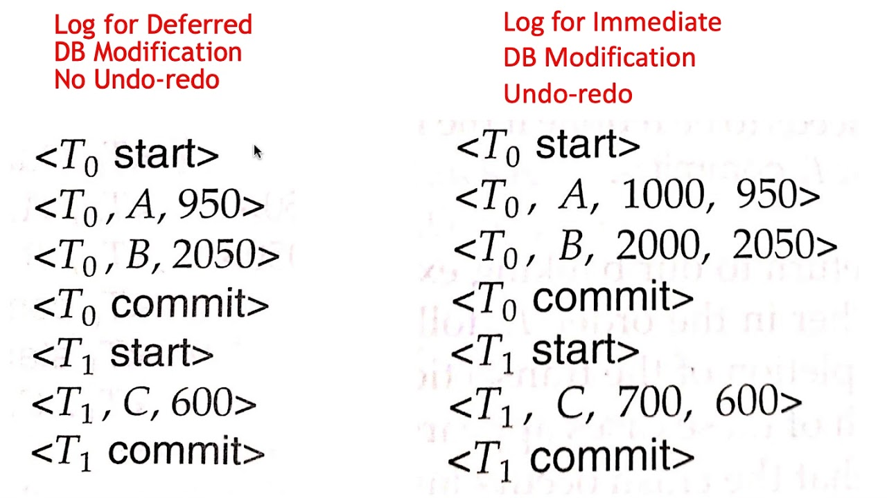

# Implement Atomicity & Durability in Transactions

!!! quote ""

    **Atomicity:** By this property, we mean that the entire transaction takes place at once or it does not take place at all. There is no midway. This means that transactions do not occur partially. Either all the changes made by a transaction are committed to the database or none of them are committed.

!!! quote ""

    **Durability:** By this property, we mean that once a transaction has completed execution its effects persist even in case of system failure. The changes made by the transaction should be stored permanently in the system.

## Methods to Implement Atomicity and Durability

### 1. Shadow Copy Scheme

This scheme is based on making copies of the **Database**. These copies of Databases are also known as Shadow Copies. Suppose there is an active transaction T1. Now, A pointer called Db_pointer is maintained on the disk, which points to the current copy of the Database. The transaction T1 that want to update the Database will first create a complete copy of the Database. All further operations are done on new copy and leave that original copy untouched.

If at any point transaction T1 is aborted, then system delete new copy and the old copy is not affected. It remain untouched.

if Transaction T1 success then OS (**Operating System**) will make sure that all the pages of new copy of Database are written in the disk. Database system update Db_pointer to point to the new copy of Database. Now, new copy will become current copy of Database. Also old copy of Database will be deleted. Transaction T1 is said to committed only if updated Db-pointer is written on disk.

!!! success "How Atomicity is Maintained in Shadow Copy Scheme?"

    If transaction T1 fails any time before Db_pointer is updated, the old content of Database are not affected. Transaction T1 abort can be done by deleting the new copy of Database. So, here either all changes are reflected or none. In this way Atomicity is maintained in this scheme.

!!! success "How Durability is Maintained in Shadow Copy Scheme?"

    Let’s suppose, system fails at any time before the updated pointer is written to disk. When system start again, it will try to read the Database pointer (Db_pointer) and thus see the original content of Database. No effects of Transaction T1 will be visible. Transaction T1 is assumed to be successful only when Db_pointer is updated. If system fails after Db_pointer update then before that all the pages of new copy were written on disk. So, When system start again then it will read the new Database copy.

---

### 2. Log-Based recovery method

* log is a sequence of records.
* Log of each transaction is maintained in some stable storage so that if any failure occurs, then it can be recovered from there.
* If any operation is performed on the database, then it will be recorded in the log.
* But the process of storing the logs should be done before the actual transaction is applied in the database.
* Stable storage is a classification of computer data storage technology that guarantees atomicity for any given write operation and allows software to be written that is robust against some hardware and power failures.

**There are two types of log-based recovery methods, these are :-**

!!! tip "1. Deferred DB Modifications"
    In this method, We ensure Atomicity by recording all the updates or modifications in the log but we deferr the execution of all the write operations until the final action of Transation T1 has been executed or T1 has been committed. Then information in log is used to execute deffered writed when Transaction T1 is completed. If system crashes before completion of T1 or if T1 is aborted then the information in the logs is ignored. If Transaction T1 is completed then the records associated to it in its log file are used to execute the **deferred writes. We will perform redo if failure occure duing updation.**

    **Example:** Consider a Transaction where we are transferring 50 rupees from A(having Rs 2000) to B(having Rs 3000) then in deferred modification its log will be maintained as

    

!!! tip "2. Immediate DB modifications"

    In this method, Database modifications to be done to Database while Transaction T1 is in active state. Database modifications written by active Transaction T1 called uncommitted modifications. When any of system crash or failure occure then system uses old value field of the logs to restore the modified values. Update take place only after log records in a stable storage. If system fails before T1 completes or if T1 is aborted then old value field in log table is used to undo T1. If T1 completes and then system crashes then new value field in log table is used to redo T1.

    **Example:** Consider a Transaction where we are transferring 50 rupees from A(having Rs 2000) to B(having Rs 3000) then in deferred modification its log will be maintained as

    

---

### Difference between the two (`Deferred Vs Immediate`)

!!! info ""
    - **Deferred** logs what it will do, and but the updates to DB are not done immediately, but rather stored in buffer. Once the whole process is over, it will go one by one over the logs, and actually execute. If before the update were committed, system crashed, means, nothing could be updated in DB. In that case, it will restart executing the logs.

!!! info ""
    - **Immediate** logs will log what it will do, then does that, and proceeds like this. If the system crashes before the execution could finish or commit, when the system will restart, it will backtrack the logs and undo the operations. In case it logged committed, but before committing, system crashed, it will redo the operations based on logs.

- **Deferred** only read the current state, whereas **Immediate** logs also store the previous and new value (helpful in case of backtrack (rollup)).
