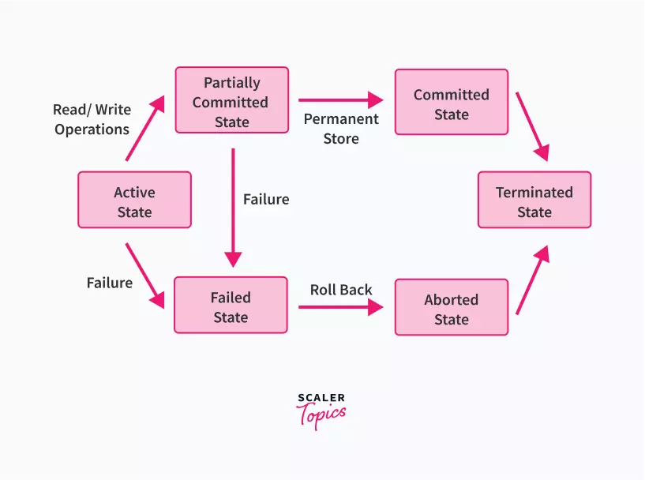

# Transaction in DBMS

## What is Transaction in DBMS?

**Transactions** in Database Management Systems (DBMS) are sets of operations performed to modify data, including insertion, updates, or deletions.These transactions have various states indicating their progress and required actions. They ensure data consistency even during system failures, demonstrating a key advantage of DBMS.

## Operations in Transaction

A certain set of **operations** takes place when a transaction is done that is used to perform some logical set of operations. For example: When we go to withdraw money from ATM, we encounter the following set of operations:

1. Transaction Initiated
2. You have to insert an ATM card
3. Select your choice of language
4. Select whether savings or current account
5. Enter the amount to withdraw
6. Entering your ATM pin
7. Transaction processes
8. You collect the cash
9. You press finish to end transaction

The above mentioned are the set of operations done by you. But in the case of a transaction in DBMS there are **three major operations** that are used for a transaction to get executed in an efficient manner. These are:

1. Read/ Access Data 
2. Write/ Change Data 
3. Commit

:bell: :anguished: Let's understand the above three sets of operations in a transaction with a real-life example of transferring money **from Account1 to Account2**.

**Initial balance in both the banks before the start of the transaction**

`Account1 - ₹ 5000 Account2 - ₹ 2000`

This data before the start of the transaction is stored in the secondary memory (Hard disk) which once initiated is bought to the primary memory (RAM) of the system for faster and better access.

Now for a transfer of ₹ 500 from Account1 to Account2 to occur, the following set of operations will take place.

`Read (Account1) --> 5000 Account1 = Account1 - 500 Write (Account1) --> 4500 Read (Account2) --> 2000 Account2 = Account2 + 500 Write (Account2) --> 2500 commit`

**The COMMIT statement permanently saves the changes made by the current transaction. When a transaction is successful, COMMIT is applied.** If the system fails before a COMMIT is applied, the transaction reaches its previous state after ROLLBACK.

After commit operation the transaction ends and updated values of Account1 = ₹ 4500 and Account2 = ₹ 2500. **Every single operation that occurs before the commit is said to be in a partially committed state and is stored in the primary memory (RAM).** After the transaction is committed, the updated data is accepted and updated in the secondary memory (Hard Disk).

If in some case, the transaction failed anywhere before committing, then that transaction gets aborted and have to start from the beginning as it can’t be continued from the previous state of failure. This is known as Roll Back. :::

## Transaction States in DBMS

During the lifetime of a transaction, there are a lot of states to go through. These states update the operating system about the current state of the transaction and also tell the user about how to plan further processing of the transaction.

**The ROLLBACK statement undo the changes made by the current transaction. A transaction cannot undo changes after COMMIT execution.**

### Following are the different types of transaction States :

1. **Active State:** When the operations of a transaction are running then the transaction is said to be active state.

2. **Partially Committed:**  If all the read and write operations are performed without any error then it progresses to the partially committed state.

3. **Failed State:** If any operation during the transaction fails due to some software or hardware issues, then it goes to the failed state.

4. **Aborted State:** If the transaction fails during its execution, it goes from failed state to aborted state and because in the previous states all the changes were only made in the main memory, these uncommitted changes are either deleted or rolled back. The transaction at this point can restart and start afresh from the active state.

5. **Committed State:** We can say that a transaction is committed in case it actually executes all of its operations successfully. In such a case, all of its effects are now established permanently on the DB system.

6. **Terminated State:** This is the final stage of a transaction's life cycle. The transaction finally enters the terminated state when its life cycle is completed after having been in the committed or aborted stage.

