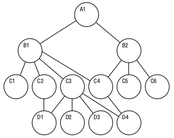

# Network Databases

## Network Databases

!!! info ""
    - Extension of Hierarchical databases
    - The child records are given the freedom to associate with multiple parent records.
    - Organized in a Graph structure.
    - Can handle complex relations.
    - Maintenance is tedious.
    - M:N links may cause slow retrieval.
    - Not much web community support.
    - e.g., Integrated Data Store (IDS), IDMS (Integrated Database Management System), Raima Database Manager, TurboIMAGE etc.

