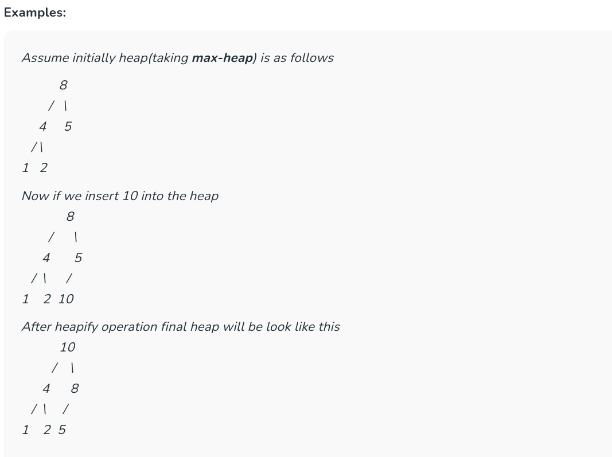
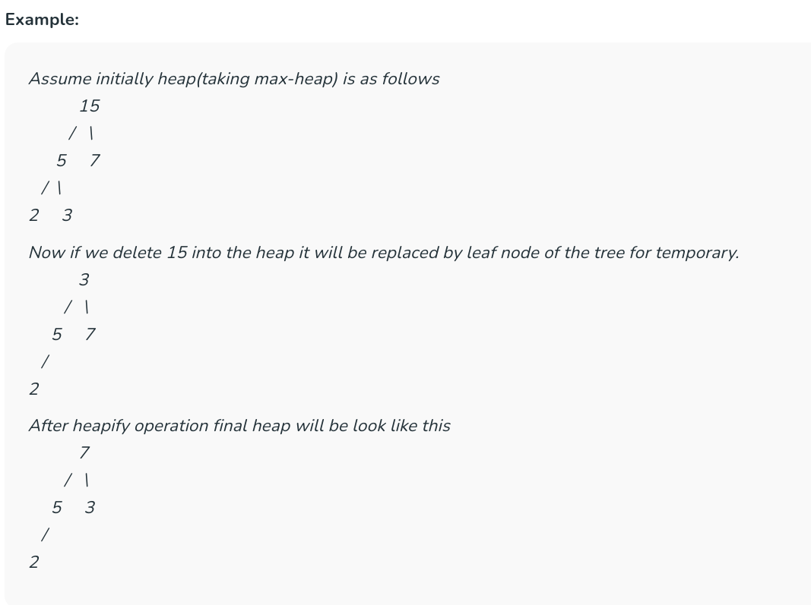

# Introduction to Heaps/Priority Queues


## What is Heap Data Structure?

A **Heap** is a complete binary tree data structure that satisfies the heap property: for every node, the value of its children is less than or equal to its own value.\


Heaps are usually used to implement priority queues, where the smallest (or largest) element is always at the root of the tree.


## Types of Heaps

There are two main types of heaps:

* **Max Heap:** The root node contains the maximum value, and the values decrease as you move down the tree.
* **Min Heap:** The root node contains the minimum value, and the values increase as you move down the tree.


## Heap Data Structure Applications

Heaps have various applications, like:

* Heaps are commonly used to implement **priority queues**, where elements are retrieved based on their priority (maximum or minimum value).
* Heapsort is a **sorting algorithm** that uses a heap to sort an array in ascending or descending order.
* Heaps are used in graph algorithms like **Dijkstra’s algorithm** and **Prim’s algorithm** for finding the shortest paths and minimum spanning trees.


## Operations Supported by Heap:


Operations supported by **min – heap** and **max – heap** are same. The difference is just that min-heap contains minimum element at root of the tree and max – heap contains maximum element at the root of the tree.


### Heapify:


It is the process to rearrange the elements to maintain the property of heap data structure. It is done when a certain node creates an imbalance in the heap due to some operations on that node. It takes **O(log N)** to balance the tree. 

* For **max-heap,** it **balances** in such a way that the maximum element is the root of that binary tree and 
* For **min-heap,** it balances in such a way that the minimum element is the root of that binary tree.


### Insertion:


If we insert a new element into the heap since we are adding a new element into the heap so it will distort the properties of the heap so we need to perform the heapify operation so that it maintains the property of the heap.

This operation also takes **O(logN)** time.





??? info "Insertion code for max-heap"


    ```cpp

    #include <iostream>
    using namespace std;

    class Heap{
        public:

        int arr[100];
        int size = 0;

        Heap(){
            arr[0] = -1;
        }

        void insert(int val){

            size++;
            int index = size;
            arr[index] = val;
            
            while(index > 1){
                int parent = index/2;
                if(arr[parent] < arr[index]){
                    swap(arr[parent],arr[index]);
                    index = parent;
                }
                else{
                    return;
                }
            }
        }

        void print(){
            for(int i = 1 ; i <= size ; i++){
                cout<<arr[i]<<" ";
            }
            cout<<endl;
        }

    };

    int main(){

        Heap h;

        h.insert(8);
        h.insert(4);
        h.insert(5);
        h.insert(1);
        h.insert(2);
        h.insert(10);

        h.print();

    }


    ```


### Deletion:

If we delete the element from the heap it always deletes the root element of the tree and replaces it with the last element of the tree.

Since we delete the root element from the heap it will distort the properties of the heap so we need to perform heapify operations so that it maintains the property of the heap. 


It takes **O(logN)** time.





??? info "Deletion code for max-heap"

    ```cpp


    #include <iostream>
    using namespace std;

    class Heap{
        public:

        int arr[100];
        int size;

        Heap(){
            arr[0] = -1;
            size = 0;
        }

        void insert(int val){

            size++;
            int index = size;
            arr[index] = val;
            
            while(index > 1){
                int parent = index/2;
                if(arr[parent] < arr[index]){
                    swap(arr[parent],arr[index]);
                    index = parent;
                }
                else{
                    return;
                }
            }
        }

        void deletion(){
            if(size == 0){
                cout<<"Nothing to delete..."<<endl;
                return;
            }

            swap(arr[size],arr[1]);
            size--;

            int idx = 1;
            while(idx < size){
                int leftIdx = 2*idx;
                int rightIdx = 2*idx+1;
                if(leftIdx < size && arr[idx] < arr[leftIdx]){
                    swap(arr[idx],arr[leftIdx]);
                    idx = leftIdx;
                }
                else if(rightIdx < size && arr[idx] < arr[rightIdx]){
                    swap(arr[idx],arr[rightIdx]);
                    idx = rightIdx;
                }
                else{
                    return;
                }
            }
        }

        void print(){
            for(int i = 1 ; i <= size ; i++){
                cout<<arr[i]<<" ";
            }
            cout<<endl;
        }

    };

    int main(){

        Heap h;

        h.insert(15);
        h.insert(5);
        h.insert(7);
        h.insert(2);
        h.insert(3);

        h.deletion();

        h.print();

    }


    ```


### getMax (For max-heap) or getMin (For min-heap):


It finds the maximum element or minimum element for **max-heap** and **min-heap** respectively and as we know minimum and maximum elements will always be the root node itself for min-heap and max-heap respectively. It takes **O(1)** time.


