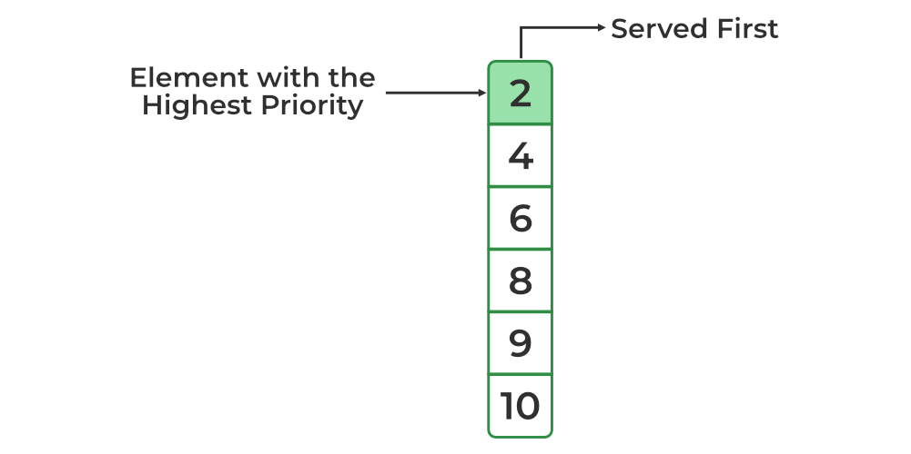
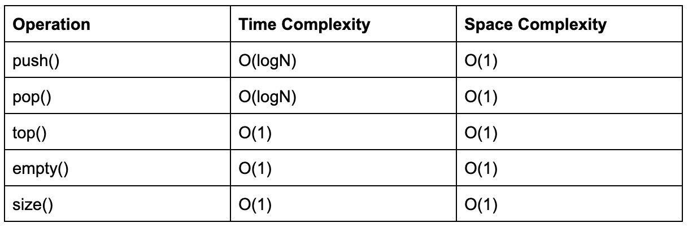

# Priority Queue

## Priority Queue in C++ Standard Template Library (STL)


A **C++ priority queue** is a type of **container adapter**, specifically designed such that the first element of the queue is either the greatest or the smallest of all elements in the queue, and elements are in non-increasing or non-decreasing order (hence we can see that each element of the queue has a priority **{fixed order}**).


## How to create a max heap for the priority queue?

```cpp

priority_queue<int> pq;


```


---

## How to create a min heap for the priority queue?

```cpp

priority_queue <int, vector<int>, greater<int>> pq;


```




---


## Operations on Priority Queue With Complexities




