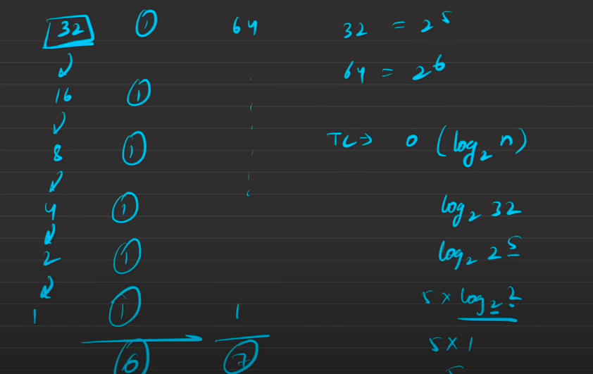

# Introduction to Binary Search


## What is Binary Search Algorithm?

**Binary search** is a search algorithm used to find the position of a **target** value within a **sorted array**. It works by repeatedly dividing the search interval in half until the target value is found or the interval is empty. The search interval is halved by comparing the target element with the middle value of the search space.


## Conditions to apply Binary Search Algorithm :

* The data structure must be **sorted**.
* Access to any element of the data structure takes constant time.


## How to Implement Binary Search Algorithm?

The **Binary Search Algorithm** can be implemented in the following two ways

* Iterative Binary Search Algorithm
* Recursive Binary Search Algorithm


## Iterative Binary Search Algorithm

```cpp

int binarySearch(int arr[], int low, int high, int target){

    while (low <= high) {

        int mid = low + (high - low) / 2;

        // Check if target is present at mid
        if (arr[mid] == target)
            return mid;

        // If target greater, ignore left half
        if (arr[mid] < target)
            low = mid + 1;

        // If target is smaller, ignore right half
        else
            high = mid - 1;
    }

    // If we reach here, then element was not present
    return -1;
}


```


## Recursive Binary Search Algorithm

```cpp

int binarySearch(int arr[], int low, int high, int target){

    //Base case
    if (low > high) return -1;

    // Perform the steps
    int mid = (low + high) / 2;

    if (arr[mid] == target){
        return mid;
    }
    else if (target > arr[mid])
        return binarySearch(arr, mid + 1, high, target);

    return binarySearch(arr, low, mid - 1, target);

}


```

---


## Time Complexity



* **Best Case** :- O(1)
* **Average Case** :- O(log N)
* **Worst Case** :- O(log N)


## Space Complexity


* **Auxiliary Space** :- O(1)
