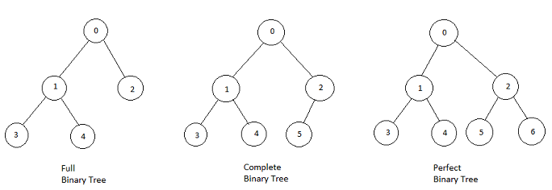
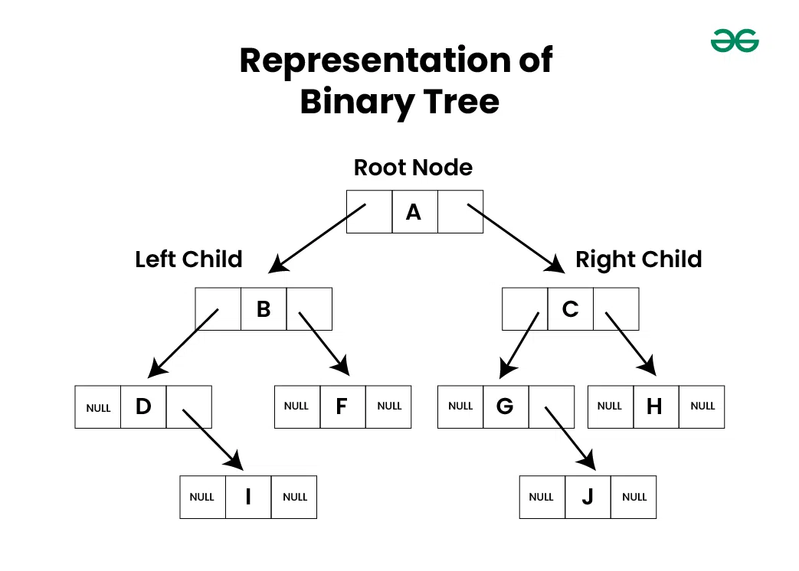

# Introduction to Binary Tree


## What is Binary Tree?

**Binary tree** is a **non-linear data structure** in which each node can have **at most two children** which are referred to as the **left child** and the **right child**.


## Types of Binary Tree

1. Full Binary Tree

    * A full binary tree is a binary tree with either zero or two child nodes for each node.

2. Complete Binary Tree
    
    * A complete binary tree is a special type of binary tree where all the levels of the tree are filled completely except the lowest level nodes which are filled from as left as possible.

3. Perfect Binary Tree

    * All leaf nodes are at the same depth. In a perfect binary tree, all leaf nodes are at the maximum depth of the tree. This means that the tree is completely filled with no gaps.

4. Balanced Binary Tree

    * A binary tree is balanced if the height of the tree is O(Log n) where n is the number of nodes.





## Representation of Binary Tree

Each node in a Binary Tree has three parts:

* Data
* Pointer to the left child
* Pointer to the right child





### Implementation


??? abstract "See the code"

    ```cpp

    #include <bits/stdc++.h>
    using namespace std;

    class Node{

        public:
        int data;
        Node* left;
        Node* right;
        Node(int x){
            this ->data = x;
            this ->left = NULL;
            this ->right = NULL;
        }
    };

    Node* Construct_tree(vector<int> arr){

        if(arr.empty()){
            return NULL;
        }

        queue<Node*> q;
        int index = 1;

        Node* root = new Node(arr[0]);
        q.push(root);

        while(!q.empty()){

            Node* t = q.front();
            q.pop();
            
            if(index < arr.size() && arr[index] != -1){
                Node* ln = new Node(arr[index]);
                t ->left = ln;
                q.push(t ->left);
            }
            index++;

            if(index < arr.size() && arr[index] != -1){
                Node* rn = new Node(arr[index]);
                t ->right = rn;
                q.push(t ->right);
            }
            index++;
        }

        return root;
    }

    void display(Node* root){

        if(root == NULL){
            return;
        }

        string str = "";
        str += root ->left == NULL ? "." : to_string(root ->left ->data) + "";
        str += "<--" + to_string(root ->data) + "-->";
        str += root ->right == NULL ? "." : to_string(root ->right ->data) + "";

        cout<<str<<endl;

        display(root ->left);
        display(root ->right);
    }


    int main(){

        vector<int> arr = {50, 25, 75, 12, 37, 62, 87, -1, -1, 30, -1, -1, 70, -1, -1};

        Node* root = Construct_tree(arr);
        display(root);

        cout<<endl;

    }

    ```


---

**GFG Practice question link is below** 🥈 🥇

* <a href="https://www.geeksforgeeks.org/problems/binary-tree-representation/1?utm_source=youtube&utm_medium=collab_striver_ytdescription&utm_campaign=binary-tree-representation" target="_blank">Binary Tree Representation (gfg)</a>
