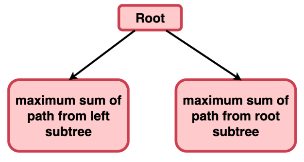
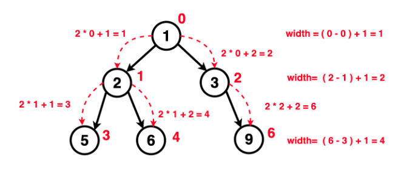

# Questions

💡 First try with yourself, if you are unable to do the question then see the solution.


??? tip "Binary Tree Maximum Path Sum"

    * <a href="https://leetcode.com/problems/binary-tree-maximum-path-sum/description/" target="_blank">Binary Tree Maximum Path Sum (leetcode)</a>


    ---

    **Algorithm / Intuition**

    * To find the **diameter** of a binary tree, we can think of every node as a potential **Curving Point** of the path along which we find the **sum**. The maximum sum of a path through a turning point (like a curve) can be **found** by adding the **maximum sum** achievable in **the left subtree, the right subtree**, and the value of the **turning point**.


        


        * **Base Case:** When the current node is null which indicates the end of a path or a lead node, we return the maximum path sum as 0.

        * **Recursive Function:**

            * Calculate the maximum path sum for the **left and right** subtrees by making recursive calls to the left and right child of the current node.
            * Calculate the **maximum** path sum when the **current node** serves as the **turning point**: Maximum Path Sum when Current Node is Turning Point = Maximum Path Sum of Left Subtree + Maximum Path Sum of Right Subtree + Current Value of Node
            * Update the overall maximum path sum **(maxi)** by considering the sum of the current node and the **left and right subtree sums**.
            * Return the **maximum sum** considering only one branch **(either left or right)** along with the value of the **current node** as the maximum sum up until this node.


    ---

    ```cpp

    class Solution {
        public:
        int solver(TreeNode* root , int &maxi){

            if(root == NULL){
                return 0;
            }

            int l_sum = max(0 , solver(root ->left , maxi));
            int r_sum = max(0 , solver(root ->right , maxi));

            maxi = max(maxi , (l_sum+r_sum+root ->val));

            return root ->val + max(l_sum , r_sum);
        }

        int maxPathSum(TreeNode* root) {

            int maxi = INT_MIN;
            solver(root , maxi);
            return maxi;
        }
    };

    ```


??? tip "Vertical Order Traversal of a Binary Tree"

    * <a href="https://leetcode.com/problems/vertical-order-traversal-of-a-binary-tree/description/" target="_blank">Vertical Order Traversal of a Binary Tree (leetcode)</a>


    ---

    **Before** doing this problem **go through** the problem like **(Top View of Binary Tree , Bottom View of Binary Tree)** which is available in **First Important Questions List**. 🔥

    ---


    ```cpp

    class Solution {
        public:
        vector<vector<int>> verticalTraversal(TreeNode* root) {
            
            vector<vector<int>> ans;
            if(root == NULL){
                return ans;
            }

            // vertex , level , datas
            map<int,map<int,multiset<int>>> mp;

            // node , vertex , level
            queue<pair<TreeNode*,pair<int,int>>> q;
            q.push({root,{0,1}});

            while(!q.empty()){
                auto it = q.front();
                q.pop();
                TreeNode* node = it.first;
                int line = it.second.first;
                int level = it.second.second;
                mp[line][level].insert(node ->val);

                if(node ->left){
                    q.push({node ->left,{line-1,level+1}});
                }
                if(node ->right){
                    q.push({node ->right,{line+1,level+1}});
                }
            }

            for(auto p : mp){
                vector<int> temp;
                for(auto q : p.second){
                    multiset<int> st = q.second;
                    for(auto it : st){
                        temp.push_back(it);
                    }
                }
                ans.push_back(temp);
            }
            return ans;
        }
    };


    ```


??? tip "Maximum Width of Binary Tree"

    * <a href="https://leetcode.com/problems/maximum-width-of-binary-tree/description/" target="_blank">Maximum Width of Binary Tree (leetcode)</a>

    ---

    **Algorithm / Intuition**

    * Start by **assigning** an **index** to the **root node as 0**. For each level, the **left child** gets an index equal to **(2 * parent index +1)**, and the **right child** gets an index equal to **(2 * parent index + 2)**. Using a **level order traversal**, we use the **leftmost and rightmost** nodes at each level and using their **indices**, get the **width** at that level. Keep **track** of the **maximum width** encountered during the **traversal**. Whenever a **wider** level is found, update the **maximum width**.


    

    ---

    ```cpp

    class Solution {
        public:
        int widthOfBinaryTree(TreeNode* root) {

            if(root == NULL){
                return 0;
            }
            
            long long ans = 0;
            queue<pair<TreeNode*,int>> q;
            q.push({root,0});
            while(!q.empty()){
                
                long long start = q.front().second;
                long long end = q.back().second;
                ans = max(ans,(end-start+1));
                int N = q.size();
                for(int i = 0 ; i < N ; i++){
                    TreeNode* node = q.front().first;
                    long long idx = q.front().second;
                    q.pop();
                    if(node ->left){
                        q.push({node ->left,2*idx+1});
                    }
                    if(node ->right){
                        q.push({node ->right,2*idx+2});
                    }
                }
            }
            return ans;
        }
    };


    ```


??? tip "All Nodes Distance K in Binary Tree"

    * <a href="https://leetcode.com/problems/all-nodes-distance-k-in-binary-tree/description/" target="_blank">All Nodes Distance K in Binary Tree (leetcode)</a>

    ---

    💯 🥇 **Think about storing parent of child node, because we need to go from child to parent in some cases.**

    ---


    ```cpp

    class Solution {
        public:
        void helper(TreeNode* root , map<TreeNode*,TreeNode*> &parent){

            queue<TreeNode*> q;
            q.push(root);
            while(!q.empty()){

                int N = q.size();
                for(int i = 0 ; i < N ; i++){
                    TreeNode* node = q.front();
                    q.pop();
                    if(node ->left){
                        q.push(node ->left);
                        parent[node ->left] = node;
                    }
                    if(node ->right){
                        q.push(node ->right);
                        parent[node ->right] = node;
                    }
                }
            }
        }

        vector<int> distanceK(TreeNode* root, TreeNode* target, int k) {
            
            map<TreeNode*,TreeNode*> parent;
            helper(root , parent);

            map<TreeNode*,bool> vis;
            int count = 0;
            queue<TreeNode*> q;
            q.push(target);
            while(!q.empty()){

                int N = q.size();
                if(count == k){
                    break;
                }
                
                for(int i = 0 ; i < N ; i++){
                    TreeNode* node = q.front();
                    q.pop();

                    vis[node] = true;

                    if(node ->left && vis[node ->left] == false){
                        q.push(node ->left);
                        vis[node ->left] = true;
                    }
                    if(node ->right && vis[node ->right] == false){
                        q.push(node ->right);
                        vis[node ->right] = true;
                    }
                    if(parent[node] && vis[parent[node]] == false){
                        q.push(parent[node]);
                        vis[parent[node]] = true;
                    }
                }
                count++;
            }

            vector<int> ans;
            while(!q.empty()){
                ans.push_back(q.front() ->val);
                q.pop();
            }

            return ans;
        }
    };


    ```


---

🥇 🥇 🥇


### Other Important Questions List

??? tip "1. Important Questions List"


    * <a href="https://leetcode.com/problems/maximum-depth-of-binary-tree/" target="_blank">Maximum Depth of Binary Tree (leetcode)</a>


    * <a href="https://leetcode.com/problems/balanced-binary-tree/description/" target="_blank">Balanced Binary Tree (leetcode)</a>


    * <a href="https://leetcode.com/problems/diameter-of-binary-tree/" target="_blank">Diameter of Binary Tree (leetcode)</a>


    * <a href="https://leetcode.com/problems/same-tree/description/" target="_blank">Same Tree (leetcode)</a>


    * <a href="https://leetcode.com/problems/binary-tree-zigzag-level-order-traversal/" target="_blank">Binary Tree Zigzag Level Order Traversal (leetcode)</a>


    * <a href="https://www.geeksforgeeks.org/problems/boundary-traversal-of-binary-tree/1?itm_source=geeksforgeeks&itm_medium=article&itm_campaign=bottom_sticky_on_article" target="_blank">Boundary Traversal of binary tree (gfg)</a>


    * <a href="https://leetcode.com/problems/vertical-order-traversal-of-a-binary-tree/description/" target="_blank">Vertical Order Traversal of a Binary Tree (leetcode)</a>


    * <a href="https://www.geeksforgeeks.org/problems/top-view-of-binary-tree/1" target="_blank">Top View of Binary Tree (gfg)</a>


    * <a href="https://www.geeksforgeeks.org/problems/bottom-view-of-binary-tree/1" target="_blank">Bottom View of Binary Tree (gfg)</a>


    * <a href="https://www.geeksforgeeks.org/problems/left-view-of-binary-tree/1" target="_blank">Left View of Binary Tree (gfg)</a>


    * <a href="https://leetcode.com/problems/binary-tree-right-side-view/" target="_blank">Binary Tree Right Side View (leetcode)</a>


    * <a href="https://leetcode.com/problems/symmetric-tree/description/" target="_blank">Symmetric Tree (leetcode)</a>


??? tip "2. Important Questions List"


    * <a href="https://www.geeksforgeeks.org/problems/root-to-leaf-paths/1?utm_source=youtube&utm_medium=collab_striver_ytdescription&utm_campaign=root-to-leaf-paths" target="_blank">Root to Leaf Paths (gfg)</a>


    * <a href="https://leetcode.com/problems/lowest-common-ancestor-of-a-binary-tree/description/" target="_blank">Lowest Common Ancestor of a Binary Tree (leetcode)</a>


    * <a href="https://www.geeksforgeeks.org/problems/children-sum-parent/1?utm_source=youtube&utm_medium=collab_striver_ytdescription&utm_campaign=hildren-sum-parent" target="_blank">Check for Children Sum Property in a Binary Tree (gfg)</a>


    ---

    This problem's logic is same as **All Nodes Distance K in Binary Tree**

    * <a href="https://www.geeksforgeeks.org/problems/children-sum-parent/1?utm_source=youtube&utm_medium=collab_striver_ytdescription&utm_campaign=hildren-sum-parent" target="_blank">Check for Children Sum Property in a Binary Tree (gfg)</a>

    ---

    * <a href="https://leetcode.com/problems/construct-binary-tree-from-preorder-and-inorder-traversal/" target="_blank">Construct Binary Tree from Preorder and Inorder Traversal (leetcode)</a>


    * <a href="https://leetcode.com/problems/construct-binary-tree-from-inorder-and-postorder-traversal/description/" target="_blank">Construct Binary Tree from Inorder and Postorder Traversal (leetcode)</a>


    * <a href="https://leetcode.com/problems/serialize-and-deserialize-binary-tree/description/" target="_blank">Serialize and Deserialize Binary Tree (leetcode)</a>


     * <a href="https://leetcode.com/problems/flatten-binary-tree-to-linked-list/description/" target="_blank">Flatten Binary Tree to Linked List (leetcode)</a>


    


💯 🔥 🚀