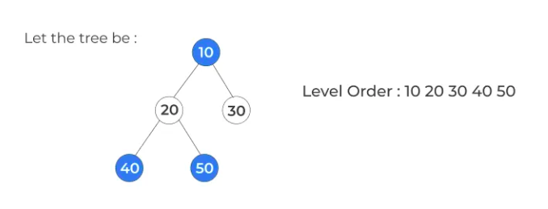

# Breadth-First Search (BFS)


## Level Order Traversal:

Visit nodes **level-by-level** and **left-to-right** fashion at the **same level**. Here, the **traversal** is level-wise. It means that the **most** left child has traversed first and then the **other children** of the same level from **left to right** have traversed.





```cpp

void solver(Node* root){
        
    queue<Node*> q;
    q.push(root);

    while(!q.empty()){
            
        Node* node = q.front();
        q.pop();
        cout<<node ->data<<" ";
            
        if(node ->left != NULL)
            q.push(node ->left);
                
        if(node ->right != NULL)
            q.push(node ->right);
        
    }
}


```

---


🥇 🥇 🥇


### Other Important Questions List

??? tip "Practice Questions List"


    * <a href="https://www.geeksforgeeks.org/problems/level-order-traversal/1?itm_source=geeksforgeeks&itm_medium=article&itm_campaign=bottom_sticky_on_article" target="_blank">Level order traversal (gfg)</a>


    * <a href="https://leetcode.com/problems/binary-tree-level-order-traversal/" target="_blank">Binary Tree Level Order Traversal (leetcode)</a>


    


💯 🔥 🚀

