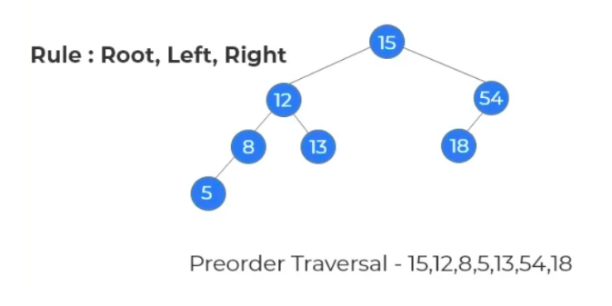
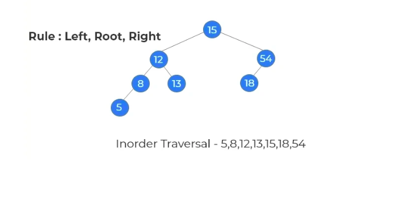
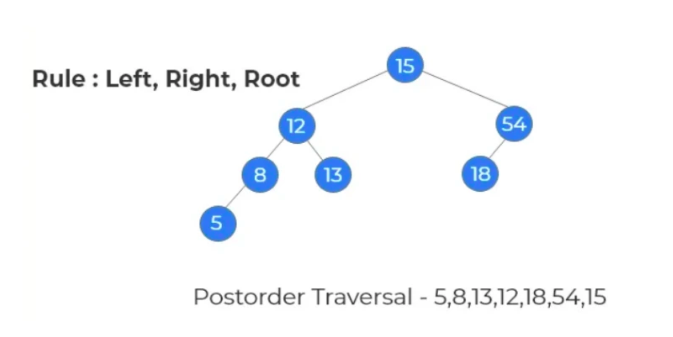

# Depth-First Search (DFS)


## Preorder Traversal (root-left-right):

Visit the **root node** before visiting any nodes inside the **left or right** subtrees. Here, the traversal is **root – left child – right child**. It means that the **root node** is traversed first then its left child and finally the **right child**.




```cpp

void printPreorder(Node* node){

    if (node == NULL){
        return;
    }

    cout << node->data << " ";

    printPreorder(node->left);
    printPreorder(node->right);
}


```

---


## Inorder Traversal (left-root-right):

Visit the **root node** after visiting all nodes inside the **left subtree** but before visiting **any node** within the right subtree. Here, the traversal is **left child – root – right child**.  It means that the **left child** is traversed first then its root node and finally the **right child**.





```cpp

void printInorder(Node* node){
    
    if (node == NULL){
        return;
    }


    printInorder(node->left);

    cout << node->data << " ";

    printInorder(node->right);
}


```

---


## Postorder Traversal (left-right-root):

Visit the **root node** after visiting all the nodes of the **left and right subtrees**.  Here, the traversal is **left child – right child – root**.  It means that the **left child** has traversed first **then** the **right child** and finally its **root node**.





```cpp

void printPostorder(Node* node){
    
    if (node == NULL){
        return;
    }


    printPostorder(node->left);
    printPostorder(node->right);

    cout << node->data << " ";

}


```

---


🥇 🥇 🥇


### Other Important Questions List

??? tip "Practice Questions List"


    * <a href="https://www.geeksforgeeks.org/problems/binary-tree-representation/1?utm_source=youtube&utm_medium=collab_striver_ytdescription&utm_campaign=binary-tree-representation" target="_blank">Binary Tree Representation (gfg)</a>


    * <a href="https://leetcode.com/problems/binary-tree-preorder-traversal/description/" target="_blank">Binary Tree Preorder Traversal (leetcode)</a>


    * <a href="https://leetcode.com/problems/binary-tree-inorder-traversal/description/" target="_blank">Binary Tree Inorder Traversal (leetcode)</a>


    * <a href="https://leetcode.com/problems/binary-tree-postorder-traversal/description/" target="_blank">Binary Tree Postorder Traversal (leetcode)</a>


    * <a href="https://www.geeksforgeeks.org/problems/postorder-traversal-iterative/1?utm_source=youtube&utm_medium=collab_striver_ytdescription&utm_campaign=postorder-traversal-iterative" target="_blank">Binary Tree Postorder Traversal [Iterative] (gfg)</a>


    


💯 🔥 🚀

