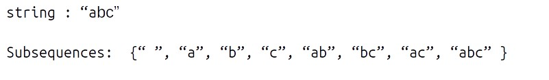

# DP on String

## What is a String?

String is considered a **data type** in general and is typically represented as arrays of bytes (or words) that store a sequence of characters. String is defined as an **array of characters**. The difference between a character array and a string is the string is terminated with a special character **‘\0’**. Some examples of strings are : - “geeks” , “for”, “geeks”, “GeeksforGeeks”, “Geeks for Geeks”, “123Geeks”.


---

**Something about subsequence :-**  💯 🔥

A **subsequence** of a string is a **list** of characters of the string where some characters are deleted (or not deleted at all) and they should be in the same order in the subsequence as in the **original string**.

**For eg:-**



* Strings like **“cab”,” bc”** will **not** be called as a subsequence of “abc” as the characters are not coming in the same order.

**Note:-** For a string of length n, the number of subsequences will be **2n**.

---


## Questions

💡 In the below **questions** try to draw the **recursion's diagram** of each problem on the 📝 paper.


??? tip "Longest Common Subsequence"

    * <a href="https://leetcode.com/problems/longest-common-subsequence/solutions/5224215/c-easy-recursion-solution/" target="_blank">Longest Common Subsequence (leetcode)</a>

    ---

    **memoization**

    ```cpp

    class Solution {
      public:

        int solver(string &str1 , int n1 , string &str2 , int n2 , vector<vector<int>> &dp){

            if(n1 < 0 || n2 < 0){
                return 0;
            }

            if(dp[n1][n2] != -1){
                return dp[n1][n2];
            }

            // if matched
            if(str1[n1] == str2[n2])
                return dp[n1][n2] = 1 + solver(str1 , n1-1 , str2 , n2-1 , dp);
            
            // if not matched
            return dp[n1][n2] = max(solver(str1 , n1-1 , str2 , n2 , dp) , solver(str1 , n1 , str2 , n2-1 , dp));
        }

        int longestCommonSubsequence(string text1, string text2) {
            
            int n1 = text1.length();
            int n2 = text2.length();
            vector<vector<int>> dp(n1 , vector<int>(n2 , -1));

            return solver(text1 , n1-1 , text2 , n2-1 , dp);
        }
    };


    ```

    **tabulation**

    ---

    **Intuition for tabulation** 🔥

    --> In the recursive logic, we set the base case to if **(ind1<0 || ind2<0)** but we can’t set the dp array’s index to -1.<br> Therefore a hack for this issue is to **shift every index by 1 towards the right**.

    * Therefore, now the **base case** will be if(ind1==0 || ind2==0).
    * Similarly, we will implement the recursive code by keeping in mind the shifting of indexes, **therefore S1[ind1] will be converted to S1[ind1-1]**. Same for others.
    * At last we will print **dp[N][M]** as our answer.

    ---

    ```cpp

    int tabulation(string &str1 , int n1 , string &str2 , int n2){

        vector<vector<int>> dp(n1+1 , vector<int>(n2+1 , -1));
        for(int j = 0 ; j <= n2 ; j++){
            dp[0][j] = 0;
        }
        for(int i = 0 ; i <= n1 ; i++){
            dp[i][0] = 0;
        }

        for(int i = 1 ; i <= n1 ; i++){
            for(int j = 1 ; j <= n2 ; j++){
                if(str1[i-1] == str2[j-1])
                    dp[i][j] = 1 + dp[i-1][j-1];
                else
                    dp[i][j] = max(dp[i-1][j] , dp[i][j-1]);
            }
        }

        return dp[n1][n2];
    }

    ```


??? tip "Print Longest Common Subsequence"

    * <a href="https://www.geeksforgeeks.org/problems/print-all-lcs-sequences3413/1?utm_source=youtube&utm_medium=collab_striver_ytdescription&utm_campaign=print-all-lcs-sequences" target="_blank">Print Longest Common Subsequence (gfg)</a>

    ---

    **tabulation**

    ```cpp

    void lcs(string s1, string s2) {

        int n = s1.size();
        int m = s2.size();

        vector < vector < int >> dp(n + 1, vector < int > (m + 1, 0));
        for (int i = 0; i <= n; i++) {
            dp[i][0] = 0;
        }
        for (int i = 0; i <= m; i++) {
            dp[0][i] = 0;
        }

        for (int ind1 = 1; ind1 <= n; ind1++) {
            for (int ind2 = 1; ind2 <= m; ind2++) {
            if (s1[ind1 - 1] == s2[ind2 - 1])
                dp[ind1][ind2] = 1 + dp[ind1 - 1][ind2 - 1];
            else
                dp[ind1][ind2] = 0 + max(dp[ind1 - 1][ind2], dp[ind1][ind2 - 1]);
            }
        }

        int i = n;
        int j = m;

        string str = "";

        while (i > 0 && j > 0) {
            if (s1[i - 1] == s2[j - 1]) {
                str += s1[i-1];
                i--;
                j--;
            } else if (s1[i - 1] > s2[j - 1]) {
                i--;
            } else j--;
        }

        reverse(str.begin(),str.end());
        cout << str;
    }

    int main() {

        string s1 = "abcde";
        string s2 = "bdgek";

        cout << "The Longest Common Subsequence is ";
        lcs(s1, s2);

        cout<<endl;
    }


    ```


??? tip "Longest Common Substring"

    * <a href="https://www.geeksforgeeks.org/problems/longest-common-substring1452/1" target="_blank">Longest Common Substring (gfg)</a>

    ---

    **Thinking in terms of consecutiveness of characters** 🔥

    **We have two conditions :-**

    * if **(S1[i-1] != S2[j-1])**, the characters don’t match, therefore the consecutiveness of characters is **broken**. So we set the cell value **(dp[i][j])** as **0**.

    * if **(S1[i-1] == S2[j-1])**, then the characters match and we simply set its value to **1+dp[i-1][j-1]**. We have done so because dp[i-1][j-1] gives us the longest common substring till the last cell character. As the current cell’s character is matching we are adding **1** to the consecutive chain.

    **Note:** dp[n][m] will not give us the answer; rather the **maximum value** in the entire dp array will give us the length of the longest common substring.

    ---

    **tabulation**

    ```cpp

    int longestCommonSubstr (string S1, string S2, int n, int m){
        
        vector<vector<int>> dp(n+1 , vector<int>(m+1 , -1));
        for(int j = 0 ; j <= m ; j++){
            dp[0][j] = 0;
        }
        for(int i = 0 ; i <= n ; i++){
            dp[i][0] = 0;
        }
        
        int ans = 0;
        for(int i = 1 ; i <= n ; i++){
            for(int j = 1 ; j <= m ; j++){
                if(S1[i-1] == S2[j-1]){
                    dp[i][j] = 1 + dp[i-1][j-1];
                    ans = max(ans , dp[i][j]);
                }
                else{
                    dp[i][j] = 0;
                }
            }
        }
        
        return ans;
    }


    ```


💯 🔥 🚀

