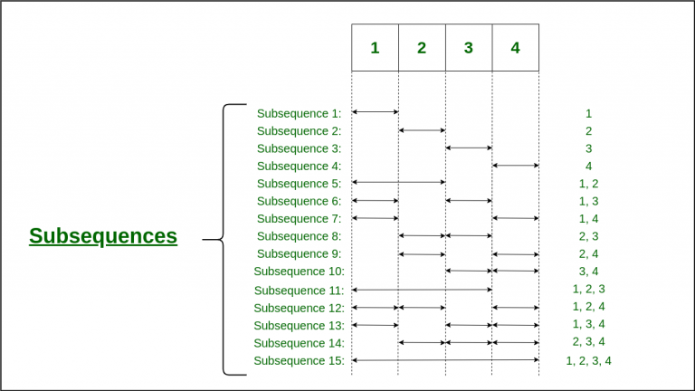
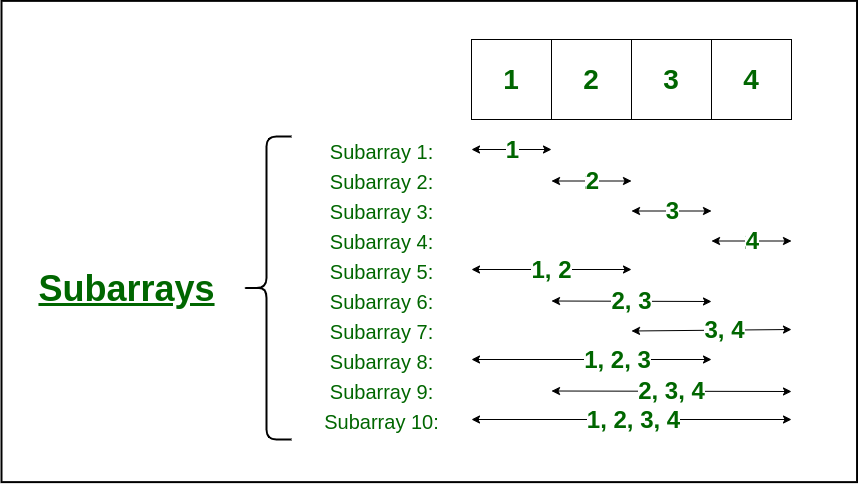
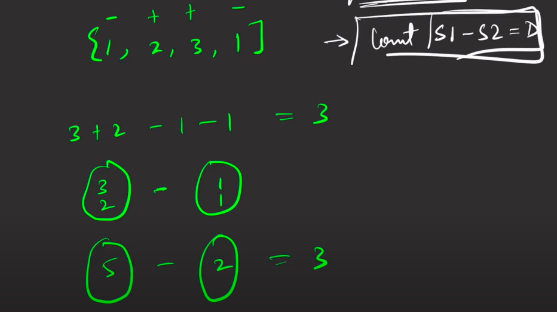

# DP on Subsequences/Subset

## What is a Subsequence?

As the name suggests, a subsequence is a sequence of the elements of the array obtained by deleting some elements of the array. One important thing related to the subsequence is that even after deleting some elements, the sequence of the array elements is not changed. Both the string and arrays can have subsequences.

* We can have **2^n** subsequences of an array since we keep the original ordering, this is the same as subsets of an array.



??? note "Code to Find All Subsequences"

    ```cpp

    void generateSubsequences(int arr[], int index, vector<int> subarray, int n) {

        if (index == n) {
            for (auto i : subarray)
                cout << i << " ";

            if (subarray.size() == 0)
                cout << "[]";
            cout << endl;
            return;
        }
        else {

            subarray.push_back(arr[index]);
            generateSubsequences(arr, index + 1, subarray, n);

            subarray.pop_back();
            generateSubsequences(arr, index + 1, subarray, n);
        }
    }

    int main() {
        int arr[] = {1, 2, 3};
        int n = sizeof(arr) / sizeof(arr[0]);
        vector<int> subarray;

        cout << "All the subsequences are: " << endl;
        generateSubsequences(arr, 0, subarray, n);
        return 0;
    }

    ```


---


## What is a Subset?

A subset is often confused with subarray and subsequence but a subset is nothing but any possible combination of the original array (or a set).

* We can have **2^(size of the array) i.e. 2^n** subsets of an array.

For example, the subsets of array arr = [1, 2, 3, 4, 5] can be:

[3, 1]<br>
[2, 5]<br>
[1, 2], etc.


??? note "Code to Find All Subsets"

    ```cpp

    void generateSubsets(int arr[], int n) {

        int powerSet = pow(2, n);
        for (int counter = 0; counter < powerSet; counter++) {
            for (int i = 0; i < n; i++) {
                // if the i-th bit is set then print the i-th element
                if (counter & (1 << i))
                    cout << arr[i] << " ";
            }
            cout << endl;
        }
    }

    ```

---

## What is a Subarray?

Well, a subarray is nothing but a slice of these contiguous memory locations of the actual array. In simpler terms, a subarray is nothing but any contiguous part of a given array. The subarray has the same sequence of elements (order of the elements) as it is in the array.

* So, we can have **n * (n+1)/2** non-empty subarrays of an array.




??? note "Code to find All Subarrays"

    ```cpp

    void generateSubArrays(int arr[], int n) {

        for (int i = 0; i < n; i++) {
            for (int j = i; j < n; j++) {
                
                // Printing the subarray between the current 
                // starting point i.e. i and the current ending point i.e. j
                for (int k = i; k <= j; k++)
                    cout << arr[k] << " ";
                cout << endl;
            }
        }
    }

    ```


---


## Questions

💡 In the below **questions** try to draw the **recursion's diagram** of each problem on the 📝 paper.


??? tip "Subset sum equal to target"

    * <a href="https://www.geeksforgeeks.org/problems/subset-sum-problem-1611555638/1" target="_blank">Subset sum equal to target (gfg)</a>

    ---

    **memoization**

    ```cpp

    bool solver(vector<int> &arr , int sum , int n , vector<vector<int>> &dp){
        
        if(sum == 0){
            return true;
        }
        if(n == 0){
            return arr[0] == sum;
        }
        
        if(dp[n][sum] != -1){
            return dp[n][sum];
        }
        
        bool not_take = solver(arr , sum , n-1 , dp);
        
        bool take = false;
        if(arr[n] <= sum){
            take = solver(arr , sum-arr[n] , n-1 , dp);
        }
        
        return dp[n][sum] = take || not_take;
    }

    bool isSubsetSum(vector<int>arr, int sum){
        
        int n = arr.size();
        vector<vector<int>> dp(n , vector<int> (sum+1 , -1));
        
        return solver(arr , sum , n-1 , dp);
    }


    ```

    **tabulation**

    ```cpp
    bool tabulation(vector<int> &arr , int sum , int n){
        
        vector<vector<bool>> dp(n , vector<bool> (sum+1 , false));
        for (int i = 0; i < n; i++) {
            dp[i][0] = true;
        }
        
        if (arr[0] <= sum) {
            dp[0][arr[0]] = true;
        }
        
        for(int i = 1 ; i < n ; i++){
            for(int j = 1 ; j <= sum ; j++){
                
                bool not_take = dp[i-1][j];
                bool take = false;
                if(arr[i] <= j)
                    take = dp[i-1][j-arr[i]];
                    
                dp[i][j] = take || not_take;
            }
        }
        
        return dp[n-1][sum];
    }

    ```


??? tip "Partition Equal Subset Sum"

    * <a href="https://leetcode.com/problems/partition-equal-subset-sum/description/" target="_blank">Partition Equal Subset Sum (leetcode)</a>

    ---

    **memoization**

    ```cpp

    class Solution {
    public:

        bool solver(vector<int> &nums , int n , int target , vector<vector<int>> &dp){

            if(target == 0){
                return true;
            }
            if(n == 0){
                return nums[n] == target;
            }

            if(dp[n][target] != -1){
                return dp[n][target];
            }

            int not_picked = solver(nums , n-1 , target , dp);
            int picked = false;
            if(nums[n] <= target)
                picked = solver(nums , n-1 , target-nums[n] , dp);

            return dp[n][target] = not_picked || picked;
        }

        bool canPartition(vector<int>& nums) {
            
            int sum = 0;
            int n = nums.size();
            for(int i = 0 ; i < n ; i++){
                sum += nums[i];
            }

            int target = 0;
            if(sum%2 == 0){
                target = sum/2;
            }
            else{
                return false;
            }

            vector<vector<int>> dp(n , vector<int> (target+1 , -1));
            return solver(nums , n-1 , target , dp);
        }
    };

    ```

    **tabulation**

    ```cpp


    ```


??? tip "Count Subsets with Sum K"

    * <a href="https://www.geeksforgeeks.org/problems/perfect-sum-problem5633/1?utm_source=youtube&utm_medium=collab_striver_ytdescription&utm_campaign=perfect-sum-problem" target="_blank">Count Subsets with Sum K (gfg)</a>

    ---

    **memoization**

    ```cpp
    class Solution{
       public:
        int mod = 1e9+7;
        int solver(int arr[] , int n , int sum , vector<vector<int>> &dp){
            
            if(n < 0){
                if(sum == 0)
                    return 1;
                else
                    return 0;
            }
            
            if(dp[n][sum] != -1){
                return dp[n][sum];
            }
            
            int not_take = solver(arr , n-1 , sum , dp);
            int take = 0;
            if(arr[n] <= sum)
                take = solver(arr , n-1 , sum-arr[n] , dp);
            
            return dp[n][sum] = (take+not_take)%mod;
        }
        
        int perfectSum(int arr[], int n, int sum){
            
            vector<vector<int>> dp(n , vector<int>(sum+1 , -1));
            return solver(arr , n-1 , sum , dp);
        }
        
    };

    ```

    **tabulation**

    ```cpp


    ``` 


??? tip "Count Partitions with Given Difference"

    * <a href="https://www.geeksforgeeks.org/problems/partitions-with-given-difference/1?utm_source=youtube&utm_medium=collab_striver_ytdescription&utm_campaign=partitions-with-given-difference" target="_blank">Count Partitions with Given Difference (gfg)</a>

    ---

    **memoization**

    ```cpp
    class Solution{
       public:
        int mod = (int)(1e9 + 7);
        int solver(int n , vector<int> &arr , int target_sum , vector<vector<int>> &dp){
            
            if(n < 0){
                if(target_sum == 0){
                    return 1;
                }
                else{
                    return 0;
                }
            }
            
            if(dp[n][target_sum] != -1){
                return dp[n][target_sum];
            }
            
            int not_take = solver(n-1 , arr , target_sum , dp);
            int take = 0;
            if(arr[n] <= target_sum)
                take = solver(n-1 , arr , target_sum - arr[n] , dp);
            
            return dp[n][target_sum] = (take+not_take)%mod;
        }
    
        int countPartitions(int n, int d, vector<int>& arr) {
            
            int sum = 0;
            for(int i = 0 ; i < n ; i++){
                sum += arr[i];
            }
            
            if((sum-d)%2 != 0 || sum < d){
                return 0;
            }
            
            int target_sum = (sum-d)/2;
            vector<vector<int>> dp(n , vector<int> (target_sum+1 , -1));
            
            return solver(n-1 , arr , target_sum , dp);
        }
        
    };

    ```

    **tabulation**

    ```cpp


    ``` 


??? tip "0/1 Knapsack"

    * <a href="https://www.geeksforgeeks.org/problems/0-1-knapsack-problem0945/1" target="_blank">0/1 Knapsack (gfg)</a>

    ---

    **memoization**

    ```cpp
    class Solution{
       public:
        int solver(int w , int wt[] , int val[] , int n , vector<vector<int>> &dp){
            
            if(n == 0){
                if(wt[n] <= w)
                    return val[n];
                else
                    return 0;
            }
            
            if(dp[n][w] != -1){
                return dp[n][w];
            }
            
            int pick = INT_MIN;
            if(wt[n] <= w)
                pick = val[n] + solver(w-wt[n] , wt , val , n-1 , dp);
            int not_pick = 0 + solver(w , wt , val , n-1 , dp);
            
            return dp[n][w] = max(pick , not_pick);
        }
        
        int knapSack(int W, int wt[], int val[], int n){ 
            
            vector<vector<int>> dp(n , vector<int> (W+1 , -1));
            return solver(W , wt , val , n-1 , dp);
        }
        
    };

    ```

    **tabulation**

    ```cpp

    int tabulation(int w , int wt[] , int val[] , int n){
        
        vector<vector<int>> dp(n , vector<int> (w+1 , 0));
        for(int i = wt[0] ; i <= w ; i++){
            dp[0][i] = val[0];
        }
        
        for(int i = 1 ; i < n ; i++){
            for(int j = 0 ; j <= w ; j++){
                
                int not_pick = 0 + dp[i-1][j];
                
                int pick = INT_MIN;
                if(wt[i] <= j)
                    pick = val[i] + dp[i-1][j-wt[i]];
                    
                dp[i][j] = max(pick , not_pick);
            }
        }
        
        return dp[n-1][w];
    }

    ``` 


??? tip "Minimum Coins/Coin Change"

    * <a href="https://leetcode.com/problems/coin-change/description/" target="_blank">Minimum Coins/Coin Change (leetcode)</a>

    ---

    **Steps to form the recursive solution :-**

    **Base Cases:**

    * If ind==0, it means we are at the first item, so in that case, the following cases can arise:

        1. arr[0] = 4 and T = 12<br>
        🤞 --> In such a case where the target is divisible by the coin element, we will return T%arr[0].

        2. arr[0] =4 and T=1 , arr[0]=3 T=10<br>
        🤞 --> In all other cases, we will not be able to form a solution, so we will return a big number like 1e9


    **Step 2:** Try out all possible choices at a given index.

    * **Exclude the current element in the subsequence:** We first try to find a subsequence without considering the current index coin. If we exclude the current coin, the target sum will not be affected and the number of coins added to the solution will be 0. So we will call the recursive function f(ind-1,T)

    * **Include the current element in the subsequence:** We will try to find a subsequence by considering the current icoin. As we have included the coin, the target sum will be updated to T-arr[ind] and we have considered 1 coin to our solution.

    💯 🔥 Now here is the catch, as there is an **unlimited supply of coins,** we want to again form a **solution** with the same coin value. **So** we will **not recursively** call for **f(ind-1, T-arr[ind])** rather we will **stay** at that index only and **call** for **f(ind, T-arr[ind])** to find the **answer**.

    ---

    **memoization**

    ```cpp

    class Solution {
       public:

        int solver(vector<int> &coins , int amount , int n , vector<vector<int>> &dp){

            if(n == 0){
                if(amount%coins[n] == 0){
                    return amount/coins[n];
                }
                else{
                    return 1e9;
                }
            }

            if(dp[n][amount] != -1){
                return dp[n][amount];
            }

            int not_picked = 0 + solver(coins , amount , n-1 , dp);
            int picked = INT_MAX;
            if(coins[n] <= amount)
                picked = 1 + solver(coins , amount-coins[n] , n , dp);

            return dp[n][amount] = min(picked , not_picked);
        }

        int coinChange(vector<int>& coins, int amount) {
            
            int n = coins.size();
            vector<vector<int>> dp(n , vector<int> (amount+1 , -1));
            int ans = solver(coins , amount , n-1 , dp);

            if(ans == 1e9) return -1;
            return ans;
        }
    };
    ```

    **tabulation**

    ```cpp


    ```


??? tip "Target Sum"

    * <a href="https://leetcode.com/problems/target-sum/description/" target="_blank">Target Sum (leetcode)</a>

    ---

    

    * Look at the **above image** and try to find out the relation between **s1 - s2 = d** , here **d = target of this given question**.<br>
    * And also look at the question **Count Partitions with Given Difference** in the above **questions** list.

    ---

    **memoization**

    ```cpp

    class Solution {
       public:

        int solver(int n , vector<int> &nums , int target_sum , vector<vector<int>> &dp){

            if(n < 0){
                if(target_sum == 0){
                    return 1;
                }
                else{
                    return 0;
                }
            }

            if(dp[n][target_sum] != -1){
                return dp[n][target_sum];
            }

            int not_take = solver(n-1 , nums , target_sum , dp);
            int take = 0;
            if(nums[n] <= target_sum)
                take = solver(n-1 , nums , target_sum - nums[n] , dp);

            return dp[n][target_sum] = take+not_take;
        }

        int findTargetSumWays(vector<int>& nums, int target) {
            
            int sum = 0;
            int n = nums.size();
            for(int i = 0 ; i < n ; i++){
                sum += nums[i];
            }

            if((sum-target)%2 != 0 || sum < target){
                return 0;
            }

            int target_sum = (sum-target)/2;
            vector<vector<int>> dp(n , vector<int> (target_sum+1 , -1));

            return solver(n-1 , nums , target_sum , dp);
        }
    };

    ```

    **tabulation**

    ```cpp


    ```


??? tip "Coin Change II"

    * <a href="https://leetcode.com/problems/coin-change-ii/description/" target="_blank">Coin Change II (leetcode)</a>

    ---

    **memoization**

    ```cpp

    class Solution {
      public:

        int solver(int amount , vector<int> &coins , int n , vector<vector<int>> &dp){

            if(n == 0){
                if(amount%coins[n] == 0){
                    return 1;
                }
                else{
                    return 0;
                }
            }

            if(dp[n][amount] != -1){
                return dp[n][amount];
            }

            int not_take = solver(amount , coins , n-1 , dp);
            int take = 0;
            if(coins[n] <= amount)
                take = solver(amount-coins[n] , coins , n , dp);

            return dp[n][amount] = take + not_take;
        }

        int change(int amount, vector<int>& coins) {
            
            int n = coins.size();
            vector<vector<int>> dp(n , vector<int> (amount +1 , -1));
            int ans = solver(amount , coins , n-1 , dp);

            return ans;
        }
    };

    ```

    **tabulation**

    ```cpp


    ```

??? tip "Unbounded Knapsack"

    * <a href="https://www.geeksforgeeks.org/problems/knapsack-with-duplicate-items4201/1?utm_source=youtube&utm_medium=collab_striver_ytdescription&utm_campaign=knapsack-with-duplicate-items" target="_blank">Unbounded Knapsack (gfg)</a>

    ---

    **memoization**

    ```cpp
    class Solution{
       public:
        int solver(int n , int w , int val[] , int wt[] , vector<vector<int>> &dp){
            
            if(n == 0){
                if(wt[n] <= w){
                    return (w/wt[n])*val[n];
                }
                else{
                    return 0;
                }
            }
            
            if(dp[n][w] != -1){
                return dp[n][w];
            }
            
            int not_pick = 0 + solver(n-1 , w , val , wt , dp);
            int pick = INT_MIN;
            if(wt[n] <= w){
                pick = val[n] + solver(n , w-wt[n] , val , wt , dp);
            }
            
            return dp[n][w] = max(pick , not_pick);
        }

        int knapSack(int N, int W, int val[], int wt[]){

            vector<vector<int>> dp(N , vector<int> (W+1 , -1));
            return solver(N-1 , W , val , wt , dp);
        }
        
    };

    ```

    **tabulation**

    ```cpp

    int tabulation(int n , int w , int val[] , int wt[]){
        
        vector<vector<int>> dp(n , vector<int> (w+1 , -1));
        for(int i = 0 ; i <= w ; i++){
            dp[0][i] = (i/wt[0])*val[0];
        }
        
        for(int i = 1 ; i < n ; i++){
            for(int j = 0 ; j <= w ; j++){
                
                int not_pick = dp[i-1][j];
                
                int pick = INT_MIN;
                if(wt[i] <= j)
                    pick = val[i] + dp[i][j-wt[i]];
                
                dp[i][j] = max(pick , not_pick);
            }
        }
        
        return dp[n-1][w];
    }

    ``` 

??? tip "Rod Cutting Problem"

    * <a href="https://www.geeksforgeeks.org/problems/rod-cutting0840/1" target="_blank">Rod Cutting Problem (gfg)</a>

    ---

    **memoization**

    ```cpp
    class Solution{
       public:
        int solver(int price[] , int n , int rod_length , vector<vector<int>> &dp){
            
            if(n == 0){
                return rod_length*price[n];
            }
            
            if(dp[n][rod_length] != -1){
                return dp[n][rod_length];
            }
            
            int not_pick = 0 + solver(price , n-1 , rod_length , dp);
            int pick = INT_MIN;
            if(rod_length >= n+1)
                pick = price[n] + solver(price , n , rod_length-(n+1) , dp);
                
            return dp[n][rod_length] = max(pick , not_pick);
        }
    
        int cutRod(int price[], int n) {
            
            vector<vector<int>> dp(n , vector<int> (n+1 , -1));
            return solver(price , n-1 , n , dp);
        }
        
    };

    ```

    **tabulation**

    ```cpp

    
    ``` 


💯 🔥 🚀