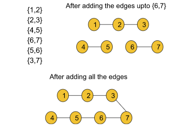
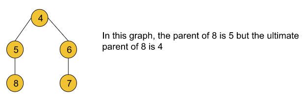
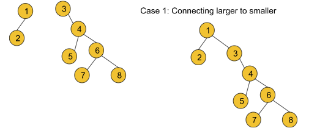
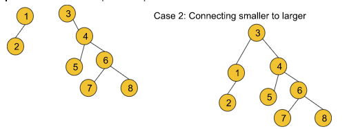

# Disjoint Set (`Union By Rank | Union by Size`)

- Disjoint Set data structure which is a **`very important topic`** in the entire graph series.

**Question**: Given two components of an undirected graph


The question is whether node 1 and node 5 are in the same component or not.

!!! info ""
    Approach:

    - Now, in order to solve this question we can use either the DFS or BFS traversal technique like if we traverse the components of the graph we can find that node 1 and node 5 are not in the same component. This is actually the brute force approach whose time complexity is O(N+E)(N = no. of nodes, E = no. of edges). 
    
    - But using a Disjoint Set data structure we can solve this same problem in **`constant time`**.

- The disjoint Set data structure is generally used for dynamic graphs.

---

## Dynamic graphs

A dynamic graph generally refers to a graph that keeps on changing its configuration. Let’s deep dive into it using an example:

- Let’s consider the edge information for the given graph as: {{1,2}, {2,3}, {4,5}, {6,7}, {5,6}, {3,7}}. Now if we start adding the edges one by one, in each step the structure of the graph will change. So, after each step, if we perform the same operation on the graph while updating the edges, the result might be different. In this case, the graph will be considered a dynamic graph.

- For example, after adding the first 4 edges if we look at the graph, we will find that node 4 and node 1 belong to different components but after adding all 6 edges if we search for the same we will figure out that node 4 and node 1 belong to the same component.



- So, **after any step, if we try to figure out whether two arbitrary nodes u and v belong to the same component or not, Disjoint Set will be able to answer this query in constant time**.

---

## Functionalities of Disjoint Set data structure

The disjoint set data structure generally provides two types of functionalities:

- **Finding the ultimate parent** for a particular node (findPar())

- **Union** (in broad terms this method basically adds an edge between two nodes)
    - Union by rank
    - Union by size

---

## Rank

The rank of a node generally refers to the distance (the number of nodes including the leaf node) between the furthest leaf node and the current node. Basically rank includes all the nodes beneath the current node.


---

## Ultimate parent

The parent of a node generally refers to the node right above that particular node. But the ultimate parent refers to the topmost node or the root node.



---

## Path compression

Basically, connecting each node in a particular path to its ultimate parent refers to path compression. Let’s understand it using the following illustration:


---

## Algorithm

!!! info "Initial configuration"

    **rank array**: This array is initialized with zero.

    **parent array**: The array is initialized with the value of nodes i.e. parent[i] = i.

!!! info "The algorithm steps"

    - Firstly, the Union function requires two nodes(let’s say u and v) as arguments. Then we will find the ultimate parent (using the findPar() function that is discussed later) of u and v. Let’s consider the ultimate parent of u is pu and the ultimate parent of v is pv.

    - After that, we will find the rank of pu and pv.

    - Finally, we will **connect the ultimate parent with a smaller rank to the other ultimate parent with a larger rank. But if the ranks are equal, we can connect any parent to the other parent and we will increase the rank by one for the parent node to whom we have connected the other one**.

---

## Code

```cpp
#include <bits/stdc++.h>
using namespace std;
class DisjointSet {
    vector<int> rank, parent;
public:
    DisjointSet(int n) {
        rank.resize(n + 1, 0);
        parent.resize(n + 1);

        // initially, everyone is self-parent.
        for (int i = 0; i <= n; i++) {
            parent[i] = i;
        }
    }

    int findUPar(int node) {
        if (node == parent[node])
            return node;
        return parent[node] = findUPar(parent[node]); // path compression
    }

    void unionByRank(int u, int v) {
        int ulp_u = findUPar(u);  // ulp means ultimate parent
        int ulp_v = findUPar(v);
        if (ulp_u == ulp_v) return;
        if (rank[ulp_u] < rank[ulp_v]) {
            parent[ulp_u] = ulp_v;
        }
        else if (rank[ulp_v] < rank[ulp_u]) {
            parent[ulp_v] = ulp_u;
        }
        else {
            parent[ulp_v] = ulp_u;
            rank[ulp_u]++;
        }
    }
};
int main() {
    DisjointSet ds(7);
    ds.unionByRank(1, 2);
    ds.unionByRank(2, 3);
    ds.unionByRank(4, 5);
    ds.unionByRank(6, 7);
    ds.unionByRank(5, 6);
    // if 3 and 7 same or not
    if (ds.findUPar(3) == ds.findUPar(7)) {
        cout << "Same\n";
    }
    else cout << "Not same\n";

    ds.unionByRank(3, 7);

    if (ds.findUPar(3) == ds.findUPar(7)) {
        cout << "Same\n";
    }
    else cout << "Not same\n";
    return 0;
}

```

---

## Time complexity ⏲️

The actual time complexity is O(4* alpha) which is very small and close to 1.

- So, we assume it to be of **`constant time-complexity`**.
- Exact derivation of the time-complexity is a very long & tedious mathematical proof. So, don't worry!

---

## Follow up: In the union by rank method, why do we need to connect the smaller rank to the larger rank? 🤔



- In this case, the traversal time to find the ultimate parent for nodes 3, 4, 5, 6, 7, and 8 increases and so the path compression time also increases. But if we do the following



- the traversal time to find the ultimate parent for only nodes 1 and 2 increases. So the path compression time becomes relatively lesser than in the previous case. So, we can conclude that we should always connect a smaller rank to a larger one with the goal of
    - **shrinking the height of the graph**.
    - **reducing the time complexity** as much as we can.

---

## Disjoint Set `Union by size`

!!! bug "Sorry, What was the meaning of Rank, again?"
    After applying path compression the rank of the graphs becomes distorted. So, rather than storing the rank, we can just store the size of the components for comparing which component is greater or smaller.

    - So, rather than storing the rank, we can **just store the size of the components** for comparing which component is greater or smaller.

- Algorithm is very same as `Union by Rank`, only the **`Size`** word is used, which indicates the size of each node.
- We will initialize size vector with 1, and unlike in rank when doing union, we will increment size by the size of node we are appending.

```cpp
class DisjointSet {
    vector<int> parent, size;
public:
    DisjointSet(int n) {
        parent.resize(n + 1); // (n+1) will handle both 0-bases & 1-based indexing graph
        size.resize(n + 1);
        for (int i = 0; i <= n; i++) {
            parent[i] = i;
            size[i] = 1;
        }
    }

    int findUPar(int node) {
        if (node == parent[node])
            return node;
        return parent[node] = findUPar(parent[node]); // path compression
    }

    void unionByRank(int u, int v) {
        int ulp_u = findUPar(u);
        int ulp_v = findUPar(v);
        if (ulp_u == ulp_v) return;
        if (rank[ulp_u] < rank[ulp_v]) {
            parent[ulp_u] = ulp_v;
        }
        else if (rank[ulp_v] < rank[ulp_u]) {
            parent[ulp_v] = ulp_u;
        }
        else {
            parent[ulp_v] = ulp_u;
            rank[ulp_u]++;
        }
    }

    void unionBySize(int u, int v) {
        int ulp_u = findUPar(u);
        int ulp_v = findUPar(v);
        if (ulp_u == ulp_v) return;
        if (size[ulp_u] < size[ulp_v]) {
            parent[ulp_u] = ulp_v;
            size[ulp_v] += size[ulp_u];
        }
        else {
            parent[ulp_v] = ulp_u;
            size[ulp_u] += size[ulp_v];
        }
    }
};
```

---