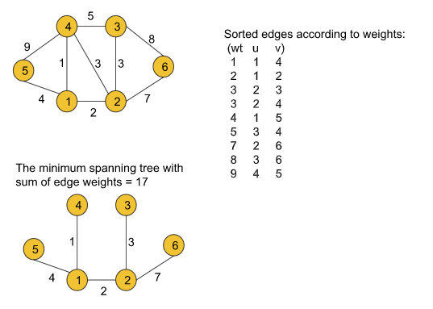

## Kruskal's Algorithm - Minimum Spanning Tree


We will be implementing Kruskal’s algorithm using the **Disjoint Set** data structure.
Kruskal’s algorithm to find the minimum cost spanning tree uses the **greedy** approach.


???+ tip "The algorithm steps are as follows :-"

    * First, we need to extract the edge information(if not given already) from the given adjacency list in the format of (wt, u, v) where u is the current node, v is the adjacent node and wt is the weight of the edge between node u and v and we will store the tuples in an array.

    * Then the array must be sorted in the ascending order of the weights so that while iterating we can get the edges with the minimum weights first.

    * After that, we will iterate over the edge information, and for each tuple, we will apply the  following operation:

        * First, we will take the two nodes u and v from the tuple and check if the ultimate parents of both nodes are the same or not using the **findUPar()** function provided by the Disjoint Set data structure.

        * **If the ultimate parents are the same**, we need not do anything to that edge as there already exists a path between the nodes and we will continue to the next tuple.

        * If the ultimate parents are different, we will add the weight of the edge to our final answer **(i.e. mstWt variable used in the following code)** and apply the **union operation(i.e. either unionBySize(u, v) or unionByRank(u, v))** with the nodes u and v. The union operation is also provided by the Disjoint Set.


    


### Code

```cpp

#include <bits/stdc++.h>
using namespace std;

class DisjointSet {
    vector<int> rank, parent, size;
public:
    DisjointSet(int n) {
        rank.resize(n + 1, 0);
        parent.resize(n + 1);
        size.resize(n + 1);
        for (int i = 0; i <= n; i++) {
            parent[i] = i;
            size[i] = 1;
        }
    }

    int findUPar(int node) {
        if (node == parent[node])
            return node;
        return parent[node] = findUPar(parent[node]);
    }

    void unionByRank(int u, int v) {
        int ulp_u = findUPar(u);
        int ulp_v = findUPar(v);
        if (ulp_u == ulp_v) return;
        if (rank[ulp_u] < rank[ulp_v]) {
            parent[ulp_u] = ulp_v;
        }
        else if (rank[ulp_v] < rank[ulp_u]) {
            parent[ulp_v] = ulp_u;
        }
        else {
            parent[ulp_v] = ulp_u;
            rank[ulp_u]++;
        }
    }

    void unionBySize(int u, int v) {
        int ulp_u = findUPar(u);
        int ulp_v = findUPar(v);
        if (ulp_u == ulp_v) return;
        if (size[ulp_u] < size[ulp_v]) {
            parent[ulp_u] = ulp_v;
            size[ulp_v] += size[ulp_u];
        }
        else {
            parent[ulp_v] = ulp_u;
            size[ulp_u] += size[ulp_v];
        }
    }
};
class Solution
{
public:
    //Function to find sum of weights of edges of the Minimum Spanning Tree.
    int spanningTree(int V, vector<vector<int>> adj[])
    {
        // 1 - 2 wt = 5
        /// 1 - > (2, 5)
        // 2 -> (1, 5)

        // 5, 1, 2
        // 5, 2, 1
        vector<pair<int, pair<int, int>>> edges;
        for (int i = 0; i < V; i++) {
            for (auto it : adj[i]) {
                int adjNode = it[0];
                int wt = it[1];
                int node = i;

                edges.push_back({wt, {node, adjNode}});
            }
        }

        DisjointSet ds(V); // ds is DisjointSet class object

        sort(edges.begin(), edges.end());
        int mstWt = 0;
        for (auto it : edges) {
            int wt = it.first;
            int u = it.second.first;
            int v = it.second.second;

            if (ds.findUPar(u) != ds.findUPar(v)) {
                mstWt += wt;
                ds.unionBySize(u, v);
            }
        }

        return mstWt;
    }
};


```

---

#### Time Complexity

O(N+E) + O(E logE) + O(E*4α*2)   where N = no. of nodes and E = no. of edges. O(N+E) for extracting edge information from the adjacency list. O(E logE) for sorting the array consists of the edge tuples. Finally, we are using the disjoint set operations inside a loop. The loop will continue to E times. Inside that loop, there are two disjoint set operations like findUPar() and UnionBySize() each taking 4 and so it will result in 4*2. That is why the last term O(E*4*2) is added.


#### Space Complexity

O(N) + O(N) + O(E) where E = no. of edges and N = no. of nodes. O(E) space is taken by the array that we are using to store the edge information. And in the disjoint set data structure, we are using two N-sized arrays i.e. a parent and a size array (as we are using unionBySize() function otherwise, a rank array of the same size if unionByRank() is used) which result in the first two terms O(N).

