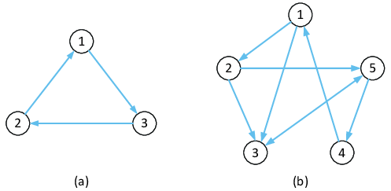
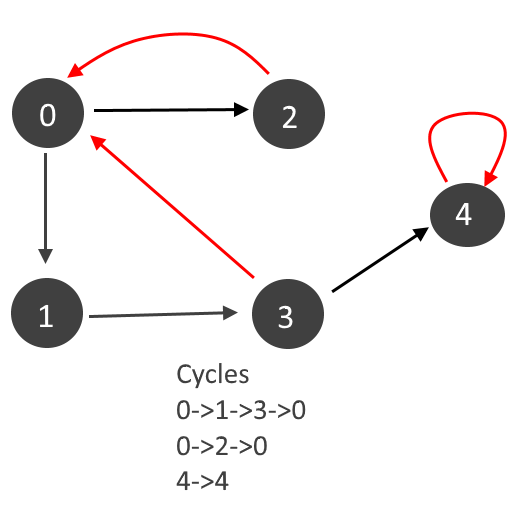

## Detect Cycle in an directed Graph using BFS

#### Intuition:

1. Since we know topological sorting is only possible for directed acyclic graphs(DAGs) if we apply Kahn’s algorithm in a directed cyclic graph(A directed graph that contains a cycle), it will fail to find the topological sorting(i.e. The final sorting will not contain all the nodes or vertices).

2. So, finally, we will check the sorting to see if it contains all V vertices or not. If the result does not include all V vertices, we can conclude that there is a cycle.




---


```cpp

// Function to detect cycle in a directed graph.
bool isCyclic(int V, vector<int> adj[]) {
	int indegree[V] = {0};
	for (int i = 0; i < V; i++) {
		for (auto it : adj[i]) {
			indegree[it]++;
		}
	}

	queue<int> q;
	for (int i = 0; i < V; i++) {
		if (indegree[i] == 0) {
			q.push(i);
		}
	}

	int cnt = 0;
	// o(v + e)
	while (!q.empty()) {
		int node = q.front();
		q.pop();
		cnt++;
		// node is in your topo sort
		// so please remove it from the indegree

		for (auto it : adj[node]) {
			indegree[it]--;
			if (indegree[it] == 0) q.push(it);
		}
	}

	if (cnt == V) return false;
	return true;
}

```

#### Time Complexity

O(V+E), where V = no. of nodes and E = no. of edges. This is a simple BFS algorithm.

#### Space Complexity

O(N) + O(N) ~ O(2N), O(N) for the in-degree array, and O(N) for the queue data structure used in BFS(where N = no.of nodes).


---

## Detect Cycle in an directed Graph using DFS





!!! success "Only we have do"

    We need to create an extra **`dfs_visited[n]`** array to keep track of visited nodes in the current path.


```cpp
class Solution{
public:
    
    bool detectCycle(int start , vector<int> &vis , vector<int> &dfs_vis , vector<int> adj[]){
        
        vis[start] = 1;
        dfs_vis[start] = 1;
        for(auto it : adj[start]){
            if(vis[it] == 0){
                bool return_val = detectCycle(it , vis , dfs_vis , adj);
                if(return_val == true){
                    return true;
                }
            }
            else if(dfs_vis[it] == 1){
                return true;
            }
        }
        dfs_vis[start] = 0;
        
        return false;
    }
    
    bool isCyclic(int V, vector<int> adj[]) {
        
        vector<int> vis(V,0);
        vector<int> dfs_vis(V,0);
        
        for(int i = 0 ; i < V ; i++){
            if(vis[i] == 0){
                bool cycle = detectCycle(i , vis , dfs_vis , adj);
                if(cycle == true){
                    return true;
                }
            }
        }
        
        return false;
    }
};

```

#### Time Complexity

O(V+E), where V = no. of nodes and E = no. of edges. This is a simple DFS algorithm.

#### Space Complexity

O(N) + O(N) + 0(N) ~ O(3N), 0(N) visited array, 0(N) for dfs_visited array and O(N) Space for recursive stack space, .


