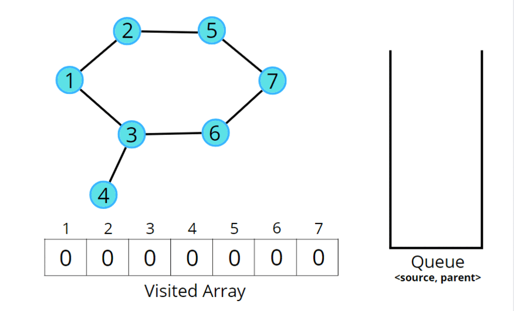

# Detect Cycle In Undirected Graph

## Detect Cycle in an Undirected Graph using BFS

The intuition is that we start from a node, and start doing BFS level-wise, if somewhere down the line, we visit a single node twice, it means we came via two paths to end up at the same node. It implies there is a cycle in the graph because we know that we start from different directions but can arrive at the same node only if the graph is connected or contains a cycle, otherwise we would never come to the same node again.


!!! danger

    A graph can have connected components as well. In such cases, if any component forms a cycle then the graph is said to have a cycle.

    ```cpp

    for(int i = 1 ; i <= n ; i++) {
        if(!vis[i]) {
            if(detect(i))
                return true;
        }
    }
    return false;

    ```





!!! success "Only we have to check"

    visited == true   &&   parent != adjacentNode


```cpp

bool detect(int src, vector<int> adj[], int vis[]) {
    vis[src] = 1;
    // store <source node, parent node>
    queue<pair<int,int>> q;
    q.push({src, -1});
    // traverse until queue is not empty
    while(!q.empty()) {
        int node = q.front().first;
        int parent = q.front().second;
        q.pop();

        // go to all adjacent nodes
        for(auto adjacentNode: adj[node]) {
            // if adjacent node is unvisited
            if(!vis[adjacentNode]) {
                vis[adjacentNode] = 1;
                q.push({adjacentNode, node});
            }
            // if adjacent node is visited and is not it's own parent node
            else if(parent != adjacentNode) {
                // yes it is a cycle
                return true;
            }
        }
    }
    // there's no cycle
    return false;
}

// Function to detect cycle in an undirected graph.
bool isCycle(int V, vector<int> adj[]) {
    int vis[V] = {0}; 
    // for graph with connected components 
    for(int i = 0 ; i<V ; i++) {
        if(!vis[i]) {
            if(dfs(i, -1, vis, adj) == true) return true; 
        }
    }
    return false; 
}

```

#### Time Complexity

O(N + 2E) + O(N), Where N = Nodes, 2E is for total degrees as we traverse all adjacent nodes. In the case of connected components of a graph, it will take another O(N) time.

#### Space Complexity

O(N) + O(N) ~ O(N), Space for queue data structure and visited array.

---


## Detect Cycle in an Undirected Graph using DFS

The cycle in a graph starts from a node and ends at the same node. DFS is a traversal technique that involves the idea of recursion and backtracking. DFS goes in-depth, i.e., traverses all nodes by going ahead, and when there are no further nodes to traverse in the current path, then it backtracks on the same path and traverses other unvisited nodes. The intuition is that we start from a source and go in-depth, and reach any node that has been previously visited in the past, it means there's a cycle.


!!! success "Only we have to check"

    visited == true   &&   parent != adjacentNode


```cpp

bool dfs(int node, int parent, int vis[], vector<int> adj[]) {
    vis[node] = 1; 
    // visit adjacent nodes
    for(auto adjacentNode: adj[node]) {
        // unvisited adjacent node
        if(!vis[adjacentNode]) {
            if(dfs(adjacentNode, node, vis, adj) == true) 
                return true; 
        }
        // visited node but not a parent node
        else if(adjacentNode != parent) return true; 
    }
    return false; 
}

// Function to detect cycle in an undirected graph.
bool isCycle(int V, vector<int> adj[]) {
    int vis[V] = {0}; 
    // for graph with connected components 
    for(int i = 0 ; i<V ; i++) {
        if(!vis[i]) {
            if(dfs(i, -1, vis, adj) == true) return true; 
        }
    }
    return false; 
}

```

#### Time Complexity

O(N + 2E) + O(N), Where N = Nodes, 2E is for total degrees as we traverse all adjacent nodes. In the case of connected components of a graph, it will take another O(N) time.

#### Space Complexity

O(N) + O(N) ~ O(N), Space for recursive stack space and visited array.


---

## Questions


💡 First try with yourself, if you are unable to solve the question then see the solution.


??? tip "Undirected Graph Cycle"

    * <a href="https://www.geeksforgeeks.org/problems/detect-cycle-in-an-undirected-graph/1?utm_source=youtube&utm_medium=collab_striver_ytdescription&utm_campaign=detect-cycle-in-an-undirected-graph" target="_blank">Undirected Graph Cycle (gfg)</a>


💯 🔥 🚀