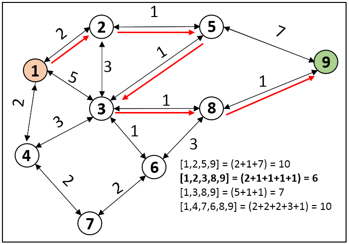

## Print Shortest Path - Dijkstra’s Algorithm


Given a weighted graph and a source vertex in the graph, find the shortest paths from the source to all the other vertices in the given graph.

!!! info "No negative weights"

    * Dijkstra's algorithm doesn't works for graphs containing **negative weights**.
    * It can't detect negative cycles and will stuck in the **loop forever**.
    * **Bellman-ford** algorithm will tackle these shortcomings, but will have more time complexity.



---


!!! tip "Why priority queue is preferred over queue?"

    * The only difference between a **queue** and a **priority** queue is that we have to traverse all connected nodes of a current node and find the minimum among them when we use a **normal queue** which takes time of **O(V)**. But using the priority queue we can optimize it to O(log V).
    * The **Time Complexity** of Dijkstra’s Algorithm using a normal queue is O(V^2).


### Code


```cpp

vector<int> dijkstra(int V, vector<vector<int>> adj[], int S){

    // Create a priority queue for storing the nodes as a pair {dist,node}
    // where dist is the distance from source to the node. 
    priority_queue<pair<int, int>, vector<pair<int, int>>, greater<pair<int, int>>> pq;

    // Initialising distTo list with a large number to
    // indicate the nodes are unvisited initially.
    // This list contains distance from source to the nodes.
    vector<int> distTo(V, INT_MAX);

    // Source initialised with dist=0.
    distTo[S] = 0;
    pq.push({0, S});

    // Now, pop the minimum distance node first from the min-heap
    // and traverse for all its adjacent nodes.
    while (!pq.empty()){
        int node = pq.top().second;
        int dis = pq.top().first;
        pq.pop();

        // Check for all adjacent nodes of the popped out
        // element whether the prev dist is larger than current or not.
        for (auto it : adj[node]){
            int v = it[0];
            int w = it[1];
            if (dis + w < distTo[v])
            {
                distTo[v] = dis + w;
    
                // If current distance is smaller,
                // push it into the queue.
                pq.push({dis + w, v});
            }
        }
    }
    // Return the list containing shortest distances
    // from source to all the nodes.
    return distTo;
}


```

#### Time Complexity 

O(E *log(V)), Where N = number of vertices and E = number of edges.


