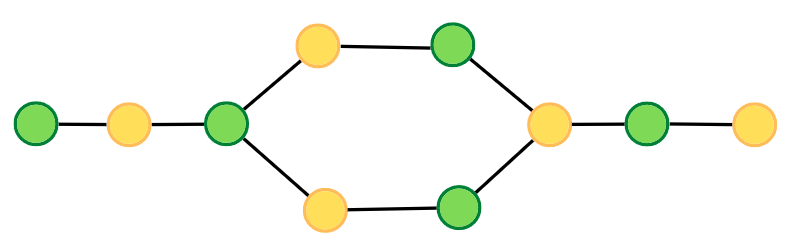
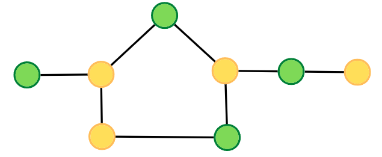

## Bipartite Graph

If we are able to colour a graph with two colours such that no adjacent nodes have the same colour, it is called a bipartite graph.


* Any linear graph with no cycle is always a bipartite graph.
* With a cycle, any graph with an even cycle length can also be a bipartite graph.



* Any graph with an odd cycle length can never be a bipartite graph.




---

## Checking Bipartite using (BFS)

??? tip "Points to remember"

    We need to create an extra **`vector<int> color(V,-1)`** vector to keep track of colored nodes.

    * And see this portion of code
    ```cpp
    
    for(auto it : adj[node]){
	    if(color[it] == -1){
	        q.push(it);
	        color[it] = 1-color[node];
	    }
	    else if(color[it] == color[node]){
	        return false;
	    }
	}

    ```

```cpp

class Solution{
public:

    bool check(int start , vector<int> adj[] , vector<int> &color){
    
	    queue<int> q;
	    q.push(start);
	    color[start] = 0;
	    
	    while(!q.empty()){
	        int node = q.front();
	        q.pop();
	        
	        for(auto it : adj[node]){
	            if(color[it] == -1){
	                q.push(it);
	                color[it] = 1-color[node];
	            }
	            else if(color[it] == color[node]){
	                return false;
	            }
	        }
	    }
	    
	    return true;
    }

	bool isBipartite(int V, vector<int>adj[]){
	    
	    vector<int> color(V,-1);
	    
	    for(int i = 0 ; i < V ; i++){
	        if(color[i] == -1){
	            bool ans = check(i , adj , color);
	            if(ans == false){
	                return false;
	            }
	        }
	    }
	    
	    return true;
	}

};

```

#### Time Complexity 

O(N+E), Where N = Nodes, E is no. of edges.

#### Space Complexity

O(2N) ~ O(N), Space for queue data structure and color array.

---

## Checking Bipartite using (DFS)

??? tip "Points to remember"

    We need to create an extra **`vector<int> color(V,-1)`** vector to keep track of colored nodes.


```cpp
class Solution{
public:

    bool check(int start , int col , vector<int> adj[] , vector<int> &color){
    
	    color[start] = col;
	    
	    for(auto it : adj[start]){
	        if(color[it] == -1){
	            if(check(it , 1-col , adj , color) == false){
	                return false;
	            } 
	        }
	        else if(color[it] == col){
	            return false;
	        }
	    }
	    
	    return true;
    }

	bool isBipartite(int V, vector<int>adj[]){
	    
	    vector<int> color(V,-1);
	    
	    for(int i = 0 ; i < V ; i++){
	        if(color[i] == -1){
	            bool ans = check(i , 0 , adj , color);
	            if(ans == false){
	                return false;
	            }
	        }
	    }
	    
	    return true;
	}

};

```

#### Time Complexity 

O(N + 2E), Where N = Vertices, 2E is for total degrees as we traverse all adjacent nodes.

#### Space Complexity

O(2N) ~ O(N), Space for DFS stack space and colour array.
