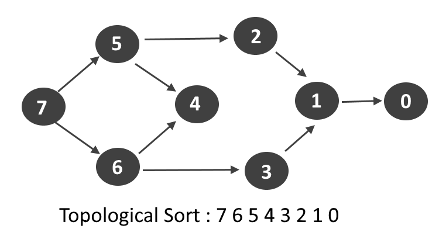

## Topological Sort

Topological sort: The linear ordering of nodes/vertices such that if there exists an edge between 2 nodes u,v then ‘u’ appears before ‘v’.

???+ tip

    Topological Sorting is applicable only for DAG(Directed Acyclic Graph).



---

## Topological Sort Using (BFS)

??? info "Steps to remember"

    1. Find in-degree of all nodes and fill them in an array.
    2. Now take Queue data structure and add nodes that have in-degree is 0.
    3. Take the top/peek node from Queue, add this x to our answer.
    4. We'll apply some conditions to the BFS:
        * Now take neighbour nodes of popped nodes and reduce their in-degree by 1.
        * if any of the popped element nodes's in-degree becomes 0, push it in to the queue.

```cpp

vector<int> topo(int N, vector<int> adj[]) {
    queue<int> q; 
	vector<int> indegree(N, 0); 
	for(int i = 0;i<N;i++) {
	    for(auto it: adj[i]) {
	        indegree[it]++; 
	    }
	}
	    
	for(int i = 0;i<N;i++) {
	    if(indegree[i] == 0) {
	        q.push(i); 
	    }
	}
	vector<int> topo;
	while(!q.empty()) {
	    int node = q.front(); 
	    q.pop(); 
	    topo.push_back(node);
	    for(auto it : adj[node]) {
	        indegree[it]--;
	        if(indegree[it] == 0) {
	            q.push(it); 
	        }
	    }
	}
	return topo;
}

```


#### Time Complexity

O(N+E), where N = no. of nodes and E = no. of edges.

#### Space Complexity

O(N) + O(N)


---

## Topological Sort Using (DFS)

??? info "Steps to remember"

    * Visited Vector - To store visit of each vertex
    * Stack - To maintain the topo sort order.

```cpp

void findTopoSort(int node, vector<int> &vis, stack<int> &st, vector<int> adj[]) {
    vis[node] = 1;

    for (auto it: adj[node]) {
      if (!vis[it]) {
        findTopoSort(it, vis, st, adj);
      }
    }
    st.push(node);
}

vector<int> topoSort(int N, vector<int> adj[]) {
    stack<int> st;
    vector<int> vis(N, 0);
    for (int i = 0; i < N; i++) {
        if (vis[i] == 0) {
            findTopoSort(i, vis, st, adj);
        }
    }
    vector<int> topo;
    while (!st.empty()) {
        topo.push_back(st.top());
        st.pop();
    }

    return topo;
}

```

#### Time Complexity

O(N+E), where N = no. of nodes and E = no. of edges.

#### Space Complexity

O(N) + O(N) , Visited Array and Stack data structure. Both will be using O(N).


