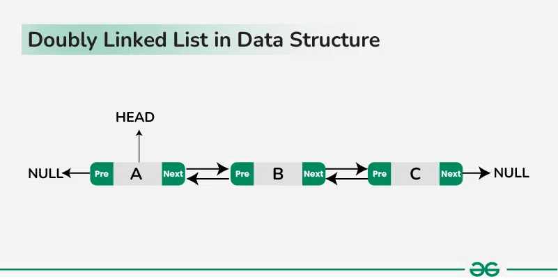

## Doubly Linked List

A **doubly linked** list or a **two-way** linked list is a more complex type of linked list that contains a **pointer** to the **next** as well as the **previous** node in sequence.





---


### Implementation

??? abstract "See the code"

    ```cpp

    #include <bits/stdc++.h> 
    using namespace std; 

    // Structure of Node
    class Node{ 
      public: 
        int data;
        Node* next;
        Node* pre;

        Node(int data){
            this ->data = data;
            this ->next = NULL;
            this ->pre = NULL;
        }
    }; 

    Node* constructLL(vector<int>& arr) {

        if(arr.size() == 0){
            return NULL;
        }
            
        Node *Head = new Node(arr[0]);
        Node *temp = Head;
            
        for(int i = 1 ; i < arr.size() ; i++){
            Node* new_node = new Node(arr[i]);
            temp ->next = new_node;
            new_node ->pre = temp;
            temp = temp ->next;
        }
            
        return Head;
    }
    
    void printList(Node* head){ 

        Node* temp = head;
        while (temp != NULL) { 

            cout << temp->data << " "; 
            temp = temp->next;
        } 
    }

    int main(){ 
         
        vector<int> arr = {1,2,3,4,5};

        Node *head = constructLL(arr);
        printList(head);
        cout<<endl;

        return 0; 
    }


    ```

---


## Questions

💡 First try with yourself, if you are unable to solve the question then see the solution.


??? tip "Introduction to Doubly Linked List"

    * <a href="https://www.geeksforgeeks.org/problems/introduction-to-doubly-linked-list/1?utm_source=youtube&utm_medium=collab_striver_ytdescription&utm_campaign=introduction-to-doubly-linked-list" target="_blank">Introduction to Doubly Linked List (gfg)</a>


    ---


    ```cpp

    class Solution {
      public:
        Node* constructDLL(vector<int>& arr) {
            if(arr.size() == 1){
                return new Node(arr[0]);
            }
            
            Node* head = new Node(arr[0]);
            Node* temp = head;
            for(int i = 1 ; i < arr.size() ; i++){
                Node* new_node = new Node(arr[i]);
                temp ->next = new_node;
                new_node ->prev = temp;
                temp = temp ->next;
            }
            return head;
        }
    };


    ```


??? tip "Delete node in Doubly Linked List"

    * <a href="https://www.geeksforgeeks.org/problems/delete-node-in-doubly-linked-list/1?utm_source=youtube&utm_medium=collab_striver_ytdescription&utm_campaign=delete-node-in-doubly-linked-list" target="_blank">Delete node in Doubly Linked List (gfg)</a>


    ---


    ```cpp

    class Solution{
      public:
        Node* deleteNode(Node *head, int x){
            
            if(head == NULL){
                return NULL;
            }
            
            Node* temp = head;
            int cnt = 0;
            while(temp != NULL){
                cnt++;
                if(cnt == x){
                    break;
                }
                temp = temp ->next;
            }
        
            Node* previous = temp ->prev;
            Node* ahead = temp ->next;

            if(previous == NULL && ahead == NULL){
                return NULL;
                free(temp);
            }
            else if(previous == NULL && ahead != NULL){
                head = head ->next;
                ahead ->prev = NULL;
                free(temp);
            }
            else if(previous != NULL && ahead == NULL){
                previous ->next = NULL;
                temp ->prev = NULL;
                free(temp);
            }
            else{
                previous ->next = temp ->next;
                ahead ->prev = previous;
                temp ->next = NULL;
                temp ->prev = NULL;
                free(temp);
            }

            return head;
        }
    };


    ```


??? tip "Doubly linked list Insertion at given position"

    

    ```cpp

    // below code follow 1 based indexing.
    Node* Insert_node(Node* head , int idx , int num){

        if(head == NULL){
            Node* new_node = new Node(num);
            return new_node;
        }

        Node* temp = head;
        int count = 0;
        while(temp != NULL){
            count++;
            if(count == idx){
                break;
            }
            temp = temp ->next;
        }

        Node* previous = temp ->pre;

        if(previous == NULL){
            Node* new_node = new Node(num);
            new_node ->next = temp;
            temp ->pre = new_node;
            head = new_node;
        }
        else{
            Node* new_node = new Node(num);
            previous ->next = new_node;
            new_node ->pre = previous;
            new_node ->next = temp;
            temp ->pre = new_node;
        }

        return head;
    }

    ```

??? tip "Reverse a Doubly Linked List"

    * <a href="https://www.geeksforgeeks.org/problems/reverse-a-doubly-linked-list/1?utm_source=youtube&utm_medium=collab_striver_ytdescription&utm_campaign=reverse-a-doubly-linked-list" target="_blank">Reverse a Doubly Linked List (gfg)</a>


    ---


    ```cpp

    class Solution{
       public:
        Node* reverseDLL(Node * head){

            if(head == NULL || head ->next == NULL){
                return head;
            }
            
            Node* curr = head;
            Node* pre = NULL;
            
            while(curr != NULL){
                Node* temp = curr ->next;
                curr ->next = pre;
                curr ->prev = temp;
                pre = curr;
                curr = temp;
                
            }
            return pre;
        }
    };


    ```


??? danger "Least Recently Used (LRU) cache  V.V.I"

    * <a href="https://leetcode.com/problems/lru-cache/description/" target="_blank">LRU Cache (leetcode)</a>


    ---

    <a href="https://www.youtube.com/watch?v=xDEuM5qa0zg&list=PLgUwDviBIf0p4ozDR_kJJkONnb1wdx2Ma&index=76" target="_blank">Striver LRU explanation video :video_camera:</a>

    If you are unable to do this question then first go through above video and then try to understand the below code.

    ---


    ```cpp

    class LRUCache {
        public:
        class Node{
            public:
                int key;
                int val;
                Node* next;
                Node* prev;

                Node(int key , int val){
                    this ->key = key;
                    this ->val = val;
                    next = NULL;
                    prev = NULL;
                }
        };

        Node* head = new Node(-1 , -1);
        Node* tail = new Node(-1 , -1);

        int cap;
        unordered_map<int,Node*> mp;

        LRUCache(int capacity) {
            cap = capacity;
            head ->next = tail;
            tail ->prev = head;
        }

        void addNode(Node* newNode){
            Node* temp = head ->next;
            newNode ->next = temp;
            temp ->prev = newNode;

            newNode ->prev = head;
            head ->next = newNode;
        }

        void deleteNode(Node* newNode){
            Node* nextt = newNode ->next;
            Node* prevv = newNode ->prev;

            nextt ->prev = prevv;
            prevv ->next = nextt;
        }
        
        int get(int key) {

            if(mp.find(key) != mp.end()){
                Node* resNode = mp[key];
                int ans = resNode->val;
                mp.erase(key);
                deleteNode(resNode);
                addNode(resNode);

                mp[key] = head->next;
                return ans;
            }
            return -1;
        }
        
        void put(int key, int value) {
            if(mp.find(key) != mp.end()){
                Node* curr = mp[key];
                mp.erase(key);
                deleteNode(curr);
            }
            if(mp.size() == cap){
                mp.erase(tail ->prev ->key);
                deleteNode(tail ->prev);
            }

            addNode(new Node(key , value));
            mp[key] = head ->next;
        }
    };


    ```


---

🥇 🥇 🥇


### Other Important Questions List

??? tip "Important Questions List"


    * <a href="https://www.geeksforgeeks.org/problems/find-pairs-with-given-sum-in-doubly-linked-list/1?utm_source=youtube&utm_medium=collab_striver_ytdescription&utm_campaign=find-pairs-with-given-sum-in-doubly-linked-list" target="_blank">Find pairs with given sum in doubly linked list (gfg)</a>


    * <a href="https://www.geeksforgeeks.org/problems/remove-duplicates-from-a-sorted-doubly-linked-list/1?utm_source=youtube&utm_medium=collab_striver_ytdescription&utm_campaign=remove-duplicates-from-a-sorted-doubly-linked-list" target="_blank">Remove duplicates from a sorted doubly linked list (gfg)</a>


    * <a href="https://www.geeksforgeeks.org/problems/delete-all-occurrences-of-a-given-key-in-a-doubly-linked-list/1?utm_source=youtube&utm_medium=collab_striver_ytdescription&utm_campaign=delete-all-occurrences-of-a-given-key-in-a-doubly-linked-list" target="_blank">Delete all occurrences of a given key in a doubly linked list (gfg)</a>


    * <a href="https://leetcode.com/problems/flatten-a-multilevel-doubly-linked-list/description/" target="_blank">Flatten a Multilevel Doubly Linked List (leetcode)</a>
    


💯 🔥 🚀